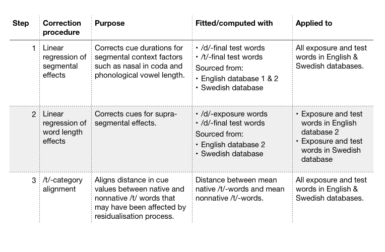

```{r rmarkdown setup, include=FALSE}
knitr::opts_chunk$set(echo = FALSE, 
                      message=FALSE, warning=FALSE, error=TRUE)
```


```{r preamble, message=FALSE, warning=FALSE, error=FALSE, echo=FALSE, results='hide'}
rm(list=ls())
library(bookdown)       # r markdown references to figures, tables, sections regardless of output format
library(tidyverse)      # There is only one universe
library(magrittr)       # Pipes!
library(stringi)
library(lme4)           # mixed-effects analyses
library(lmerTest)       # p-values in LMMs
library(sjPlot)         # HTML tables of mixed models
library(knitr)          
library(emmeans)        # simple effects in LMMs
library(broom.mixed)    # easy extraction of information from LMMs
library(ggplot2)        # plotting
library(cowplot)        # multi-plot figures
library(plotly)         # 3D plotting 
library(shiny)          # tabs
library(ggpubr)
library(gridExtra)
library(assertthat)
# devtools::install_github('kleinschmidt/daver')
library(daver)
# devtools::install_github("kleinschmidt/phondisttools")
library(phondisttools)
```

```{r constants and environments}
theme_set(
  theme_bw() + 
    theme(panel.border = element_blank())
)

levels.Category = c("/d/", "/t/")
levels.Group = c("/d/-exposure", "control")
levels.Accent = c("non-native", "native")
levels.Language = c("Mandarin-accented English", "Flemish-accented Swedish")
levels.NativeLanguage = c("English", "Swedish")
colors.Group = c("red", "gray")
colors.Accent = colors.Group
colors.Category = c("lightblue", "orange")
colors.Language = c("cyan", "pink")
shapes.Category = c("circle","square")
```

```{r functions and pipes}
applyFactorLevels = function(d) {
  d %>%
    { if ("Language" %in% names(d)) mutate(., Language = 
                                             factor(Language, 
                                                    levels = levels.Language)) else . } %>%
    { if ("NativeLanguage" %in% names(d)) mutate(., NativeLanguage = 
                                                   factor(NativeLanguage, 
                                                          levels = levels.NativeLanguage)) else . } %>%
    { if ("Group" %in% names(d)) mutate(., Group = 
                                          factor(Group, 
                                                 levels = levels.Group)) else . } %>%
    { if ("Accent" %in% names(d)) mutate(., Accent = 
                                           factor(Accent, 
                                                  levels = levels.Accent)) else . } %>%
    { if ("Sound" %in% names(d)) mutate(., Sound = 
                                          factor(Sound, 
                                                 levels = levels.Category)) else . } %>%
    { if ("Used_for.Model.NativeLanguage" %in% names(d)) mutate(., Used_for.Model.NativeLanguage = 
                                                                factor(Used_for.Model.NativeLanguage, 
                                                                       levels = levels.NativeLanguage)) else . } %>%
    { if ("Used_for.Model.Accent" %in% names(d)) mutate(., Used_for.Model.Accent = 
                                                          factor(Used_for.Model.Accent, 
                                                                 levels = levels.Accent)) else . } %>%
    { if ("Used_for.Model.Sound" %in% names(d)) mutate(., Used_for.Model.Sound = 
                                                         factor(Used_for.Model.Sound, 
                                                                levels = levels.Category)) else . }
}

applyContrasts = function(d) {
  within(d, {
    contrasts(NativeLanguage) <- cbind("=Swedish vs. English" = c(-1,1))
    contrasts(Group) <- cbind("=/d/-exposure vs. control" = c(1,-1))
    contrasts(Sound) <- cbind("=/d/ vs. /t/" = c(1,-1))
  })

  # contrasts(d.test$NativeLanguage)
  # contrasts(d.test$Group)
  # contrasts(d.test$Sound)
}

insertLayer <- function(P, after=0, ...) {
  #  P     : Plot object
  # after  : Position where to insert new layers, relative to existing layers
  #  ...   : additional layers, separated by commas (,) instead of plus sign (+)
  if (after < 0)
    after <- after + length(P$layers)
  
  if (!length(P$layers))
    P$layers <- list(...)
  else 
    P$layers <- append(P$layers, list(...), after)
  
  return(P)
}

get_axes = function(.data, cues) { 
  if(substr(cues[1], 1, 1) == "r")
  cue.names = paste(cues, "(ms)")
  cue.names = ifelse(substr(cue.names, 1, 1) == "r", 
                     paste("corr.", substr(cue.names, 2, nchar(cue.names))), 
                     cue.names)
  
  # axis setting 
  axx <- list(
    title = cue.names[1],
    nticks = 4,
    range = range(.data[, cues[1]]),
    gridwidth = 2
  )
  axy <- list(
    title = cue.names[2],
    nticks = 4,
    range = range(.data[, cues[2]]),
    gridwidth = 2
  )
  axz <- list(
    title = cue.names[3],
    nticks = 4,
    range =  range(.data[, cues[3]]),
    gridwidth = 2
  )
  
  return(list(axx, axy, axz))
}
```


# TO DO

1) Check whether warnings are addressed, and then (after) set to silent.
2) Run final compilation with echo = F.
3) Check why in English non-native data the stress-final n-coda words get pulled out of the rest of the cloud. that seems wrong.
4) Add test to result section of ideal observers
5) Consider adding perception noise to IOs to simulate various subjects. In any case, *explain in IO result section why IO results are more categorical than human responses** (lack of noise is one plausible reason).
6) Add model comparisons that assess whether the models that match the exposure condition (`Model.Accent.matchesGroup == yes`) perform better than those that don't.
7) REMOVE CATEGORY DENSITY CODE.

# Overview

This supplementary information describes the results and methods of the perception experiments on Mandarin-accented English and Flemish-accented Swedish, as well as the development and evaluation of the ideal observer models. The experiment on Mandarin-accented English (Xie et al., 2017) found an effect of exposure to the foreign-accented sound (syllable-final /d/) on subsequent /d/- and /t/-goodness ratings. This effect has been replicated in two other paradigms (categorization and priming) using the same stimuli (Xie et al., 2017). <!-- Xin: is this summary correct? --> Additionally, an earlier priming study found the same type of benefit for exposure to syllable-final /d/ in Dutch-accented English (Dutch, like Flemish, exhibits final devoicing, partially or completely neutralizing stop voicing in the syllable final position). In contrast to these previous studies, the experiment on Flemish-accented Swedish did *not* find a significant effect of exposure on subsequent /d/ and /t/-goodness ratings.

We begin by summarizing the results of the two experiments. As we discuss, these analyses suggest that the native Swedish listeners had an easier time understanding the Flemish-accented speaker than the American listeners had understanding the Mandarin-accented English speaker. This showed in the lexical decision accuracies during exposure, as well as the goodness ratings during test. 

We then provide a detailed list of differences between the two experiments, ranging from the number of participants and items, to the way stimuli were recorded, etc. This summary aims to be exhaustive and to err on the side of listing differences regardless of whether we believe them to be relevant. For each difference, we describe the design consideration that motivated it, or whether it arose due to misunderstandings/mistakes. Finally, we discuss whether the difference in methodology is likely to explain the difference in the results between the English and Swedish experiments. Where possible, we present additional analyses to inform this discussion. 

The upshot of this summary is that we believe to be plausible that the Swedish null result is *at least in part* driven by the phonetic characteristics of the Flemish-accented speech in our recordings---specifically, that the phonetic distribution of syllable-final /d/ in the Flemish-accented recordings deviated less from typical native Swedish than the phonetic distributions of syllable-final /d/ in the Mandarin-accented recordings deviated from typical American English. Such a difference in the 'non-nativeness' or 'accentedness' between the Flemish- and Mandarin-accented recordings could be particular to the specific recordings used in the experiment, reflect the talker-specific pronunciation of the speaker we recorded (e.g., due differences in L2 proficiency), or reflect more general differences between Flemish-accented Swedish and Mandarin-accented English. 

Regardless of the specific source of the difference between the Flemish- and Mandarin-accented recordings, the question arises how to *predict* the effect of exposure on native listeners's perception given a specific set of foreign-accented speech stimuli. This motivates the present study: we sought to present a simple but principled approach to quantify the predicted effect of exposure on subsequent perception (here /d/- and /t/-goodness ratings, though the approach we present generalizes to categorization tasks). Ideal observers provide a tool for this purpose, making it possible to predict the effect of exposure on ratings with zero computational degrees of freedom based on only 1) the phonetic properties of the foreign-accented exposure stimuli, 2) the phonetic properties of the  foreign-accented test stimuli, and 3) the phonetic properties of native-accented speech. The third and final component requires some estimates of the phonetic distributions of `typical' native-accented speech. We thus introduce and describe additional data sets containing information about native pronunciations of the same materials used in the perception experiments on foreign-accented speech. 

## Overview of data organization

The R code in this document work with three types of data sources. In Sections \@ref(sec:perception-results) and \@ref(sec:perception-methods), we work exclusively with the perception data from the English and Swedish experiments. The perception data is split into the exposure data (`d.exposure`) and the test data (`d.test`). In Sections \@ref(sec:IO-methods) and \@ref(sec:IO-results), we use phonetic annotations from both the two experiments and additional sources (together combined into `d.stims`) to train ideal observers (`d.training`) that are then stored in a separate data frame (`d.IO`). Finally, we combine the perception data from the test phase of the two experiments (`d.test`) with the ideal observers into one data frame that contains the posterior probabilities, categorization decisions, and /d/-goodness ratings predicted by the various ideal observers for each of the test trials from the experiments (`d.test.IO`).

# Results of perception experiment {#sec:perception-results}

We compare the results of the perception experiments on English and Swedish. We first compare lexical decision accuracy during exposure. Then we compare the effect of the exposure manipulation on ratings of /d/-goodness during test. 

```{r load rating experiments, results='hide'}
# Swedish rating data
d.swedish = read_csv(file = "../data/Swedish/Swedish_perception_rating_exposure+test_Tan et al 2020.csv")
# English rating data
d.english.exposure <- read.csv("../data/English/English_perception_rating_exposure_Xie et al 2017.csv")
d.english.test <- read.csv("../data/English/English_perception_rating_test_Xie et al 2017.csv")

# Standardize variable names for Swedish
d.swedish %<>%
  dplyr::rename(
    Participant = participant,
    Item.WordID = item,
    Item.Type = item_cond,
    Item.Filename = sound,
    LD.Expected = corr_ans,
    LD.Response = key_resp_2.keys,
    LD.Correct = key_resp_2.corr,
    LD.RT = key_resp_2.rt,
    Rating.for = rating_for,
    Rating.Response = rating_1.response,
    Rating.RT = rating_1.rt,
    Block.Order = block_id) %>%
  mutate(
    Language = "Flemish-accented Swedish",
    NativeLanguage = "Swedish",
    Block.Type = gsub("^([A-Z]).*$", "\\1", Item.Type),
    Block.Type = case_when(
      Block.Type == "E" ~ "exposure",
      Block.Type == "T" ~ "test",
      T ~ NA_character_
    ),
    Participant = paste0("S", Participant),
    # Do not move the next line from here (order sensitive)
    ItemTemp = gsub("^[A-Z]([A-Z]+)$", "\\1", Item.Type),
    Item.WordStatus = factor(case_when(
      ItemTemp == "NW" ~ "pseudoword",
      ItemTemp %in% c("FW", "CW", "TW", "TF", "DF", "TI", "DI") ~ "word",
      T ~ NA_character_
    )),
    Item.Type = factor(case_when(
      ItemTemp %in% c("NW", "FW") ~ "filler",
      ItemTemp %in% c("CW", "TW") ~ "critical",
      ItemTemp %in% c("TF", "DF", "TI", "DI") ~ "test",
      T ~ NA_character_
    )),
    Sound = factor(case_when(
      ItemTemp %in% c("DI", "DF", "TW") ~ "/d/",
      ItemTemp %in% c("TI", "TF") ~ "/t/",
      T ~ NA_character_
    ), levels = levels.Category),  
    Sound.Position = case_when(
      ItemTemp %in% c("TF", "DF", "TW") ~ "final",
      ItemTemp %in% c("TI", "DI") ~ "initial",
      T ~ NA_character_
    ),
    Item.Word = str_replace(stri_trans_general(
      Item.Filename, 
      "Latin-ASCII"),
      "^[A-Z]+_[0-9]+_([a-z]+)_.*$", "\\1"),
    # For exposure trials, set Item.Minimal ID to NA. For the test trials, extract
    # ID from filename
    Item.MinimalPair = 
      ifelse(Block.Type == "exposure", 
             NA, 
             paste0("S", tolower(gsub("^[A-Z]+_([0-9]+)_.*$", "\\1", Item.Filename)))),
    # For exposure trials, use Item.WordID. For test trials, this is ambiguous since both
    # words of a minimal pair currently have the same Item.WordID. So change it for test
    # trials so that these words have unique IDs (the minimal pair ID plus d or t)
    Item.WordID = 
      ifelse(Block.Type == "exposure", 
             paste0("S", Item.WordID),
             paste0(Item.MinimalPair, ifelse(Sound == "/d/", "d", "t"))), 
    # One word ("nod") occurs twice. Make sure it has a unique Item.Word value.
    Item.Word = ifelse(Item.MinimalPair == "S15" & Item.Word == "nod", 
                       "nod15", as.character(Item.Word)),
  ) %>%
  group_by(Participant) %>%
  mutate(
    Group = if(sum(ifelse(ItemTemp == "TW", 1, 0)) == 0) 
      "control" else "/d/-exposure",
    Trial = row_number()
  ) %>%
  ungroup() %>%
  # Delete variable no longer necessary
  mutate(    
    listname = NULL,
    group = NULL,
    ItemTemp = NULL,
    position = NULL,
    X1 = NULL,
    X = NULL
  ) %>%
  # Order columns
  select(Language, 
         NativeLanguage, 
         Group, Participant,
         Block.Type, Block.Order,
         Trial, 
         Item.MinimalPair, Item.WordID, Item.Type, Item.Word, Item.WordStatus, Item.Filename,
         Sound, Sound.Position, 
         LD.Expected, LD.Response, LD.Correct, LD.RT,
         Rating.for, Rating.Response, Rating.RT)

# Swedish exclusion
d.swedish %<>%
  # Remove participants 100 & 111 because they are nonnative
  filter(!Participant %in% c("S100", "S111")) %>%
  # Remove the second test block with /d,t/-initial sounds
  filter(is.na(Sound.Position) | Sound.Position == "final") %>%
  # Remove the 4 test items because -rd and -rt are pronounced differently in Swedish than d/t in other context
  filter(! Item.Word %in% c("voart", "voard", "hoart", "hoard")) %>%
  droplevels()

# Standardize variable names for English
d.english.test %<>%
  rename(
    Item.Word = Word,
    Item.MinimalPair = MinimalPairID,
    Rating.Response = Rating.Answer,
    Rating.RT = RT) %>%
  mutate(
    Language = "Mandarin-accented English",
    NativeLanguage = "English",
    Participant = paste0("E", Participant),
    Group = ifelse(Group == "experimental", "/d/-exposure", "control"),
    Block.Type = "test",
    Item.MinimalPair = paste0("E", Item.MinimalPair),
    Item.WordID = paste0("E", as.numeric(as.factor(Item.Word))),
    Item.Word = as.character(Item.Word),
    Sound = paste0("/", Sound, "/"),
    Sound.Position = "final",
    Session = NULL,
    Subject = NULL)

# Combine Swedish and English *test* data
d.test = d.swedish %>%
  filter(Block.Type == "test", Sound.Position == "final") %>%
  select(Language,
         NativeLanguage,
         Group, Participant,
         Block.Type, Block.Order,
         Trial, 
         Item.MinimalPair, Item.WordID, Item.Type, Item.Word, 
         Sound, Sound.Position, 
         Rating.for, Rating.Response, Rating.RT) %>%
  full_join(d.english.test) %>%
  # Convert to /d/-goodness ratings and then zscore that rating
  mutate(Rating.Response.d = ifelse(Rating.for == "d", Rating.Response, 8 - Rating.Response)) %>%
  group_by(NativeLanguage, Group, Participant) %>%
  mutate(Rating.Response.d.zscored = as.numeric(scale(Rating.Response.d))) %>%
  ungroup() %>%
  # Create factors
  mutate_at(
    c("Participant", 
      "Block.Order", "Block.Type", 
      "Item.MinimalPair", "Item.WordID", "Item.Word",
      "Sound.Position",
      "Rating.for"),
    .funs = factor
  ) %>%
  applyFactorLevels()

# Combine English and Swedish *exposure* data 
d.exposure = 
  d.swedish %>%
  filter(Block.Type == "exposure") %>%
  select(Language, NativeLanguage, Group, Participant, 
         Block.Type, Item.Type, Item.WordStatus,
         LD.Correct, LD.RT) %>%
  # Expand the English data so that we can have a combined tibble
  full_join(d.english.exposure %>%
              pivot_longer(
                cols = filler:Accuracy,
                names_to = "Item.Type",
                values_to = "accuracy"
              ) %>%
              filter(Item.Type != "Accuracy") %>%
              crossing(LD.Correct = c(0,1)) %>%
              mutate(
                Language = "Mandarin-accented English",
                NativeLanguage = "English",
                # Participants were renumbered in the English test-data. 
                # Making sure that IDs match across exposure and test data.
                Participant = ifelse(Group == "/d/-exposure",
                                     paste0("E", Participant + 100),
                                     paste0("E", Participant + 200)),
                Item.WordStatus = ifelse(Item.Type == "non.word", "pseudoword", "word"),
                Item.Type = ifelse(Item.Type == "non.word", "filler", Item.Type),
                Block.Type = "exposure",
                LD.RT = NA,
                Count = case_when(
                  Item.Type == "pseudoword" ~ 90,
                  Item.Type == "filler" ~ 60,
                  Item.Type == "critical" ~ 30
                ),
                Count = case_when(
                  LD.Correct == 1 ~ round(Count * accuracy, 0),
                  LD.Correct == 0 ~ Count - round(Count * accuracy, 0)
                ),
                accuracy = NULL) %>%
              group_by(Language, NativeLanguage, Group, Participant, 
                       Block.Type, Item.Type, Item.WordStatus, 
                       LD.Correct) %>%
              tidyr::expand(Count = 1:Count) %>%
              mutate(Count = NULL),
            by = c("Language", "NativeLanguage", "Group", "Participant", 
                   "Block.Type", "Item.Type", "Item.WordStatus", 
                   "LD.Correct")) %>%
  mutate_at(
    c("Participant", "Block.Type", "Item.Type", "Item.WordStatus"),
    .funs = factor
  ) %>%
  applyFactorLevels()

save(d.exposure, file = "../data/data_perception_exposure phase_both languages.Rdata")
save(d.test, file = "../data/data_perception_test phase_both languages.Rdata")
```

## Lexical decision accuracy during exposure ##

```{r functions for exposure data}
# Pipes
get_LD_byParticipant = . %>% 
  filter(Block.Type == "exposure") %>%
  group_by(Language, NativeLanguage, Group, Participant) %>% 
  summarise(
    Accuracy = mean(LD.Correct, na.rm = T),
    RT = mean(LD.RT, na.rm = T)) 

get_LD.Accuracy_byGroup = . %>% 
  get_LD_byParticipant() %>% 
  group_by(Language, NativeLanguage, Group) %>% 
  summarise(mean = mean(Accuracy, na.rm = T), 
            sd = sd(Accuracy, na.rm = T)) %>%
  ungroup() %>%
  mutate_at(c("mean", "sd"),
            .funs = function(x) 100 * round(x, 3))

get_LD.RT_byGroup = . %>% 
  get_LD_byParticipant() %>% 
  group_by(Language, NativeLanguage, Group) %>% 
  summarise(mean = mean(RT, na.rm = T), 
            sd = sd(RT, na.rm = T)) %>%
  ungroup() %>%
  mutate_at(c("mean", "sd"),
            .funs = function(x) round(x, 1))

# functions
extract_columns <- function(data) {
  extracted_data <- data %>%
    select(.dots = common_cols)
  return(extracted_data)
}

get_LD_performance = function(
  d, 
  language = levels.NativeLanguage, 
  group = levels.Group, 
  what = "accuracy",
  critical = F) {
  require(magrittr)
  
  if (critical) {
    d %<>% 
      filter(Item.Type == "critical") 
  }
  d %<>% 
    filter(NativeLanguage %in% language, Group %in% group) %>% 
    droplevels()
  
  if (what == "accuracy") {
    d %<>% get_LD.Accuracy_byGroup() 
    suffix = "\\%"
  } else if (what == "RT") {
    d %<>% get_LD.RT_byGroup()
    suffix = " sec"
  }
  
  text = ""
  for (l in language) {
    # If more than one language, add language to paste, otherwise not
    if (length(language) > 1) text = paste0(text, l, ", ")
    for (g in group) {
      text = paste0(
        text, 
        # If more than one group, add group to paste, otherwise not
        if (length(group) > 1) paste0(g, " group: ") else "",
        "M = ", 
        d[d$NativeLanguage == l & d$Group == g, "mean"], 
        suffix, ", SD = ",
        d[d$NativeLanguage == l & d$Group == g, "sd"],
        suffix)
      if (
        !and(
          l == language[length(language)], 
          g == group[length(group)])) 
        text = paste0(text, "; ")
    }
  }
  
  return(text)
} 
```

The analysis of the exposure data serves to make two points. First, lexical decision accuracy during exposure was high across exposure groups and experiments. In particular, we show that participants in the /d/-exposure group recognized the critical exposure words with syllable-final /d/ (and without minimal pair neighbors). This justifies the assumption of lexically-guided adaptation made by the ideal observer we introduce below. 

Second, lexical decision accuracy was substantially higher in the Swedish data. This is one piece of evidence suggesting that the Flemish-accented speaker being easier to process for native Swedish participants than the Mandarin-accented English speaker was for the American participants. 

### English ###
Lexical decision accuracy was high across both the /d/-exposure (`r get_LD_performance(d.exposure, "English", "/d/-exposure")`) and control group (`r get_LD_performance(d.exposure, "English", "control")`). Accuracy was also high for critical words, including words with syllable-final /d/ in the /d/-exposure group (`r get_LD_performance(d.exposure, "English", critical = T)`). No reaction time data was available.

### Swedish ###
Figure \@ref(fig:LD-accuracy) summarizes participants' accuracy and reaction time for during exposure. 
Lexical decision accuracy was high across both the /d/-exposure (`r get_LD_performance(d.exposure, "Swedish", "/d/-exposure")`) and control group (`r get_LD_performance(d.exposure, "Swedish", "control")`). Accuracy was also high for critical words, including words with syllable-final /d/ in the /d/-exposure group (`r get_LD_performance(d.exposure, "Swedish", critical = T)`). 

Reaction times were slower in the /d/-exposure group (`r get_LD_performance(d.exposure, "Swedish", what = "RT")`). The very high average reaction time for participant 101 in the /d/-exposure group was caused by a single outlier trial, on which the participant took 35 seconds to respond. The difference between exposure conditions does, however, persist if reaction times above 3.5 SDs away from a participant's mean RT are excluded (`r get_LD_performance(d.exposure %>% group_by(Participant) %>% filter(abs(scale(LD.RT)) < 3.5) %>% ungroup(), "Swedish", what = "RT")`).

This suggests that the syllable-final /d/ of the Flemish-accented speaker was indeed accented, leading to additional difficulty beyond whatever other difficulty participants might have experienced while processing the foreign accent.

(ref:LD-accuracy) Lexical decision accuracies and RTs in the Swedish experiment by exposure group: all words (left) or only critical words (right). For the /d/ exposure group, critical words have syllable-final /d/. For the control group, critical words are matched in average length and frequency, but do not contain /d/ (or /t/).

```{r LD-accuracy, fig.cap="(ref:LD-accuracy)", fig.height=4.5, out.width='75%', fig.show = 'hold'}
p = d.exposure %>%
  filter(NativeLanguage == "Swedish") %>%
  get_LD_byParticipant() %>%
  ggplot(
    aes(x = RT, 
        y = Accuracy, 
        label = Participant, fill = Group)) + 
  geom_label(alpha = .5) + 
  scale_x_continuous(
    name = "Mean Reaction Time",
    limits = c(0,3)) + 
  scale_y_continuous(
    name = "Mean accuracy", 
    breaks = c(0, 0.25, 0.5, 0.75, 1.0), 
    limits = c(0, 1.0)) + 
  scale_fill_manual(values = colors.Group) + 
  facet_wrap(~ Language) +
  theme(legend.position = "right")

l = get_legend(p)
p = p + theme(legend.position = "none")
plot_grid(
  plotlist = list(p, 
                  p %+% (d.exposure %>% 
                   filter(NativeLanguage == "Swedish" & Item.Type == "critical") %>%
                   get_LD_byParticipant())),
  nrow = 1, rel_widths = c(.45, .45, .1))
```


## Goodness ratings during test ##

We focus here on goodness ratings for test words ending in /d,t/. Unlike the English data, the Swedish data also contained ratings for words beginning with /d,t/. These ratings were always obtained *after* the ratings of /d/-final test words. Ratings of these /d/-intial test words are not analyzed here, though we mention for completeness's sake that /d/-initial test words also did not reveal a significant effect of exposure group for the Swedish data.

We note here that the two experiments differed in the number of subject and items during test. Bootstrap analyses presented later in the SI assess whether this difference in the amount of test data could explain the difference in results. Here we first compare the two data sets using linear mixed-effects models, which do not require data to be balanced. 

### Preparing /d/- and /t/-goodness ratings for analysis

(ref:rating-to-rating-correlation) /d/-goodness ratings during test (z-scored) by native language and exposure group

```{r rating-to-rating-correlation, fig.cap='(ref:rating-to-rating-correlation)', fig.height=4.5, out.width='75%'}
d.test %>%
  filter(NativeLanguage == "English") %>%
  droplevels() %>%
  group_by(Group, Participant) %>%
  mutate(Rating.Response.zscored = as.numeric(scale(Rating.Response))) %>%
  group_by(Language, Group, Item.Word, Rating.for) %>%
  summarise(Rating.mean = mean(Rating.Response.zscored)) %>%
  spread(Rating.for, Rating.mean) %>%
  ggplot(
    aes(x = d, y = t, label = Item.Word)
  ) + 
  geom_label(alpha = .5, aes(fill = Group)) + 
  geom_smooth(method = "lm", color = "black", alpha = .5) +
  scale_x_continuous("/d/-goodness rating (z-scored)") +
  scale_y_continuous("/t/-goodness rating (z-scored)") +
  scale_color_manual(values = colors.Group) +
  scale_fill_manual(values = colors.Group) +
  facet_wrap(~ Language) +
  theme(legend.position = "top")
```


The /d/- and /t/-goodness ratings could range from 1 to 7. The two types of ratings were highly inversely correlated (see Figure \@ref(fig:rating-to-rating-correlation)). To simplify data analysis, we thus converted  all goodness ratings into /d/-goodness ratings. For /t/-goodness ratings, this means that we subtracted them from 8 (i.e., if a token was given a /t/-goodness of 3, it is tranformed to have a /d/-goodness of 5). This decision does not affect the results: all results remain the same if the original ratings are analyzed while including `rating.for` (/d/- vs. /t/-goodness) and all its interactions as a predictor in the analysis. Following Xie et al. (2017), we then z-scored /d/-goodness ratings within participants, by subtracting the participant's mean and dividing by the participant's standard deviation. 

### Results {#sec:results}

(ref:ratings-results) /d/-goodness ratings during test (z-scored) by native language and exposure group

```{r ratings-results, fig.cap="(ref:ratings-results)", fig.height=4.5, out.width='75%'}
p.results.perception = d.test %>%
  group_by(Language, NativeLanguage, Group, Sound, Participant) %>%
  summarise(Rating.mean = mean(Rating.Response.d.zscored)) %>%
  ggplot(mapping = aes(x = Sound, y = Rating.mean)) + 
  stat_summary(aes(fill = Group), fun = mean, geom = "bar", 
               alpha = .6,
               position = position_dodge(.93)) +
  stat_summary(aes(group = Group), fun.data = mean_cl_boot, geom = "linerange", 
               size = .8, 
               position = position_dodge(.93)) +
  scale_x_discrete("Intended sound category") +
  scale_y_continuous("/d/-goodness rating (z-scored)") +
  scale_color_manual(values = colors.Group) +
  scale_fill_manual(values = colors.Group) +
  facet_grid(. ~ Language, scales="free_y") +
  theme(legend.position = "top",
        panel.grid.major.x = element_blank(),
        panel.grid.minor.x = element_blank())
ggsave(p, filename = "../figures/Result-ratings.png",
       width = 7, height = 4)

p.results.perception.bySubject = insertLayer(p.results.perception, after = 0,
            geom_dotplot(aes(fill = Group), color = NA, 
               alpha = 1,  dotsize = 0.5, 
               binaxis = "y", stackdir = "center", 
               position = position_dodge(.9)))
p.results.perception.bySubject
```

Figure \@ref(fig:ratings-results) shows the z-scored /d/-goodness ratings from both experiments. To compare participants' ratings for the /d,t/-final test words across the two experiments, we conducted a linear mixed-effects regression (Baayen et al., 2008) over the combined data from both experiments. The regression predicted z-scored /d/-goodness ratings based on the sound category (sum-coded: 1 = word recording intended to end in /d/ vs. -1 = word recording intended to end in /t/), exposure group (sum-coded: 1 =  /d/-exposure vs. -1 = control), the experiment (sum-coded: 1 = Swedish vs. -1 = English), and all their interactions. The regression contained the maximal random effect structure justified by the design (random by-participant intercepts and slope for sound; random by-item intercepts and slopes for sound, exposure group, and their interaction).^[Even this simplified model estimated the variance of the by-participant intercepts to be zero (see below), presumably because the z-scoring of ratings within participant already removed that variance. If all by-participant random effects are excluded, the results reported below do not change. If non-zscored ratings are analyzed instead (unlike in previous work), the three-way interaction is no longer significant ($p = .11$).]

For the by-participant random effects, we had to remove the random slope for sound in order for the model to converge without perfect correlations. All other random correlations are included in the model. Table \@ref(tab:ratings-analysis) summarizes the results. We find a highly significanct main effect of sound, so that foreign-accented productions of /d/ were judged to have higher /d/-goodness than foreign-accented productions of /t/ ($\hat{\beta} = .55, t = 19.3, p < .0001$). The two-way interaction between native language and sound was also higly significant ($\hat{\beta} = .11, t = 3.8, p < .0003$), so that the differences between the /d/-goodness ratings for /d/ and /t/ was larger for the Flemish-accented Swedish speaker than the Mandarin-accented English speaker. One possible interpretation of this is that the Flemish-accented Swedish speaker deviated less from the expectations native Swedish listeners than the Mandarin-accented English speaker deviated from the expectations of American listeners. 

Finally, the three-way interaction between native language, sound, and exposure group was also significant ($\hat{\beta} = -.04, t = -3.3, p < .002$), suggesting that the effect of exposure on /d/-goodness ratings for /d/ and /t/ differed between the Swedish and English experiments. Simple effect analyses revealed that the two-way interaction between exposure group and sound was significant for English, so that /d/-exposure *in*creased the difference in /d/-goodness ratings for /d/ and /t/, compared to the control group ($\hat{\beta} = .04, t = 4.1, p < .0001$). That is, compared to the English control group, participants in the English /d/-exposure group rated the Mandarin-accented /d/ as a better exemplar of /d/ and the Mandarin-accented /t/ as a better examplar of /t/. This simple effect did not reach significance in the Swedish experiment; in fact, it went in the opposite of the predicted direction ($\hat{\beta} = -.03, t = -1.6, p > .1$).


```{r ratings-analysis}
lmer.rating = lmer(Rating.Response.d.zscored ~ 
                     NativeLanguage * Group * Sound + 
         (1 + Sound * Group | Item.MinimalPair) + (1 | Participant), 
       data = d.test %>% 
         applyContrasts())

# Kenward-Rogers seems to take forever
# summary(lmer.rating, ddf="Kenward-Roger")
# summary(lmer.rating, ddf="Satterthwaite")
pred.labels = c(
            "(Intercept)",
            "Native language (Swedish vs. English)", 
            "Group (/d/-exposure vs. control)",
            "Sound (/d/ vs. /t/)",
            "Native language : Group", 
            "Native language : Sound",
            "Group : Sound", 
            "Native language : Group : Sound")
tab_model(lmer.rating,
          show.r2 = F,
          title = "(\\#tab:ratings-analysis) Results of linear mixed-effects regression of /d/-goodness ratings.",
          pred.labels = pred.labels,
          dv.labels = "/d/-goodness rating (z-scored)")

# Get simple effects via emmeans
emm = emmeans(lmer.rating,  ~ Group : Sound | NativeLanguage,
                       lmer.df = "Satterthwaite", lmerTest.limit = 10000)
                       # relevant only if lmer.df is set to Kenward-Rogers
                       # pbkrtest.limit = 10000)
lmer.rating.simple = contrast(emm, interaction = c("consec", "consec"))
```


### Are outliers driving these results?

For the Swedish data it seems that both the /d/-exposure and the control group had two participants each who had ratings that were overall much closer to 0 than was the case for other participants (it is worth pointing out that, these ratings of these participants are not necessarily unexpected compared to the *English* data). To address potential concerns that the difference in the English and Swedish results is driven by these four Swedish participants, we repeated the analysis without these participants. Table \@ref(tab:ratings-analysis) summarizes the results. All effects---including the three-way interaction---remain significant.

```{r ratings-analysis-noOutliers}
lmer.rating.noOutliers = lmer(Rating.Response.d.zscored ~ 
                     NativeLanguage * Group * Sound + 
         (1 + Sound * Group | Item.MinimalPair) + (1 | Participant), 
       data = d.test %>%
         filter(!(Participant %in% c("S105", "S108", "S113", "S122"))) %>% 
         applyContrasts())

tab_model(lmer.rating.noOutliers,
          show.r2 = F,
          title = "(\\#tab:ratings-analysis-noOutliers) Results of linear mixed-effects regression of /d/-goodness ratings after exclusion of the four participants in the Swedish data that have /d/-goodness ratings close to zero.",
          dv.labels = "/d/-goodness rating (z-scored)",
          pred.labels = pred.labels)
```

### Relating ratings to performance during exposure

Another common concern is that participants who do not correctly recognize the critical words with syllable-final /d/ during exposure might not exhibit accent adaptation (e.g, because the input they experienced during exposure is not lexically labeled from the perspective of these participants). We therefore related participants' ratings during test to their accuracy on the critical words during exposure (for the /d/-exposure group, those are the foreign-accented words with syllable-final /d/). For this purpose, we transformed goodness ratings into the goodness rating for the *intended* category, so that higher ratings indicate that listeners perceived the recording to be typical for the sound category it was intended to represent (i.e., /d/-goodness ratings if the recorded word ended in /d/, /t/-goodness ratings if the recorded word ended in /t/). The result is shown in Figure \@ref(fig:ratings-and-accuracy). Although the direction of the trend is in the expected direction for the Swedish data, this trend was not significant (see confidence intervals in Figure \@ref(fig:ratings-and-accuracy)).

(ref:ratings-and-accuracy) Relation between the accuracy on critical exposure items and ratings during test.

```{r ratings-and-accuracy, height = 4, out.width="75%", fig.cap="(ref:ratings-and-accuracy)"}
d.test %>%
  group_by(Language, NativeLanguage, Group, Participant) %>%
  # Collapse into overall goodness ratings
  summarise(Rating.mean = mean(ifelse(Sound == "/d/", 
                                      Rating.Response.d.zscored,
                                      -Rating.Response.d.zscored))) %>%
  left_join(d.exposure %>% 
              filter(Item.Type == "critical") %>%
              get_LD_byParticipant(),
            by = c("Language", "NativeLanguage", "Group", "Participant")) %>%
  ggplot(aes(x = Accuracy * 100, y = Rating.mean, color = Group)) +
  geom_label(aes(label = Participant), alpha = .5) +
  geom_smooth(method = "lm") +
  scale_x_continuous("Percent correct on critical exposure items") +
  scale_y_continuous("goodness rating for the intended category (z-scored)") +
  scale_color_manual(values = colors.Group) +
  scale_fill_manual(values = colors.Group) +
  facet_grid(. ~ Language, scales="free_y") +
  theme(legend.position = "top",
        panel.grid.major.x = element_blank(),
        panel.grid.minor.x = element_blank())
```

# Methods of perception experiments {#sec:perception-methods}

We describe the methods used to derive the English (Xie, Theodore, \& Myers, 2017) and Swedish data sets. Both experiments employed an exposure-test paradigm. Exposure was manipulated between participants. Both groups were exposed to foreign-accented speech from the same talker (Mandarin-accented English for the English data; Flemish-accented Swedish for the Swedish data). The two groups of participants differed, however, in whether the exposure materials contained information about the critical phonological category (syllable-final /d/), for which the foreign accent is known to deviate from native pronunciations. The control group never heard any instances of syllable-final /d/ or /t/. The /d/-exposure group heard words with syllable-final /d/, but no words with syllable-final /t/. Following exposure, both groups went through the exact same test phase, during which they made goodness judgments of /d/- or /t/ tokens that were part of minimal pairs (e.g., "seed" or "seat").

In addition to the L1-L2 language pairs (Mandarin-accented English vs. Flemish-accented Swedish) and participants' L1 (American English vs. Swedish), the two experiments exhibited a number of differences that we detail next. This includes differences in i) the number of participants, ii) the instructions and visual appearance of the experiment, iii) the number of stimuli, and iv) minor differences in the stimuli design. As indicated below, some of these differences were intended, some were not. For each difference, we consider whether it is likely to explain the difference in results, and find this to be unlikely---at least, compared to the possibility explored in this study that it is primarily the phonetic properties of the foreign-accented speech and its relation to native listeners' expectations that causes the difference in results.

## Amount of data (Power analyses) 
Compared to the English experiment, the Swedish experiment had substantially fewer participants (about 50\% fewer). The Swedish experiment also employed fewer test tokens than the English experiment (about 50\% fewer). One questions is thus whether the null effect of exposure in the Swedish experiment (the lack of a significant interaction between group and sound in the analysis of /d/-goodness ratings) is a Type II error. This possibility is further highlighted by the fact that the effect of exposure on the perception of foreign-accented syllable-final /d/ have also been found in other paradigms---both for the same Mandarin-accented stimuli (Xie et al., 2017, 2018) and for Dutch-accented English (Eisner et al., 2013).

### English 
48 monolingual English speakers participated in the experiment (24 /d/-exposure, 24 control). Each participant rated each word (one of the pair) both for goodness as /d/ and for goodness as /t/, resulting in 30 ratings per sound category (/d/ vs. /t/) per rating type (goodness as /d/ vs. goodness as /t/) and 120 ratings per participant.

**Total observations:**  48 \* 30 \* 2 \* 2 = 5760 

### Swedish
25 Swedish speakers recruited from the Department of Swedish \& Multilingualism at Stockholm University participated. Two of the participants were excluded from the analysis because post-experiment surveys found that they were not native speakers of Swedish. Participants were alternately assigned to the /d/-exposure or control group (11 /d/-exposure, 12 control). Each participant rated each word (one of the pair) either for goodness as /d/ or for goodness as /t/, resulting in 16 ratings per sound category (/d/ vs. /t/) per rating type (goodness as /d/ vs. goodness as /t/) and 64 ratings per participant.

**Total observations:**  23 \* 15 \* 2 \* 2 = 1380

### Why the difference?

The decision to recruit a smaller number of participants was made because 1) the Swedish experiment was conceived as pilot experiment for a larger series of experiments still to be conducted, and 2) other previous studies had found significant effects with a similarly small number of participants (12 participants for each of two conditions in Eisner, Melinger, \& Weber, 2013).

### Are differences in the number of participants and test items likely to explain the results? {#sec:bootstrap}

```{r bootstrap-downsampling, warning=F, fig.cap = "(ref:bootstrap-downsampling)", fig.height=4.5, out.width='70%'}
set.seed(333)

n.participant = 11
n.item = 30
n.bootstrap = 1000
original.tvalue = 
  lmer.rating.simple %>% 
  tidy() %>%
  filter(NativeLanguage == "Swedish") %>%
  select(statistic) %>%
  as.numeric()

# Define the bootstrap function
bootstrap = function(replacement = T) {
  d = full_join( 
    # Get random sample of participants 
    d.test %>%
      distinct(NativeLanguage, Group, Participant) %>%
      group_by(NativeLanguage, Group) %>%
      sample_n(., n.participant, replace = replacement) %>%
      droplevels() %>%
      mutate(Participant.BootstrapID = row_number()),
    # Get random sample of items (minimal pairs)
    d.test %>%
      distinct(NativeLanguage, Item.MinimalPair) %>%
      group_by(NativeLanguage) %>%
      sample_n(., n.item, replace = replacement) %>%
      droplevels() %>%
      mutate(Item.BootstrapID = row_number()),
    by = "NativeLanguage"
  ) %>%
  # Add rating information for /d/ and /t/ item of minimal pair
  left_join(
    d.test %>% 
      select(NativeLanguage, Group, Participant, Item.MinimalPair, 
             Sound, Rating.Response.d.zscored),
    by = c("NativeLanguage", "Group", "Participant", "Item.MinimalPair")) %>%
  # Make sure contrasts are the same as in main analysis
  applyContrasts() %>% 
  ungroup() %>%
  # Run analysis and simple effects
  summarise(
    lmer.rating = list(
      lmer(Rating.Response.d.zscored ~ 
             NativeLanguage * Group * Sound + 
             (1 + Sound * Group | Item.BootstrapID) + (1 | Participant),
           data = .)),
    lmer.rating.simple = list(
      contrast(emmeans(lmer.rating[[1]], ~ Group : Sound | NativeLanguage,
                       lmer.df = "Satterthwaite", lmerTest.limit = 10000),
               interaction = c("consec", "consec")))
  )
  
  return(d)
}

# Check if bootstrap file or summary file exists. If summary exists load that.
# If not, if bootstrap exists load that. If neither file exists run bootstrap 
# and store results. 
filename.bootstrap = "../models/bootstrap.RData"
filename.bootstrap.summary = "../models/bootstrap-summary.RData"
if (file.exists(filename.bootstrap.summary)) { 
    load(filename.bootstrap.summary) 
  } else {
    # Summary doesn't exist. Create it.
    if (file.exists(filename.bootstrap)) 
      load(filename.bootstrap) else {
        # Bootstrap doesn't exist. Create it.
        d.bootstrap = plyr::rdply(n.bootstrap,
                                  bootstrap, .progress = "text") 
        save(d.bootstrap, file = filename.bootstrap)
      }

    d.bootstrap %<>% 
      # Extract the model coefficients
      mutate(
        coefs = map(lmer.rating, tidy, effects = "fixed"),
        coefs.simple = map(lmer.rating.simple, tidy)) %>%
      # Get the signficance and direction of 3-way interaction
      unnest(coefs) %>%
      filter(term == "NativeLanguage=Swedish vs. English:Group=/d/-exposure vs. control:Sound=/d/ vs. /t/") %>%
      group_by(.n) %>%
      transmute(
        interaction.significance = ifelse(p.value < 0.05, T, F),
        interaction.direction = ifelse(estimate >= 0, "+", "-"),
        coefs.simple = coefs.simple) %>%
      # Get the significance and direction of simple effects
      unnest(coefs.simple) %>%
      group_by(.n, 
               interaction.significance, interaction.direction, 
               NativeLanguage) %>%
      transmute(
        simple.significance = ifelse(p.value < 0.05, T, F),
        simple.direction = ifelse(estimate >= 0, "+", "-"),
        simple.tvalue = statistic
      ) 
    save(d.bootstrap, file = filename.bootstrap.summary)
  }

d.bootstrap %>%
  ggplot(aes(x = simple.tvalue, fill = NativeLanguage)) +
  geom_vline(xintercept = 0, color = "darkgray") +
  geom_density(alpha = .5, color = NA) +
  geom_vline(xintercept = original.tvalue, color = "blue") +
  scale_x_continuous("t-value") +
  scale_fill_manual("Native language",
                    values = colors.Language)
  
d.bootstrap %<>%
  pivot_wider(names_from = NativeLanguage,
              values_from = c(simple.significance, simple.direction,simple.tvalue),
              names_sep = ".") %>%
  # Was the t-value of the two-way interaction for English more extreme than the
  # t-value of the original two-way interaction in the original Swedish data?
  mutate(
    simple.larger_than_original = ifelse(simple.tvalue.English <= original.tvalue, T, F)
  )

  
d.bootstrap %<>%
  # Tally the results of the bootstrap
  ungroup() %>%
  summarise(
    p.interaction.significant = sum(interaction.significance) / n(),
    p.interaction.direction.expected = sum(interaction.direction == "-") / n(),
    p.interaction.significant.direction.expected = 
      sum(interaction.significance & interaction.direction == "-") / n(),
    p.simple.English.significant = sum(simple.significance.English) / n(),
    p.simple.English.direction.expected = sum(simple.direction.English == "+") / n(),
    p.simple.English.significant.direction.expected = 
      sum(simple.significance.English & simple.direction.English == "+") / n(),
    p.simple.Swedish.significant = sum(simple.significance.Swedish) / n(),
    p.simple.Swedish.direction.expected = sum(simple.direction.Swedish == "+") / n(),
    p.simple.Swedish.significant.direction.expected = 
      sum(simple.significance.Swedish & simple.direction.Swedish == "+") / n(),
    p.simple.larger_than_original = sum(simple.larger_than_original) / n()
  ) %>%
  mutate_all(.funs = function(x) round(x * 100, 1))
```

Since a benefit of /d/-exposure was found for the larger (English), but not the smaller (Swedish), data set, one obvious question is whether the difference in results is due to statistical power: the null result for the Swedish data might simply reflect a Type II error.

To address this possibility, we repeated the linear mixed-effects regression over the combined data from both experiments (reported in Section \@ref(sec:results)), while down-sampling with replacement both the English and Swedish data to 11 participants per group and 30 minimal pair items during test. This hierarchical bootstrap was repeated `r n.bootstrap` times. 

The bootstrap analysis yielded two important findings. First, the analyses suggest that the Swedish experiment was indeed underpowered: the two-way interaction between exposure group and sound present in the original English data does not reliably replicate once the English data is downsampled to (a little less than) the size of the Swedish data. Specifically, the simple effect of the two-way interaction was significant in the predicted direction---i.e., a bigger difference between the /d/-goodness of /d/-final and /t/-final words in the /d/-exposure condition, compared to the control---in `r d.bootstrap$p.simple.English.significant.direction.expected`\% of all bootstrap samples. 

This result does not, however, entail that power explains the null results we observed for Swedish. Indeed, other aspects of the bootstrap results argue *against* this conclusion: even though the downsampled data did not provide high power, the bootstrapped samples reliably showed a clear difference between the English and Swedish data. For instance, even in the downsampled English data, the simple effect went in the predicted direction (regardless of significance) in `r d.bootstrap$p.simple.English.direction.expected`\% of the samples. Significant two-way interactions in the *opposite* of the predicted---and originally observed---direction occurred in only `r d.bootstrap$p.simple.English.significant - d.bootstrap$p.simple.English.significant.direction.expected`\% of all samples (`r round((1-(d.bootstrap$p.simple.English.significant.direction.expected/d.bootstrap$p.simple.English.significant))*100,1)`\% of the samples with significant effects). For the downsampled Swedish data, the simple effect of the two-way interaction between exposure group and sound was significant in the predicted direction in `r d.bootstrap$p.simple.Swedish.significant.direction.expected`\% of all bootstrap samples (overall, the effect went in the predicted direction `r d.bootstrap$p.simple.Swedish.direction.expected`\% of the time). Significant two-way interactions in the *opposite* of the predicted direction occurred in `r d.bootstrap$p.simple.Swedish.significant - d.bootstrap$p.simple.Swedish.significant.direction.expected`\% of all samples (`r round((1-(d.bootstrap$p.simple.Swedish.significant.direction.expected/d.bootstrap$p.simple.Swedish.significant))*100, 1)`\% of the samples with significant effects).

(ref:bootstrap-downsampling) Distribution of $t$-values for the (simple effects) two-way interactions between exposure group (/d/-exposure vs. control) and sound (/d/ vs. /t/) across the `r n.bootstrap` bootstrap samples. The $t$-value of the two-way interaction in the original Swedish data is indicated by the blue vertical line.

In line with our main analysis, this bootstrap result suggests that the effect of exposure on goodness ratings---i.e., the two-way interaction between exposure group and sound---differs between the Swedish and English data. This is also visible in Figure \@ref(fig:bootstrap-downsampling), which summarizes the distribution of the two-way interactions between exposure group and sound for both the English and Swedish bootstrap samples. In light of these differences, it is not surprising that the three-way interaction between native language, exposure group, and sound went in the same direction as in the original data for `r d.bootstrap$p.interaction.direction.expected`\% of the bootstrap samples. This three-way interaction was significant in `r d.bootstrap$p.interaction.significant.direction.expected`\% of the bootstrap samples. Significant three-way interactions in the opposite direction occurred in only `r d.bootstrap$p.interaction.significant-d.bootstrap$p.interaction.significant.direction.expected`\%. 

Finally, we can ask how often the bootstrapped English data returned $t$-values for the two-way interaction that were as large or larger than the $t$-value observed in the original Swedish data. In short, how likely would we be to observe the actual Swedish results if they reflected the same effect as present in the English sample. This was the case on only `r d.bootstrap$p.simple.larger_than_original`\% of all bootstrap samples.


## Recording of materials {#sec:recording}

By design, the two experiments differ by design in the L1-L2 background of the recorded speaker. Additionally, the two experiments differed in the recording procedure. Whereas the English recordings was elicited without playing a native pronunciation (*unassisted*), the Swedish recordings were elicited by first playing a native pronunciation of the target word (*assisted*). 

### English

Recordings were made of a male native-Mandarin speaker who was a late second language learner of English. This speaker was an undergraduate student enrolled in a U.S. university and had resided in the United States for 18 months at the time of recording. Recordings were made in a sound-proof room using a microphone onto a digital recorder, digitally sampled at 44.1 kHz and normalized for root mean square amplitude to 70 dB sound pressure level.


### Swedish

Recordings were made of a 25-year old, female native speaker of the Brabantish dialect of Central Flanders, with level A1 (CEFR) knowledge of Swedish at the time of recording. Additionally, recordings were made of a female native Swedish speaker of similar age (36). These recordings served as native exemplars for the Flemish speaker. 

Recordings were made in a sound-attenuated room at the Stockholm University Multilingualism Lab. Each trial started with a recording of the target word by the native Swedish speaker, played over Sony MDR-7506 headphones at a comfortable volume. Simultaneously and throughout the trial, the target word was displayed on a computer screen placed within a comfortable viewing distance. An audible beep was played after 2 seconds from trial onset (after the native recording had finished playing) to cue production of the target. Words were spoken into an Audio-Technica AT3035 microphone, placed directly in front of the speaker. Recordings were sampled at 44.1kHz. The experimenter controlled the presentation of each word which appeared three times in random order in order to give the speaker sufficient time and opportunity to say the words correctly. Recording samples were screened for vowel mispronunciation (e.g. mispronouncing a long vowel as short) and excluded from consideration. The word lists were divided into exposure /d/-final words, filler words, replacement words, and test words. These were recorded in separate sessions. Minimal pair test words were presented in separate lists to avoid deliberate contrastive hyper-articulation.

### Why the difference?

The difference in the L1-L2 background of the recorded speaker was part of the design. The central purpose of the Swedish experiment was to replicate the findings of Xie et al. (2017) and Eisner et al., 2013 for another L1-L2 combination. Whether differences between native and non-native accents in the statistics of the cue distributions for /d/ and /t/ could explain the results is the purpose of the present paper (regardless of whether these differences are caused by the L1-L2 pairing, the specific speaker that was recorded, or any other aspect of the recording procedure).

The decision to use an assisted recording procedure for the Swedish experiment was made because the non-native speaker was still in the early stages of L2 acquisition (A1 CEFR). In particular, Swedish has a complex vowel system, with many vowel categories that have no counterparts in the speakers' L1 (Flemish). Furthermore, the mapping from orthography to pronunciation is non-transparent in Swedish. As would be expected, the non-native speaker struggled with vowel pronunciation. After an initial *un*assisted recording session, we therefore decided to re-record the Flemish speaker in the assisted condition. The perception experiment employed the recordings from this latter recording session.

### Are differences in recording procedure likely to explain the results?

This is one of the specific possibilities that could drive the results of the IO models. In previous analyses, we have found that the recording procedure indeed had a strong effect on the pronunciations of the non-native speaker (Tan, Xie, \& Jaeger, 2019). Specifically, we found that the category means of /d/ and /t/ in either of the two recording conditions differed significantly from the native pronunciations of the native speaker whose recordings were used in the assisted condition. However, the recordings in the unassisted condition differed significantly more from the native-accented speech, both in terms of the number of cue dimensions along which the non-native speech differed from native speech and in terms of the degree of difference (for details, see Tan et al., 2019).

It is therefore possible that the decision to use stimuli from the assisted recording condition caused the null effect of /d/-exposure. Indeed, this is the prediction our IO approach would make. <!-- Maryann, Xin: commented out for now but we might add this in later: In Section \@ref(sec:unassisted), we report a comparison of the IO's predictions for the foreign-accented stimuli recorded in the unnassisted condition and those recorded in the assisted condition. This comparison predicts that a perception experiment with the recordings from the unassisted condition would be substantially more likely to elicit a benefit of /d/-exposure. -->

### Are potential differences in recording quality likely to explain the results?

The two recording equipment and environments were similar across the two experiments. Care was taken in both experiments to elicit recording free of noticable background noise. All three cues (vowel, closure, and burst duration) are durational and therefore unlikely to suffer from minor differences in recording quality. The materials for both experiments are available via OSF. 


## Exposure stimuli and procedure

During exposure, participants performed a lexical decision task. Recordings were played over headphones at a comfortable volume. Participants were instructed to decide whether the word they heard was a real word or not. Order of presentation was randomized across participans.

The full list of stimuli is available in Section \@ref(sec:stimuli) for both Swedish and English. In both experiments participants in both groups heard a total of 180 words, including the same 60 filler words in the respective languages and 90 pseudowords that obeyed English or Swedish phonotactical rules. The remaining 30 words were the critical words, manipulated between exposure groups. 

### English
The /d/-exposure group heard 30 critical words ending with \/d\/, and without \/t\/-final minimal pair neighbors (e.g. \textit{overload}). The 30 replacement words for the control group (e.g., animal) were matched to the critical /d/-words in syllable length and mean lemma frequency (based on CELEX, Baayen, Piepenbrock, & Gulikers, 1995). 

All words or pseudowords were multisyllabic and contained three to four syllables. Other than the critical /d/-final words, no other alveolar stops, voiced stops, dental fricatives, and postalveolar affricates occured. The voiceless stops (/k/ and /p/) did not appear in word-final position. 

### Swedish

The /d/-exposure group heard 30 critical words ending with /d/, and without /t/-final minimal pair neighbors (e.g. \textit{episod}). The 30 replacement words for the control group did not contain \/d, t, b, g\/, and were matched in syllable length and average base form frequency (based on a 25 million word database from selected corpora from Språkbanken, https://spraakbanken.gu.se/korp, accessed January 2019). 

All words or pseudowords were multisyllabic and contained two to four syllables. Other than the /d/-final critical words, all stimuli were chosen to avoid voiced stops as well as /t/ in any position (i.e., no /d, t, b, g/). The other two voiceless stops (/k/ and /p/) were kept at a minimum but not fully avoidable in order to have a sufficent number of exposure words. Overall, there were 28 occurrences of /k/ or /p/ in the exposure words for both groups (14 each), and 1 occurrence in the filler words. 

Unintended by the design, one critical word in the /d/-exposure group contained a word-medial syllable-initial /d/ (*medellivslangd*---'average life span'), one pseudoword contained word-medial syllable-initial /d/ (*mörvinder*---'meaningless'), and one pseudoword contained word-final /t/ (*spållrivet*---'meaningless'). 

### Why the difference?
Other than the three unintended occurences of /d,t/, differences between the English and Swedish exposure stimuli were a result of the constraints imposed by the two languages and the goal to balance word frequency across the two exposure groups. Under those constraints, complete avoidance of all stops other than syllable-final /d/ in the /d/-exposure group was not possible.

### Are these differences likely to explain the results?

The  occurence of word-medial syllable-initial /d/ and word-final /t/ in the pseudoword list are unlikely to explain the null effect for the Swedish data. First off, participants reliably categorized these words as pseudowords (M = 0.96, SD = 0.19). This also means that these two exposures were not lexically labeled, meaning that participants did not get information as to whether the tokens they heard were meant to be pronunciations of /d/ or /t/. Even if participants gathered information from these pronunciations, it is unlikely that the two tokens alone (heard by both groups) led to so much adaptation that no further difference between exposure group could be detected.

Finally, the word-medial /d/ in *medellivslängd* was only heard by the /d/-exposure group and thus cannot not have affected adaptation in the control group. It is also unlikely that the occurrence of syllable-initial /d/ strongly affected adaptation in the the /d/-exposure group. On the one hand, only syllable-final stops are devoiced in Flemish, so that the syllable-initial /d/ pronunciation of the Flemish-accented speaker is unlikely to deviate as strongly from native Swedish pronunciation. But participants in the /d/-exposure group heard 30 words with syllable-final /d/, all of which deviated from native pronunciation. Even if both the two pseudowords and the word-medial /d/ in *medellivslängd* somehow affected participants' ratings during test, we would expect that the 30 critical exposure words with syllable-final /d/ would affect participants' ratings over and above that effect.


## Test stimuli and procedure

The test phase followed immediately after the exposure phase. In both experiments, the test phases started with two blocks in which participants rated recordings of /d,t/-final minimal pair words. Specifically, participants were asked to rate the final sound of the words on a 1-7 scale for how good an example that sound was for the named category (either /d/ or /t/), with 1 being the worst rating and 7 being the best. In one of these two test blocks, participants rated /d/-goodness. In the other test block, they rated /t/-goodness. The two words of a minimal pair never occurred within the same block. The order of the two blocks was counter-balanced across participants. Within each block, order of presentation was randomized across participans.

### English
The test stimuli included 60 monosyllabic minimal pairs ending in /d/ or /t/ (e.g., seed–seat). Other than the final stops, the same restrictions on sounds as in the exposure words were applied here. Across participants, all test words were rated both for /d/-goodness and for /t/-goodness (individual participants rated each word only for *either* /d/- *or* /t/-goodness).

### Swedish 
The Swedish experiment employed fewer test stimuli (64 \/d-\/t\/-final words from 32 minimal pairs,  e.g., *röd*---'red', *comm. gen.* and *röt*---'shout', *pret.*).  Additionally, test words were allowed to have word-initial voiced stops (other than /d/, e.g. *bädd-bett*).

Two pairs, (*vård-vårt* and *hård-hårt*) were excluded from analysis as it was discovered that dental stops preceded by /r/ in Swedish are pronounced differently as retroflexed variations of /d,t/ and therefore would not have been consistent with the rest of the set. This left 30 minimal pairs for analysis (and the test of the ideal observers in Section \@ref(sec:IO-results)).

Due to a misunderstanding, the Swedish data did not counter-balance whether a word recording was rated for /d/- or for /t/-goodness (e.g., the word *rid*---'ride' was always rated for /d/-goodness; the word *rit* ---'rite' was always rated for /t/-goodness; across minimal pair words, /d/- and /t/-final words were equally often rated for /d/- and /t/-goodness). This is unlikely to cause any problems: as shown in Figure \@ref(fig:rating-to-rating-correlation) /d/- and /t/-goodness ratings were almost perfectly inversely correlation, so that the gain in information from having each word rated for both /d/- and /t/-goodness (across participants) is minimal.

Finally, the Swedish experiment contained a third and fourth test block during which participants rated 54 words from 27 /d/-/t/-*initial* minimal pairs (e.g., *dom* and *tom*) for their /d/- or /t/-goodness. The relative order of these later test blocks (/d/- or /t/-goodness ratings) was counter-balanced across participants but participants always completed the test block with word-final ratings *before* performing the word-initial ratings. The data from word-initial ratings tasks are not part of the current analysis, though we note that exposure group did not affect the Swedish word-initial ratings either.

### Why these differences?

The Swedish experiment employed fewer test tokens because it was difficult to find additional minimal pairs for Swedish. While there are many /d/-/t/-final minimal pairs in Swedish, a large number of them share the same stem (e.g., *hård*---'hard', *comm. gen., adverb'* and *hårt*---'hard', *neut., adj.*). As the materials designed for this pilot was done in conjunction with the planning of a similar study involving priming, materials of this type would have been unsuitable and therefore excluded. The limited options also motivated the decision to allow test stimuli in which voiced stops (other than /d/) occurred at the word onset.

The additional test blocks with /d/- or /t/-initial minimal pair words were included in the Swedish experiment in order to investigate the question of whether exposure to devoiced /d/-final words might result in higher goodness ratings for /d/- or /t/-initial words (building on Eisner et al., 2013).  

### Are these differences likely to explain the results?

Compared to the English experiment, the Swedish experiment had about 50\% fewer items. The resulting reduction in power could explain the null effect for Swedish. This possibility was ruled out by bootstrap analyses reported in Section \@ref(sec:bootstrap). It is unclear how the other differences in the materials, or the inclusion of additional (later) test blocks would explain the Swedish data.


# Methods of ideal observer analyses {#sec:IO-methods}

For both the English and the Swedish data, we compare the predictions of a native model and a non-native model. The native models are meant to predict the behavior of listeners without exposure to the foreign-accented /d/, i.e., listeners in the control condition. The non-native models are meant to predict the behavior of listeners with exposure to the foreign-accented /d/, i.e. listeners in the /d/-exposure condition. 

To this end, we train and test a total of four ideal observers: the native and non-native English models, and the native and non-native Swedish models. Both the native and non-native ideal observer are *tested* on the same foreign-accented minimal pair stimuli from the test phase of the experiments. Below we refer to these as the **test data**. The two models are, however, *trained* on different inputs. To avoid confusion with the set of exposure words used in the experiments, we refer to set of words used during the training of the ideal observers as the **training data**.  In particular, the native and non-native IOs were *trained on different /d/ tokens*: The non-native IOs were trained on the foreign-accented words with syllable-final /d/ from the /d/-exposure condition. The native IOs were trained on native-accented syllable-final /d/ productions from another database. This training is meant to parallel and capture the difference between the /d/- and control exposure in the experiments.

To derive predictions from the ideal observers it is also necessary to train each ideal observer on data from the /t/ category. Since /t/ was never (or hardly ever) observed in either exposure condition, both the native and non-native model were training on *native* /t/. In other words, our non-native ideal observer makes the simplifying assumption that the /d/-exposure condition did not convey any information about the /t/ category, so that listeners in the /d/-exposure condition change their beliefs about the /d/ category, but do not change their beliefs about the /t/ category. This simplifying assumption is almost certainly wrong since, for example, talkers' means for different categories tend to correlate (Chodroff et al., 2017, 2018). Such between-category correlations are also observed in the native-English database we used (Li et al., 2020; see below for details). However, it is unlikely to bias our results: here we ask whether the predictions of native and non-native ideal observers differ for the English and the Swedish data. Critically, we apply the same simplifying assumption to both the English and the Swedish ideal observers. Any difference we find between the predictions for English and Swedish can therefore not be due to this simplifying assumption.

Figure \@ref(fig:ideal-observer-and-data) summarizes what speech databases we used to train the ideal observers---i.e., to estimate the mean $\mu$ and covariance matrix $\Sigma$ of the multivariate Gaussian distributions for the /d/ and /t/ categories in each of the four ideal observers. The dotted lines in Figure \@ref(fig:ideal-observer-and-data) indicate for each category (/d/, /t/) in each model (native vs. non-native x English vs. Swedish), which database it was trained on.

In the following sections, we walk through the steps summarized in Figure \@ref(fig:ideal-observer-and-data). As shown in the figure, we draw on multiple databases. The speech materials in these databases differed along dimensions that were not of theoretical interest to us, but that could affect the performance of the ideal observers. For example, if we train the ideal observers on the vowel, closure, and burst duration of multi-syllabic words and then test them on the vowel, closure, and burst duration of the mono-syllabic test items (of the English and Swedish experiment), this might make the comparison of the native and non-native models' performance on the test items uninformative. We thus prepared the training and test data by correcting for effects of phonological context, as we describe next. Following that, we describe the training and test procedure for the ideal observers.

```{r ideal-observer-and-data, fig.cap="(ref:ideal-observer-and-data)", out.width="100%"}
knitr::include_graphics("../figures/IdealObserverAndData.png")
```

(ref:ideal-observer-and-data) Four ideal observer models---a *native* and *non-native* ideal observer each for the English and the Swedish data---were fit and cross-validated against production data from native- and foreign-accented English and Swedish. In the databases (top and bottom), native speech is shown in gray; non-native speech is shown in red. We use the same colors to distinguish between the native and non-native *model*. Each ideal observer has two components: the /d/ and the /t/ category. Training of the ideal observer refers to estimating the mean $\mu$ and covariance matrix $\Sigma$ of these two categories.


## Phonetically annotated production data
The ideal observers require estimates of the distribution of the relevant phonetic cues for the syllable-final contrast between /d/ and /t/. Specifically, we need to estimate these distributions for `typical' native-accented productions of /t/ (for both the native and non-native IOs), the native-accented production of /d/ (for the native IO), and the foreign-accented production of /d/ (for the non-native IO). Next, we describe the databases, annotation procedure, and additional steps taken to obtain these estimates.

### English
For the native English IO, the /d/ and /t/ training data came from a database of 10 male native talkers of American English (Li, Jaeger, & Xie, 2020). To the best of our knowledge, this is the largest database of syllable-final stop voicing in native-accented American English for which vowel, closure, and burst duration are annotated. The 10 talkers had the same sex and spanned a similar age range (18-35) as the Mandarin-accented talker in Xie et al. (2017). The recording procedure was the same as in Xie et al. (2017). We used the data of the 10 male native speakers in Li et al. (2020) to estimate the mean and covariance for a *prototypical* native talker's /d/ and /t/. Specifically, we took the prototypical category mean to be the mean of 10 talkers' category means, and the prototypical category covariance to be the mean of the 10 talkers' covariance matrices. This provides an---admittedly very coarse-grained---point estimate of a native listeners' beliefs about a prototypical native talker's /d/ and /t/ categories.

For the non-native English IO, the /t/ training data was the same as the /t/ training data for the native English IO. This reflects our simplifying assumption that the /d/-exposure condition did not contain any information about the non-native /t/ (see above). The /d/ training data for the non-native English IO were the 30 critical words with syllable-final /d/ used during the foreign-accented exposure in Xie et al. (2017). Note that we intentionally did *not* use data from additional non-native talkers in Li et al.'s database: the non-native IO is intended to approximate the beliefs held by a native listener who has perfectly adapted to the foreign-accented /d/ distribution during exposure. 

Of note, the words that were used as training data for the native /d/ were not the same as those used as training data for the non-native /d/. The training data for the native /d/ were all mono-syllabic words with syllable-final /d/ from Li et al. (2020). Below, we report how we corrected for effects of phonological context and syllable length.

### Swedish
The procedure for the Swedish data was identical with one exception. We did not find any Swedish database comparable to Li et al. (2020). We thus had access to only the recordings of one gender and age-matched native-accented speaker, judged to have standard Swedish pronunciation. This was the speaker recorded to provide the native pronunciations for the foreign-accented talker (see \@ref(sec:recording)). Instead of estimating a prototypical native talker of Swedish, we thus use the speech from the only native talker we had recordings of to estimate the /d/ and /t/ categories for the native Swedish IO. Thus, unlike for the English IOs, the words that were recorded to estimate the native and non-native Swedish categories were the same. 

As for the English data, the non-native Swedish IO's /t/ category was the same as for the native Swedish IO.


## Annotation and extraction of cues
Tokens were annotated for their duration of vowel, closure, and burst. These three cues are considered primary cues to syllable-final voicing (Hillenbrand et al., 1984; Lisker, 1957 Luce & Charles-Luce, 1985). It is therefore likely, but not guaranteed, that the three cues would explain a substantial part of variation in participants' ratings during test. The results of the ideal observer analyses reported below support this assumption: performance of the non-native IO was high for both experiments. This suggests that /d/ and /t/ in both the English and the Swedish data formed clusters that were separable within the 3D space defined by the three cues.

Annotations were completed in Praat (Boersma, 2001) using visual examination of spectrograms, and listening judgments. Cue boundaries were marked following conventions (Flege, Munro, & Skelton, 1992). Vowel duration was measured from the beginning of the first periodic portion of each waveform to the zero-crossing where the amplitude decreased abruptly and the waveform became sinusoidal. Burst was measured from stop release to the first zero crossing point where the amplitude became near zero. Closure was measured as the time between vowel offset and burst onset (for stops following nasals, closure onset was marked by an abrupt decline in amplitude of the nasal). Annotations for both English and Swedish datasets were conducted separately by phonetically trained experimenters, following the same procedure and applied the same decision criteria. 

## Correction for phonological context

<!-- Xin: should we perhaps code vowel lenght, coda lateral and rhotic for the English data or are there good reasons to believe that these variables don't matter for the English data? Or perhaps we don't have enough of those contexts? (there seemed to be quite a few, but they might not be balanced across data parts in a way that let's us estimate their effect?) -->

```{r load production data, include=FALSE}
d.stims = 
  # Swedish data from Tan et al. (2019)
  read.csv("../data/Swedish/Swedish_production_exposure+test_Tan et al 2019.csv") %>%
  # Tan et al (2019) elicited recordings under two conditions. We limit the data set to those recordings
  # that were used in the Swedish perception experiment 
  filter(mimic %in% c("irrelevant", "yes")) %>%
  # Remove the 4 items because -rd and -rt are pronounced differently in Swedish than d/t in other context
  # (the same items were removed from the perception data)
  filter(! Word %in% c("voart", "voard", "hoart", "hoard")) %>%
  select(-mimic, -phon_ctxt_canonical_vl, -MinimalPairID, -Item.Filename) %>%
  rename(
    has_long_vowel = phon_ctxt_vl,
    has_stress = phon_ctxt_stress,
    coda_has_rhotic = phon_ctxt_r,
    coda_has_lateral = phon_ctxt_l,
    coda_has_nasal = phon_ctxt_n,
    number_syllables = syllable,
    Accent = language,
    Item.WordID = Item.Word,
    Item.Word = Word) %>%
  mutate(
    # Repair item ID to match that used in the perception experiment data files
    Item.WordID = paste0("S", gsub("^[A-Z]+_([0-9]+)_.*$", "\\1", Item.WordID)),
    # For exposure trials, use Item.WordID. For test trials, this is ambiguous since both
    # words of a minimal pair currently have the same Item.WordID. So change it for test
    # trials so that these words have unique IDs (the minimal pair ID plus d or t)
    Item.WordID = 
      ifelse(Block.Type == "exposure", 
             Item.WordID,
             paste0(Item.MinimalPair, ifelse(Sound == "/d/", "d", "t"))), 
    NativeLanguage = "Swedish",
    Talker = ifelse(Accent == "native", "S1", "F1"),
    # Maryann, please check whether this list is complete and correct and then 
    has_long_vowel = ifelse(has_long_vowel == "short", "no", "yes"),
    onset_has_nasal = ifelse(Item.Word %in% 
                               c("skillnad", "vemod", "nomad", "haarmed", 
                                 "skepnad", "loppmarknad" , 
                                 "promenad", "oeverlevnad", "nod", "not", 
                                 "smed", "smet", "smid", "smit", "mod", 
                                 "mot", "nod15", "noet"), "yes", "no")) %>%
  droplevels() %>%
  # English data from Xie et al. (2017)
  full_join(
    read.csv("../data/English/English_production_exposure+test_Xie et al 2017.csv") %>%
      rename(
        has_stress = phon_ctxt_stress,
        number_syllables = syllable
      ) %>%
      mutate(
        NativeLanguage = "English",
        Accent = "non-native",
        Talker = "M5") %>%
      select(-Word)
  ) %>%
  mutate(
    Used_for = case_when(
      # Only the non-native /d/ and /t/ are used for test.
      # The native test /d/ are not used at all.
      # The native test /t/ are used for training (only exist for Swedish, where they are the only available native /t/s)
      # The exposure /d/s are used for training.
      Sound %in% c("/d/", "/t/") & Accent %in% "non-native" & Block.Type == "test" ~ "test",
      Sound %in% c("/d/") & Accent == "native" & Block.Type == "test" ~ "nothing",
      Sound %in% c("/t/") & Accent == "native" & Block.Type == "test" ~ "training",
      Sound %in% c("/d/") & Accent %in% c("native", "non-native") & Block.Type == "exposure" ~ "training",
      T ~ NA_character_)) %>%
  # English data from Li et al. (2020). It is assumed that this file only
  # contains data from **native** talkers.
  full_join(
    read.csv("../data/English/English_production_Li et al 2020.csv") %>%
      select(-Word) %>%
      rename(
        Talker = Speaker,
        has_stress = phon_ctxt_stress,
        number_syllables = syllable
      ) %>%
      mutate(NativeLanguage = "English",
             Accent = "native",
             Block.Type = "none") %>%
      # All of the words from the Li et al. database are used for training
      mutate(Used_for = "training")
  ) %>%
  # Select columns and order them
  select(NativeLanguage, Accent, Talker, Used_for, Block.Type, 
         Item.MinimalPair, Item.WordID, Item.Word, Sound,
         vowel, closure, burst, 
         starts_with("has"), starts_with("onset"), starts_with("coda"), everything()) %>%
  mutate_at(c("vowel", "closure", "burst"), function(x) x * 1000) %>%
  mutate_at(c("NativeLanguage", "Accent", "Used_for", "Talker", "Block.Type",
              "Item.MinimalPair", "Item.Word", "Item.WordID",
              "has_stress", "has_long_vowel", "onset_has_nasal",
              "coda_has_rhotic", "coda_has_lateral", "coda_has_nasal", "coda_has_fricative",
              "set"), factor) %>%
  applyFactorLevels()
```


The realization of phonetic cues is known to be strongly influenced by phonological context (Ladefoged & Broadbent 1957; Lindblom & Studdert-Kennedy, 1967), and human listeners are known to effectively discount these effects---a process often referred to as *normalization* (e.g., Mann & Repp, 1980; Ohala 1986; McMurray & Jongman, 2011). Additionally, some of the cues to syllable-final /d/ voicing are simultaneously used to signal other contrasts. This is most obviously the case for vowel duration in Swedish. Swedish has a phonological contrast between long and short vowels (e.g., *vit*---'white, comm. gend.' vs. *vitt*---'white, neuter'). Vowel duration is an important cue to this contrast. 

We thus obtained context-corrected phonetic cues by estimating (via linear regression) and removing (via residualization) the effects of phonological context from vowel, closure, and burst duration. This also includes corrections of word length (in syllables), as word length affects the realization of durational cues. By both training and testing the ideal observer on context-corrected cues, we ensure that we are comparing likes with likes. 

Figure \@ref(fig:summary-cue-correction) summarizes the three step procedure we employed to correct for various aspects of phonological context. As we describe next, these steps involved a number of researchers' degrees of freedom. In other words, there often were several reasonable approaches that made slightly different assumptions about the data, and we had to choose one. Sometimes the data we had access to limited our choices. Whenever possible, however, we were guided by the goal to train and test two ideal observers that differed maximally in how much they knew about the foreign-accented speech: the native ideal observer reflecting a native listener without any knowledge about the foreign-accented speech, and the non-native ideal observer reflecting a native listener with maximal knowledge about the foreign-accented speech.

```{r summary-cue-correction, fig.cap="(ref:summary-cue-correction)", out.width="100%"}

```

(ref:summary-cue-correction) Summary of steps in the cue value correction procedure. For the native Swedish data, the test words are the native recordings of the same words used in the foreign-accented test phase of the Swedish experiment. For the native English data, the test words are the native recordings of the mono-syllabic words with final /d,t/ in Li et al. (2020).

### Step 1: Correcting for segmental context {.tabset .tabset-fade}

```{r step 1 functions to correct for segmental context}
# Correct for phonological context. For the specified cue (cue.name), we use linear regression 
# to predict its values from the phonological context. The linear regression is fit against the
# /d/ and /t/ test words (data.fit) for the specified experiment (language). 
# The predictions of this linear regression are then substracted from *all* data (data.predict: 
# exposure /d/ + test /d/ + test /t/). 

# We do not include coda fricative, rhotic, or lateral since these variables
# did not vary within test within the test stimuli.
correct_for_segmental_context = function(cue.name, 
                          data.fit,
                          language = c("English", "Swedish")
) {
  data.predict = data.fit
  data.fit %<>%
    # Predict from test data and Li et al.
    filter(Block.Type != "exposure")
  
  data.fit$y = as_vector(data.fit[, cue.name])

  # Fit separate effects for each accent
  l = 
    if(language == "English") 
      lmer(
        y ~ 1 + Accent /  (onset_has_nasal + coda_has_nasal) + (1 + onset_has_nasal + coda_has_nasal | Talker), 
        data = data.fit) else
      lm(
        y ~ 1 + Accent / (has_long_vowel + coda_has_nasal), 
        data = data.fit)

  print(plot_model(l, type = "est",
                  show.p = T, show.values = T, show.data = T,
            title = paste("Effects of segmental context on", cue.name, "duration for the", language, "test data"),
            axis.title = c(paste("Change in", cue.name, "duration (in msec)"), "")))

  return(unlist(data.predict[, cue.name] - predict(l, newdata = data.predict)))
}
```

It is possible that native and non-native speakers differ in how their pronunciations are affected by segmental context. There are at least two reasons to believe that this might be the case. First, effects of segmental context are known to be at least partially conventionalized (Lahiri & Marslen-Wilson, 1991), and thus would have to be learned by non-native speakers. Second, it is possible that non-native speakers react differently to being recorded, choosing different speech registers. In a study conducted over the Li et al. (2020) database of native and Mandardin-accented English, Xie and Jaeger (2020) found that effects of phonological context were often reduced in the foreign-accented speech. 

This raises questions as to how we should estimate effects of phonological context. There are at least two possibilities. One possibility is to estimate the effects of phonological context from native data alone. For the present purpose, this would model the assumption that non-native speakers do not deviate from native speakers in how they are affected by phonological context, or the assumption that native listeners do *not* learn that non-native speakers deviate from native speakers in how phonological context affects their speech. A third possibility is to estimate effects of phonological context separately for native and non-native speech. For the present purpose---where we use the non-native speech to train the non-native ideal observer---this would model the assumption that native listeners learn, not only the general cue distribution of non-native speakers, but also how non-native speakers differ from native speakers in how they are affected by phonological context. 

Here we adopt the latter approach. As mentioned above, we aimed to make the native and non-native ideal observers as distinct as possible, with the native ideal observer reflecting a native listener without any knowledge about the foreign-accented speech and the non-native ideal observer reflecting a native listener with maximal knowledge about the foreign-accented speech. We thus estimated the effects of segmental context separately for the native and non-native data. 

For Swedish, we *estimated* (fit) the effects of segmental context from both the native and non-native recordings of the /d/- and /t/-final words from the test block. This was achieved through linear regressions (one each for the three cues) that contained predictors for segmental context, accent (native vs. non-native), and their interactions. We then *corrected* (residualized) both test and the training data for the predicted effects. We did not include words from the training data in the fitting of the regression, because test and training words differed in terms of word length (corrected for in Step 2 below). Our procedure thus assumes that the effect of segmental context is identical regardless of word length. However, even if this assumption turned out to be wrong, it does not introduce any obvious bias with regard to the ideal observer comparisons. 

For English, we followed the same procedure with two exceptions. First, recordings of the /d/- and /t/-final words from the test block were available only from the non-native talker. Effects of phonological context in native speech were estimated from Li et al. (2020). As mentioned above, the words in in Li et al. were slightly different from those in Xie et al.'s (2017) test block. However, both sets of words were mono-syllabic sets of minimal pairs and included the same type of segmental contexts. Second, since Li et al. contained data from multiple talkers, we used linear mixed-effects regressions with random by-talker intercepts and slopes for all context effects. This additionally normalizes for cross-talker differences in both the average duration of each cue and the effect of segmental context on each cue.

The phonological contexts that were included as predictors in the linear regressions differed somewhat for the Swedish and English datasets, based on previous findings on context effects in the two languages as well as the type of contexts present in each dataset. For the English data, we considered the effect of preceding and following nasals. This was achieved by fitting a separate linear regression to each of the three cues `lm(cue ~ 1 + Accent / (preceded_by_nasal + followed_by_nasal))`. For the Swedish data, we considered two phonological contexts (phonologically long vs. short vowel; following nasal, e.g., *sladd*---'cord' vs. *ved*---'wood'). This was achieved by fitting a separate linear regression to each of the three cues: `lm(cue ~ 1 + Accent / (has_long_vowel + preceded_by_nasal))`. All effects were treatment-coded. 

Across the two languages, there were a total of six linear regressions, summarized in the next six figures. Each figure shows the predicted effect (in msecs) and confidence interval for all predictors. Significance is indicated through stars. For some cues and contexts, the simple effects of phonological context did not differ much between native and non-native speech. A notable exception is the effect of onset nasals, which was substantial in native-accented English but completely absent in Mandarin-accented English. Another exception was the effect of phonological vowel length in the Swedish data, which was *more* pronounced in the Flemish-accented talker compared to the native-accented talker. 

```{r step 1 correct for segmental context}
d.stims %<>%
  group_by(NativeLanguage) %>%
  nest() %>%
  mutate(
    rvowel = map2(
      data, NativeLanguage,
      ~ correct_for_segmental_context("vowel", 
                             data.fit = .x,
                             language = .y)),
    rclosure = map2(
      data, NativeLanguage, 
      ~ correct_for_segmental_context("closure", 
                             data.fit = .x,
                             language = .y)),
    rburst = map2(
      data, NativeLanguage, 
      ~ correct_for_segmental_context("burst", 
                             data.fit = .x, 
                             language = .y)))

warning("I have checked whether this way of unnesting does what we want, but perhaps double check whether this matches the resid values!")
d.stims %<>%
  unnest(data, rvowel, rclosure, rburst) %>%
  # Make copy of most recent correction step and store it separately 
  mutate(
    rvowel.step1 = rvowel,
    rclosure.step1 = rclosure,
    rburst.step1 = rburst) 
```

 
<!-- Xin, Maryann: Perhaps we can put the output plots into html tabs, so as to not have this onslaught of figures -->


Figures \@ref(fig:native-english-cue-before-and-after-segment-correction) to \@ref(fig:non-native-swedish-cue-before-and-after-segment-correction) show the distribution of cues to the /t/ and /d/ categories before and after correction for segmental context for the English and Swedish experiment, respectively. 

```{r prepare for cue plot after step 1, include=FALSE}
# Make pipe to transform d.stim into long format for plotting (used a few times below)
make_long = . %>%
  distinct() %>%
  # Remove duplicate of most recent step
  select(-c("rvowel", "rclosure", "rburst")) %>%
  # Convert into long format for plotting, with one row for each correction step as well 
  # as uncorrected cues
  # pivot_longer(
  #   cols = c(contains("vowel"), contains("closure"), contains("burst"), -has_long_vowel),
  #   names_to = c(".value", "ContextCorrected"),
  #   names_pattern = "r{0,1}([a-z]+)[\\.]{0,1}(step[0-9]){0,1}"
  # ) %>%
  # <!-- I had problems running the above pivot_longer chunk, so having this as a temporay get-around--!>
  rename(has_long_v = has_long_vowel) %>%
  pivot_longer(cols = c(contains("vowel"), contains("closure"), contains("burst")),
    names_to = c(".value", "ContextCorrected"),
    names_pattern = "r{0,1}([a-z]+)[\\.]{0,1}(step[0-9]){0,1}"
  ) %>%
  rename(has_long_vowel = has_long_v) %>%
  mutate(
    ContextCorrected = ifelse(is.na(ContextCorrected), "uncorrected", ContextCorrected),
    ContextCorrected = factor(ContextCorrected,
                              levels = unique(ContextCorrected))
  )


d.stims.long = 
  d.stims %>%
  make_long()

# Animations can be manipulated via animation_opts() but it seems that 
# scatter3d (and other 3D options) are currently not animatable (see schema()).
plot_corrected_cues = function(.data, title = "Correction step") {
  plot_ly(data = .data %>% 
            droplevels(),
          frame= ~ContextCorrected,
          ids= ~Item.Word, 
          x= ~vowel,
          y= ~closure,
          z= ~burst,
          text= ~Item.Word,
          color= ~Sound,
          colors = colors.Category,
          opacity = .35, 
          symbol= ~Used_for,
          symbols = shapes.Category,
          hoverinfo = "text", showlegend = T,
          type="scatter3d", mode="markers") %>%
    animation_slider(
      currentvalue = list(prefix = paste0(title, ": "), 
                          font = list(color="black"))
    )   
}
```

<!-- ```{r results='asis', echo=FALSE} -->
<!-- p1 = plot_corrected_cues( -->
<!--    d.stims.long %>%  -->
<!--           filter(NativeLanguage == "English", Accent == "native"), -->
<!--    title = "Corrected for segmental context" -->
<!-- ) -->

<!-- p2 = plot_corrected_cues( -->
<!--    d.stims.long %>%  -->
<!--           filter(NativeLanguage == "English", Accent == "non-native"), -->
<!--    title = "Corrected for segmental context" -->
<!-- ) -->

<!-- shiny::tabsetPanel(id = 'tbSet1', -->
<!--                    shiny::tabPanel('Tab Name 1', ggplotly(p1)), -->
<!--                    shiny::tabPanel('Tab Name 2', ggplotly(p2)) -->
<!-- ) -->
<!-- ``` -->

#### English (native)
(ref:native-english-cue-before-and-after-segment-correction) Native-accented English words with syllable-final /d/ or /t/ before and after correction for segmental context.

```{r native-english-cue-before-and-after-segment-correction, fig.cap="(ref:native-english-cue-before-and-after-segment-correction)", out.width="75%", fig.show='hold'}
plot_corrected_cues(
   d.stims.long %>% 
          filter(NativeLanguage == "English", Accent == "native"))
```

#### English (non-native)
(ref:non-native-english-cue-before-and-after-segment-correction) Mandarin-accented English words with syllable-final /d/ or /t/ before and after correction for segmental context.

```{r non-native-english-cue-before-and-after-segment-correction, fig.cap="(ref:non-native-english-cue-before-and-after-segment-correction)", out.width="75%", fig.show='hold'}
plot_corrected_cues(
   d.stims.long %>% 
          filter(NativeLanguage == "English", Accent == "non-native"))
```


#### Swedish (native)
(ref:native-swedish-cue-before-and-after-segment-correction) Native-accented Swedish words with syllable-final /d/ or /t/ before and after correction for segmental context.


```{r native-swedish-cue-before-and-after-segment-correction, fig.cap="(ref:native-swedish-cue-before-and-after-segment-correction)", out.width="75%", fig.show='hold'}
plot_corrected_cues(
   d.stims.long %>% 
          filter(NativeLanguage == "Swedish", Accent == "native"))
```

#### Swedish (non-native)
(ref:non-native-swedish-cue-before-and-after-segment-correction) Flemish-accented Swedish words with syllable-final /d/ or /t/ before and after correction for segmental context.

```{r non-native-swedish-cue-before-and-after-segment-correction, fig.cap="(ref:non-native-swedish-cue-before-and-after-segment-correction)", out.width="75%", fig.show='hold'}
plot_corrected_cues(
   d.stims.long %>% 
          filter(NativeLanguage == "Swedish", Accent == "non-native"))
```


### Step 2: Correcting for supra-segmental context

```{r step 2 functions to correct for word length}
# Correct for word length. Syllable duration affects cue duration and syllable duration is itself affected by lexical stress and the total number of segments. We correct syllable duration for these factors so that the syllable_duration measure used in the correction of cue durations is better correlated with cue durations. 
# The predictions of this linear regression are then substracted from *all* data (data.predict: 
# exposure /d/ + test /d/ + test /t/). 

# Step 2a: function to residualise effects of stress and word length on syllable duration 
correct_syllable_duration = function(syllable_duration, 
                                     data.fit,
                                     language = c("English", "Swedish")
) {
  data.predict = data.fit
  data.fit %<>%
    filter(Sound == "/d/")
  
  if (language == "English")
    data.fit %<>%
    filter(Accent == "non-native")
  
  data.fit$y = as_vector(data.fit[, syllable_duration])
  
  # Fit separate effects for each language
  f = formula(
    case_when(
      language == "English" ~ "y ~ 1 + number_syllables + has_stress",
      language == "Swedish" ~ "y ~ 1 + Accent / (number_syllables + has_stress)",
      T ~ NA_character_))
  
  l = lm(f, data = data.fit)
  print(plot_model(l, type = "est",
                   show.p = T, show.values = T, show.data = T,
                   title = paste("Effects of supra-segmental context on syllable duration for the", language, "test data"),
                   axis.title = "Change in syllable duration (in msec)"))
  
  return(unlist(data.predict[, syllable_duration] - predict(l, newdata = data.predict)))
}

# Step 2b: function to correct cues for word length effects
correct_for_word_length = function(cue.name, 
                                   data.fit, 
                                   language,
                                   accent) {
  
  data.predict = data.fit
  data.fit %<>%
    filter(Sound == "/d/")

  
  data.fit$y = as_vector(data.fit[, cue.name])
  
  # Fit separate effects for each accent
  f = formula(
    case_when(
      language == "English" & accent == "native" ~ "y ~ 1 + rsyllable_duration", 
      language == "English" & accent == "non-native" ~ "y ~ 1 + number_syllables + has_stress + rsyllable_duration",
      language == "Swedish" ~ "y ~ 1 + number_syllables + has_stress + rsyllable_duration",
      T ~ NA_character_))
  
  l = lm(f, data = data.fit)
  print(plot_model(l, type = "est",
                   show.p = T, show.values = T, show.data = T,
                   title = paste("Effects of supra-segmental context on", gsub("^r", "", cue.name), "duration for the", accent, language, "test data"),
                   axis.title = c(paste("Change in", cue.name, "duration (in msec)"), "")))
  
  return(unlist(data.predict[, cue.name] - predict(l, newdata = data.predict)))
}


```

Word length, lexical stress, and speech rate are also known to affect the phonetic realization of sounds. Specifically, segments tend to have longer durations in stressed syllables (Lindblom, 1963; Van Summers, 1987) and  some evidence suggests that they tend to be longer in shorter words (Warner et al., 2004; but see Gahl at al., 2012). We thus expect syllable durations to be affected by both word length and lexical stress. At the same time, speaking rate--defined as syllable per second, or the inverse of syllable duration--has a direct influence on durational measures: faster speech rates usually result in shorter durations of speech segments (e.g. Crystal & House, 1982; Tsao et al). Given that non-native speakers tend to speak more slowly, it is necessary to control for cue duration variaion caused by differences in speaking rate. We thus aimed to remove differences in the cue realization that were due to word length or stress, and speech rates (syllable duration).

We take a two-step approach. First, we assess the influence of phonological factors on syllable duration itself. We expect syllable duration to be influenced stress and word length due to compensatory shortening or lengthening, and coarticulation (Peterson & Lehiste, 1960; Lindblom & Rapp, 1973; Fowler, 1981). This is formalised in separate linear regressions for English: `lm(syllable_duration ~ 1 + number_syllables + has_stress)` and the two accents of Swedish: `lm(syllable_duration ~ 1 + Accent / (number_syllables + has_stress))`. The models were estimated using only the /d/-final words; specifically for English, only /d/-final words from the *non-native* talker were used because the words from the native English talker varied neither in word length nor stress. We take the residualised syllable duration as a measure for speaking rate, beyond influences from phonological factors within an accent. 

Second, we estimate the effects of phonological factors (word length, lexical stress) and speaking rate (residualised syllable duration) affect cue duration. We fitted separate linear regressions: English native: `lm(cue ~ 1 + rsyllable_duration)`, English non-native: `lm(cue ~ 1 + number_syllables + has_stress + rsyllable_duration)`, and Swedish (fitted for each accent separately): `lm(cue ~ 1 +  number_syllables + has_stress + rsyllable_duration)`, using /d/-final words. 

We did not include /t/-final words in the fitting of the regression, because syllable-final /t/ (by design) only occurred in the mono-syllabic test words. Our procedure thus assumes that the effect of word length is identical for both syllable-final /d/ and /t/. However, even if this assumption turned out to be wrong, it does not introduce any obvious bias with regard to the ideal observer comparisons. 

These regressions were applied to all the test and the training data for the predicted effects by *language and accent*. This resulted in nine linear regressions: one regression for each of the three cues in the Swedish data, one regression for each of the three cues in the English native data, and one for each of the three cues in the English non-native data.

```{r step 2a correct syllable duration for phonological effects}
d.stims %<>%
  group_by(NativeLanguage) %>%
  nest() %>%
  mutate(rsyllable_duration = map2(data, NativeLanguage, 
                                   ~ correct_syllable_duration("syllable_duration",
                                                               data.fit = .x, 
                                                               language = .y)))
d.stims %<>% 
  unnest(data, rsyllable_duration) 

```


```{r step 2b correct cues for suprasegmental context}

d.stims %<>% 
  group_by(NativeLanguage, Accent) %>% 
  nest() %>% 
  mutate(
    rvowel = pmap(
      list(data, NativeLanguage, Accent),
      ~ correct_for_word_length("rvowel", 
                                data.fit = ..1, 
                                language = ..2,
                                accent = ..3)),
    rclosure = pmap(
      list(data, NativeLanguage, Accent),
      ~ correct_for_word_length("rclosure", 
                                data.fit = ..1, 
                                language = ..2,
                                accent = ..3)),
    rburst = pmap(
      list(data, NativeLanguage, Accent),
      ~ correct_for_word_length("rburst", 
                                data.fit = ..1, 
                                language = ..2,
                                accent = ..3))) 

d.stims %<>%  unnest(data, rvowel, rclosure, rburst) 

 d.stims %<>%  rename(
    rvowel.step2 = rvowel1,
    rclosure.step2 = rclosure1,
    rburst.step2 = rburst1) %>%
#Override rvowel, rclosure, rburst with second step
  mutate(
    rvowel = rvowel.step2,
    rclosure = rclosure.step2,
    rburst = rburst.step2
  )

```


Figures \@ref(fig:native-english-cue-before-and-after-length-correction) to \@ref(fig:non-native-swedish-cue-before-and-after-length-correction) show the distribution of cues to the /t/ and /d/ categories before and after correction for supra-segmental context for the English and Swedish experiment, respectively.

```{r prepare for cue plot after step 1 and 2, include=FALSE}
d.stims.long = 
  d.stims %>%
  make_long()
```

#### English (native)
(ref:native-english-cue-before-and-after-length-correction) Native-accented English words with syllable-final /d/ or /t/ before and after correction for supra-segmental context.

```{r native-english-cue-before-and-after-length-correction, fig.cap="(ref:native-english-cue-before-and-after-length-correction)", out.width="75%", fig.show='hold'}
plot_corrected_cues(
   d.stims.long %>% 
          filter(NativeLanguage == "English", Accent == "native"))
```

#### English (non-native)
(ref:non-native-english-cue-before-and-after-length-correction) Mandarin-accented English words with syllable-final /d/ or /t/ before and after correction for supra-segmental context.

```{r non-native-english-cue-before-and-after-length-correction, fig.cap="(ref:non-native-english-cue-before-and-after-length-correction)", out.width="75%", fig.show='hold'}
plot_corrected_cues(
   d.stims.long %>% 
          filter(NativeLanguage == "English", Accent == "non-native"))
```


#### Swedish (native)
(ref:native-swedish-cue-before-and-after-length-correction) Native-accented Swedish words with syllable-final /d/ or /t/ before and after correction for supra-segmental context.

```{r native-swedish-cue-before-and-after-length-correction, fig.cap="(ref:native-swedish-cue-before-and-after-length-correction)", out.width="75%", fig.show='hold'}
plot_corrected_cues(
   d.stims.long %>% 
          filter(NativeLanguage == "Swedish", Accent == "native"))
```

#### Swedish (non-native)
(ref:non-native-swedish-cue-before-and-after-length-correction) Flemish-accented Swedish words with syllable-final /d/ or /t/ before and after correction for supra-segmental context.

```{r non-native-swedish-cue-before-and-after-length-correction, fig.cap="(ref:non-native-swedish-cue-before-and-after-length-correction)", out.width="75%", fig.show='hold'}
plot_corrected_cues(
   d.stims.long %>% 
          filter(NativeLanguage == "Swedish", Accent == "non-native"))
```


### Step 3: Align all data sets with the non-native test /t/ 
```{r step 3 align to /t/ category from non-native test words}
# Get difference between non-native and native /t/ means (separately for each native talker)
d.diff.t =
  d.stims %>%
  filter(Sound == "/t/") %>%
  droplevels() %>%
  group_by(NativeLanguage, Accent, Talker) %>%
  summarise_at(vars(rvowel, rclosure, rburst), mean) %>%
  na.omit() %>%
  ungroup() %>%
  { . ->> d.means.t} %>%
  filter(Accent == "native") %>%
  left_join(
    # Obtain non-native /t/-means
    d.means.t %>%
      filter(Accent == "non-native") %>%
      select(-c(Talker, Accent)) %>%
      rename_at(vars(rvowel, rclosure, rburst), toupper)) %>%
  # Subtract non-native /t/-means out of talkers' native /t/-means
  mutate(
    diff.vowel = rvowel - RVOWEL,
    diff.closure = rclosure - RCLOSURE,
    diff.burst = rburst - RBURST
  ) %>%
  select(NativeLanguage, Accent, Talker, starts_with("diff"))

# Subtract non-native /t/ means out of all data sets.
d.stims %<>%
  left_join(d.diff.t) %>%
  replace_na(list(diff.vowel = 0, diff.closure = 0, diff.burst = 0)) %>%
  mutate(
    rvowel.step3 = rvowel - diff.vowel,
    rclosure.step3 = rclosure - diff.closure,
    rburst.step3 = rburst - diff.burst,
    # Always make sure that the most recent step is *also* stored as rvowel, rclosure, rburst
    rvowel = rvowel.step3,
    rclosure = rclosure.step3,
    rburst = rburst.step3
  ) %>%
  select(-starts_with("diff"))

d.means.t <- NULL
d.diff.t <- NULL
```

Finally, in order to make sure that we are really comparing likes with likes, we align the /t/ category of *all* four data sets (the native and non-native English and Swedish data) with the /t/ category in the respective non-native test data. For example, for the native Swedish data, we calculated the vector from the mean of the native /t/ category to the non-native /t/ category (recall that the latter is solely based on the /t/-final test words). We then added that vector to all tokens in the native Swedish training data (i.e., both words with syllable-final /t/ and words with syllable-final /d/). 

Since the /t/-categories of both the native and non-native ideal observers are trained on the same (native) /t/-data (see dashed lines in Figure \@ref(fig:ideal-observer-and-data)), this makes sure that any differences in performance between the native and non-native ideal observers comes solely from differences in their /d/ categories. This is line with our goal to use these ideal observers to capture the effect of the two exposure conditions (exposure to foreign-accented /d/ and control exposure without any such exposure).

Figures \@ref(fig:native-english-cue-before-and-after-alignment) to \@ref(fig:non-native-swedish-cue-before-and-after-alignment) show the distribution of cues to the /t/ and /d/ categories before and after alignment with the mean of the non-native /t/-category from the test tokens. The comparison of the cue distributions before and after correction shows that the three correction steps employed here are successful in reducing the multi-modality of cue distribution, leading to largely unimodal distributions within each category. This is particularly striking for Swedish (likely because vowel length is a strong, phonologized, factor for Swedish).

```{r prepare for cue plot after step 4}
d.stims.long = 
  d.stims %>%
  make_long()

# temp = d.stims %>%
#   filter(Used_for != "nothing") %>%
#   group_by(NativeLanguage,Accent,Used_for, Block.Type, Sound) %>%
#   summarise(rvowel = mean(rvowel),
#               rclosure = mean(rclosure),
#               rburst = mean(rburst)) %>%
#   filter(rvowel != "NaN",
#          rclosure != "NaN",
#          rburst != "NaN")
```

#### English (native)
(ref:native-english-cue-before-and-after-alignment) Native-accented English words with syllable-final /d/ or /t/ before and after correction for supra-segmental context.

```{r native-english-cue-before-and-after-alignment, fig.cap="(ref:native-english-cue-before-and-after-alignment)", out.width="75%", fig.show='hold'}
plot_corrected_cues(
  d.stims.long %>% 
          filter(NativeLanguage == "English", Accent == "native"))
```

#### English (non-native)
(ref:non-native-english-cue-before-and-after-alignment) Mandarin-accented English words with syllable-final /d/ or /t/ before and after correction for supra-segmental context.

```{r non-native-english-cue-before-and-after-alignment, fig.cap="(ref:non-native-english-cue-before-and-after-alignment)", out.width="75%", fig.show='hold'}
plot_corrected_cues(
  d.stims.long %>% 
          filter(NativeLanguage == "English", Accent == "non-native"))
```


#### Swedish (native)
(ref:native-swedish-cue-before-and-after-alignment) Native-accented Swedish words with syllable-final /d/ or /t/ before and after correction for supra-segmental context.

```{r native-swedish-cue-before-and-after-alignment, fig.cap="(ref:native-swedish-cue-before-and-after-alignment)", out.width="75%", fig.show='hold'}
plot_corrected_cues(
  d.stims.long %>% 
          filter(NativeLanguage == "Swedish", Accent == "native"))
```

#### Swedish (non-native)
(ref:non-native-swedish-cue-before-and-after-alignment) Flemish-accented Swedish words with syllable-final /d/ or /t/ before and after correction for supra-segmental context.

```{r non-native-swedish-cue-before-and-after-alignment, fig.cap="(ref:non-native-swedish-cue-before-and-after-alignment)", out.width="75%", fig.show='hold'}
plot_corrected_cues(
  d.stims.long %>% 
          filter(NativeLanguage == "Swedish", Accent == "non-native"))
```


```{r store corrected production data, include=FALSE}
save(d.stims, file = "../data/data_production_corrected for phonetic context_both languages.Rdata")
```


## Training the four ideal observers

```{r IO-training-functions, include=FALSE}
# Select cues to train on
selected_cues = c("rvowel", "rclosure", "rburst")

# Draws on training set for all four IO models (i.e., English & Swedish x native & non-native)
# The only random part is the selection of the native English training data
draw_training_data = function(
  .data
) {
  # Draw English and Swedish training data for /t/ and /d/ category of native models
  .data %>%
    filter(Used_for == "training", Accent == "native") %>%
    group_by(NativeLanguage, Talker, Sound) %>%
    droplevels() %>% 
    # For the native data, one can sample with replacement since this is really meant to represent 
    # knowledge from a much large base of experience
    sample_n(30, replace = T) %>%
    mutate(Used_for.Model.Accent = "native") %>%
    ungroup() %>%
    # Duplicate this training data for the /t/ category of non-native models
    { . ->> temp } %>% 
    rbind(temp %>% 
            filter(Sound == "/t/") %>%
            mutate(Used_for.Model.Accent = "non-native")) %>%
    # Draw English and Swedish training data for /d/ category of non-native model
    full_join(
      .data %>%
        filter(Used_for == "training", Accent == "non-native" & Sound == "/d/") %>% 
        droplevels() %>% 
        group_by(NativeLanguage, Talker, Item.Word) %>%
        sample_n(1) %>%
        mutate(Used_for.Model.Accent = "non-native")
    ) %>% 
    ungroup() %>%
    rename(
      Used_for.Model.NativeLanguage = NativeLanguage,
      Used_for.Model.Sound = Sound) %>%
    mutate_at(vars(Used_for, Used_for.Model.NativeLanguage, Used_for.Model.Accent, Used_for.Model.Sound,
           Talker,Item.Word), factor) %>%
    select(Used_for, Used_for.Model.NativeLanguage, Used_for.Model.Accent, Used_for.Model.Sound,
           Talker,Item.Word, 
           vowel, closure, burst, 
           rvowel, rclosure, rburst) %>%
    applyFactorLevels()
}

# Guesses groups for data
guess_groups = function(.data) {
  groups = c()
  
  if (length(unique(.data$Used_for.Model.NativeLanguage)) > 1) groups = append(groups, "Used_for.Model.NativeLanguage") 
  if (length(unique(.data$Used_for.Model.Accent)) > 1) groups = append(groups, "Used_for.Model.Accent") 
  if (length(unique(.data$Used_for.Model.Sound)) > 1) groups = append(groups, "Used_for.Model.Sound") 
  if (length(unique(.data$Talker)) > 1) groups = append(groups, "Talker") 

  return(groups)  
}

# Returns the mu and Sigma for a data se
make_IO = function(
  .data, 
  cues, 
  # Guess maximal grouping structure from data
  groups = guess_groups(.data)
) {
  # Make sure that only training data is used
  .data %<>%
    ungroup() %>%
    filter(Used_for == "training") %>%
    droplevels()
  
  # Get the mean and covariance matrix
  .data %>%
    # If there's more than one talker do the subsequent steps separately for each talker
    group_by(!!! rlang::syms(groups)) %>%
    summarise(
      mu = list(colMeans(cbind(!!! rlang::syms(cues)))),
      Sigma = list(cov(cbind(!!! rlang::syms(cues))))
    ) %>%
    # If there's more than one talker get the average of by-talker mu and Sigma
    { if (nlevels(.data$Talker) > 1) {
      # Group by everything *except* for Talker
      group_by(., !!! rlang::syms(setdiff(groups, "Talker"))) %>%
        summarise(
          Model = list(list(
            mu = Reduce("+", mu) / length(mu),
            Sigma = Reduce("+", Sigma) / length(Sigma)))
        ) } else . } %>%
    select(!!! rlang::syms(setdiff(groups, "Talker")), Model) %>%
    # Now that IO is made, change the "Used_for" columns into "Model" columns
    rename_at(vars(starts_with("Used_for.")), ~str_remove(.x, pattern = "Used_for.")) %>%
    applyFactorLevels()
}
```

```{r IO-visualization-functions, include=FALSE}
# Make ellipsis from mu and Sigma, and return as tibble with 3 columns, named after cue names
make_ellipse = function(model, cues) {
  ellipse = rgl::ellipse3d(model$Sigma, subdivide = 5)
  message("make_ellipse() currently expects three cues: vowel, closure, burst (corrected or uncorrected).")
  
  # Could be revised to accept a flexible number of cues
  x = as.numeric(ellipse$vb[1,] + model$mu[1])
  y = as.numeric(ellipse$vb[2,] + model$mu[2])
  z = as.numeric(ellipse$vb[3,] + model$mu[3])
  
  t = tibble(x, y, z)
  names(t) = cues
  return(t)
}


# Plot ideal observer's beliefs in 3D cue space.
plot_IO = function(
  .data.IO, 
  language, 
  .plot = NULL,
  cues,
  alpha = .5,
  addSlider = T
) {
  # Unnest data if that hasn't already happened
  if ("ellipse" %in% names(.data.IO)) .data.IO %<>%
    unnest(ellipse)

  if (is.null(.plot)) .plot = plot_ly()
  
  .plot = .plot %>%
    add_trace(
      data = .data.IO %>%
        filter(Model.NativeLanguage == language) %>%
        mutate(
          vowel = !! rlang::sym(cues[1]),
          closure = !! rlang::sym(cues[2]),
          burst = !! rlang::sym(cues[3])),
      type = 'scatter3d', 
      size = I(1),
      color = ~Model.Sound,
      colors = colors.Category,
      inherit = F,
      opacity = alpha, 
      frame = ~Model.Accent,
      x= ~vowel, y= ~closure, z= ~burst,
      showlegend = F, mode="markers")
  
  if (addSlider) {
    .plot = .plot %>%
    animation_slider(
      currentvalue = list(prefix = paste0("Ideal observer for ", language, ": "), 
                          font = list(color="black"))
    ) 
  }
  
  return(.plot)
}

plot_IO_training = 
  function(
  .data.IO, 
  .data.training = NULL,
  language, 
  cues
) {
  message("plot_IO() currently expects three cues: vowel, closure, burst (corrected or uncorrected).")
  
  # Unnest data if that hasn't already happened
  if ("ellipse" %in% names(.data.IO)) .data.IO %<>%
    unnest(ellipse)
  
  axes = get_axes(.data.IO, cues)
  
  if (!is.null(.data.training)) {
    p = plot_ly(
      data = .data.training %>%
        filter(Used_for.Model.NativeLanguage == language) %>%
        mutate(
          vowel = !! rlang::sym(cues[1]),
          closure = !! rlang::sym(cues[2]),
          burst = !! rlang::sym(cues[3])),
      x= ~vowel, y= ~closure, z= ~burst,
        color= ~Used_for.Model.Sound,
        colors = colors.Category,
        frame = ~Used_for.Model.Accent,
        opacity = .1,
        showlegend = T,
        type="scatter3d", mode="markers") 
  } else p = plot_ly()
  
  p = p %>%
    # specify axis range to be held constant across plots
    layout(scene = list(xaxis = axes[[1]], yaxis = axes[[2]], zaxis = axes[[3]], aspectmode='cube'))

  p = plot_IO(.data.IO, language = language, .plot = p, cues = cues)
    
  return(p)
}
```


For the non-native /d/ category, we used all 30 tokens observed during non-native exposure. For the native /d/ and /t/, we sampled 30 tokens with replacement for each talker. The non-native /t/ category was identical to the native /t/ category (for each draw of a training set). In summary, we use the following training data:

- **Native** model: 
  + Exposure /d/ comes from the *native* talker's exposure /d/ (30 tokens)
  + Exposure /t/ comes from the native talker's test /t/ (downsampled to 30 tokens)
  + Test /d/ and /t/ comes from the non-native talker's test /d/ and /t/

- **Non-native** model: 
  + Exposure /d/ comes from the *non-native* talker's exposure /d/ (30 tokens)
  + Exposure /t/ comes from the native talker's test /t/ (downsampled to 30 tokens)
  + Test /d/ and /t/ comes from the non-native talker's test /d/ and /t/

We then calculated the mean $\mu$ and covariance matrix $\Sigma$ for each unique combination of native language (English, Swedish), model type (native, non-native), sound category (/d/, /t/), and talker. For the native English /d/ and /t/, for which we had 10 talkers' worth of data, we then calculated the mean of the by-talker $\mu$s and $\Sigma$s. Put differently, we marginalize (average over) the 10 different ideal observers for English, to create an ideal observer based on expectations about the 'prototypical' native talker of English. The result of this procedure was one estimate of $\mu$ and $\Sigma$ for each unique combination of native language (English, Swedish), model type (native, non-native), and sound category (/d/, /t/). Together the pairs of $\mu$s and $\Sigma$s for /d/ and /t/ form an ideal observer, for a total of four ideal observers (native and non-native English, native and non-native Swedish). Figures \@ref(fig:plot-IO-3D-English) and \@ref(fig:plot-IO-3D-Swedish) visualize the resulting four ideal observers, along with the training data that was used to train these four models.

(ref:plot-IO-3D-English) English native and non-native ideal observer visualized in 3D cue space. Points show the data used for *training* the model.

(ref:plot-IO-3D-Swedish) Swedish native and non-native ideal observer visualized in 3D cue space. Points show the data used for *training* the model.

```{r plot-IO-3D-English, fig.cap="(ref:plot-IO-3D-English)", out.width="75%", fig.show='hold'}
d.IO.training = d.stims %>%
  draw_training_data() 
save(d.IO.training, file = "../data/data_IO training_both languages.Rdata")

d.IO = d.IO.training %>%
  make_IO(., cues = selected_cues) %>%
  # Create ellipses of the training data
  mutate(ellipse = map(Model, ~ make_ellipse(.x, cues = selected_cues))) 

d.IO %>% plot_IO_training(d.IO.training, language = "English", cues = selected_cues)
```

```{r plot-IO-3D-Swedish, fig.cap="(ref:plot-IO-3D-Swedish)", out.width="75%", fig.show='hold'}
d.IO %>% plot_IO_training(d.IO.training, language = "Swedish", cues = selected_cues)
``` 


### Category density function {#sec:IO-methods-training-density-functions}

Figure \@ref(fig:ideal-observers-training-density) shows the density functions of /d/ and /t/ categories under both the native and non-native ideal observer.

(ref:ideal-observers-training-density) Density functions of /d/ and /t/ estimated by the native and non-native ideal observers for the foreign-accented /d/- and /t/ words during training. 

```{r compute-ideal-observers-training-density, include = FALSE, eval = FALSE}

# extract model paramters and organize them into dataframes
df.mu.train <- map(d.IO$Model, magrittr::extract, c('mu')) %>%
  map_dfr(., magrittr::extract, c('mu')) 
df.mu.train = as.data.frame(matrix(t(df.mu.train), ncol=length(selected_cues), 
                                               byrow=TRUE), stringsAsFactors=FALSE)
colnames(df.mu.train) <- c('C1','C2','C3')


df.Sigma.train <- map(d.IO$Model, magrittr::extract, c('Sigma')) %>%
  map_dfr(., magrittr::extract, c('Sigma'))
df.Sigma.train = as.data.frame(matrix(t(df.Sigma.train), ncol=length(selected_cues)^2,byrow=TRUE), stringsAsFactors=FALSE)
colnames(df.Sigma.train) <- c('C1_C1','C1_C2','C1_C3','C2_C1','C2_C2','C2_C3', 'C3_C1', 'C3_C2', 'C3_C3')

d.model.parameters.train <- cbind(as.data.frame(d.IO), as.data.frame(cbind(df.mu.train,df.Sigma.train)))

```

```{r load-libraries-for-bivariate-gaussian-distribution-density, include = FALSE, eval = FALSE}
library(lattice)  
library(MASS)
```

```{r function-bivariate-gaussian-distribution-density, include = FALSE, eval = FALSE}

# gaussian distribution
f<-function(x1,x2)
{
term1<-1/(2*pi*sqrt(s11*s22*(1-rho^2)))
term2<--1/(2*(1-rho^2))
term3<-(x1-mu1)^2/s11
term4<-(x2-mu2)^2/s22
term5<--2*rho*((x1-mu1)*(x2-mu2))/(sqrt(s11)*sqrt(s22))
term1*exp(term2*(term3+term4-term5))
} # setting up the function of the multivariate normal density

```


```{r debug-compare-methods-computing-density-2d, include = FALSE, eval = FALSE}
# using a simple dataset to check whether the dmvnorm and f functions generate the same density results -- in toy set 1, they seem to yield the same result, but in toy set 2, they are somewhat different. This inconsistence becomes very problematic in the following chunk where the categorization function is calculated.

toyset = 2

# toy set 1
if(toyset == 1){
  "x1" = seq(-3,3,length=41)
  "x2" = seq(-3,3,length=41)
  mu1= 1
  mu2 = 2
  s11 = 1
  s12 = 0
  s22 = 1
  rho<- s12/(sqrt(s11)*sqrt(s22))
}


# toy set 2 -- these are the numbers from /d/ category in the native model for English data (using corrected cues, all 3 steps)
if(toyset == 2){
  "x1" = seq(-200,200,length=41)
  "x2" = seq(-200,200,length=41)
  mu1= 97.753843
  mu2 = -64.981084
  s11 = 3060.1355
  s12 = -461.45234
  s22 = 627.9008
  rho<- s12/(sqrt(s11)*sqrt(s22))
}


temp1 = t(outer(x1,x2,f))
temp2 <- mvtnorm::dmvnorm(expand.grid("x1" = x1, "x2" = x2), mean = c(mu1,mu2), sigma = matrix(c(s11,s12,s12,s22),2))
temp2 = t(matrix(temp2, nrow = length(x1), ncol=length(x2)))

# check if they yield the same results
temp1 == temp2

df1 <- list(x1,x2,temp1)
names(df1) = c("x", "y", "z") 

df2 <- list(x1,x2,temp2)
names(df2) = c("x", "y", "z") 

plot_ly(x = df1$y, y = df1$x, z = df1$z) %>% add_surface(opacity = 0.5, colorscale = list(c(0, 1), c("red", "red"))) %>%
  add_surface(x = df2$x, y = df2$y, z = df2$z, opacity = 0.5, colorscale = list(c(0, 1), c("black", "black")))

```


```{r compute-IO-training-model-density-2d, include = FALSE, eval = FALSE}

debug_mode = "no"
toyset = 2

current_cues= c("rvowel", "rclosure") # name which two cues are to be plotted on the x-y plane
current_NativeLanguage = "English" # choose the dataset (English vs. Swedish)
current_Accent = "native" # choose the model (native vs. non-native)
current_dim = "2d" # name whether to use 3d multivariate gaussian distributions or just the 2d bivariate distributions (the two cues shown on the x-y plane)

for (i in 1:length(levels(factor(d.model.parameters.train$Model.Sound)))){
  current_sound = levels(factor(d.model.parameters.train$Model.Sound))[i]
  current_data <- d.model.parameters.train %>% 
                 filter(Model.NativeLanguage == current_NativeLanguage & Model.Accent == current_Accent &
                          Model.Sound == current_sound) %>%
                 ungroup()
  mu1<- current_data$C1 # setting the expected value of x1
  mu2<- current_data$C2 # setting the expected value of x2
  s11<- current_data$C1_C1 # setting the variance of x1
  s12<- current_data$C1_C2 # setting the covariance between x1 and x2
  s22<- current_data$C2_C2 # setting the variance of x2
  rho<- s12/(sqrt(s11)*sqrt(s22)) # setting the correlation coefficient between x1 and x2

  x1<-seq(-200,200,length=41)  # generating the vector series x1
  x2<-seq(-200,200,length=41) # copying x1 to x2

  
  if (debug_mode == "yes" & toyset == 2) {
    "x1" = seq(-200,200,length=41)
    "x2" = seq(-200,200,length=41)
  
    # use the following to debug
    if (current_sound == "/d/"){
    mu1= 97.753843
    mu2 = -64.981084
    s11 = 3060.1355
    s12 = -461.45234
    s22 = 627.9008
    rho<- s12/(sqrt(s11)*sqrt(s22))
    }
    
    if (current_sound == "/t/"){
    mu1=  10.950940
    mu2 = -3.080302
    s11 = 1210.8542
    s12 = -174.16150
    s22 = 925.1336
    rho<- s12/(sqrt(s11)*sqrt(s22))
    }
  }
  
  if (debug_mode == "yes" & toyset == 1) {
    #use the following to debug
    if (current_sound == "/d/"){
    
    "x1" = seq(-3,3,length=41)
    "x2" = seq(-3,3,length=41)
    
    mu1= 2
    mu2 = 2
    s11 = 1
    s12 = 0
    s22 = 1
    rho<- s12/(sqrt(s11)*sqrt(s22))
    }
    
    
    if (current_sound == "/t/"){
    
    "x1" = seq(-3,3,length=41)
    "x2" = seq(-3,3,length=41)
    
    mu1=  -1
    mu2 = -1
    s11 = 1
    s12 = 0
    s22 = 1
    rho<- s12/(sqrt(s11)*sqrt(s22))
    }
  }
  
  # use 'f' function to calculate bivariate gaussian density
  #this should be equivalent to dmvnorm when only bivariate gaussian distributions are considered
  z<-t(outer(x1,x2,f)) # calculating the density values; transpose the matrix generated by 'outer': x is the first cue, y is the 2nd cue
  df = list(x1,x2,z)
  names(df) = c("x1", "x2", "z")
  

  # use 'dmvnorm' function to calculate bivariate gaussian density
  if (current_dim == "2d") {
  # if using bivariate gaussian distribution
  df3 <- expand.grid("x1" = x1, "x2" = x2)
  df3$z <- mvtnorm::dmvnorm(as.matrix(df3), mean = c(mu1,mu2), sigma = matrix(c(s11,s12, s12,s22),2))
  }
  
  # using 3d multivariate gaussian distribution
  if (current_dim == "3d") {

  # add information about cue 3
  x3 <-seq(-200,200,length=41)
  mu3 <- current_data$C3
  s13 <- current_data$C1_C3
  s23 <- current_data$C2_C3
  s33 <- current_data$C3_C3
  
  df3 <- expand.grid("x1" = x1, "x2" = x2, "x3" = x3)
  df3$z <- dmvnorm(as.matrix(df3), mean = c(mu1,mu2, mu3), sigma = matrix(c(s11,s12,s13, s12,s22, s23, s13,s23,s33),3))
  df3 %<>%
    distinct(x1, x2, .keep_all = T)
  }
  
  temp2 = t(matrix(df3$z, nrow = length(x1), ncol=length(x2)))
  df3 <- list(x1,x2,temp2)
  names(df3) = c("x1", "x2", "z") 

  # if calculating 3d multivariate gaussian distribution, then use 'dmvnorm' method; otherwise, use the 'f' method
  if (current_dim == "3d") {
  df = df3
  }
  
 if (current_sound == "/d/"){
    d.bivn = df
    d.bivn3 = df3
    # add ellipse at the bottom
    # d.ellipse <- ellipse(mu=c(mu1, mu2), sigma = matrix(c(s11, rho*sqrt(s11)*sqrt(s22), rho*sqrt(s11)*sqrt(s22), s22), 2), alpha = .05, npoints = 250, newplot = F, draw = F)
    # d.d.ellipse = cbind(as.data.frame(d.ellipse[,1]), as.data.frame(d.ellipse[,2]))
    # colnames(d.d.ellipse) = c("Dur", "F0")
    # print(mu2)
    
    d.prob = df$z
    d.prob3 = df3$z
  }
  if (current_sound == "/t/"){
    t.bivn = df
    t.bivn3 = df3
    # add ellipse at the bottom
    # t.ellipse <- ellipse(mu=c(mu1, mu2), sigma = matrix(c(s11, rho*sqrt(s11)*sqrt(s22), rho*sqrt(s11)*sqrt(s22), s22), 2, 2), alpha = .05, npoints = 250, , newplot = F, draw = F)
    # d.t.ellipse = cbind(as.data.frame(t.ellipse[,1]), as.data.frame(t.ellipse[,2]))
    # colnames(d.t.ellipse) = c("Dur", "F0")
    # print(mu2)
    # 
    t.prob = df$z
    t.prob3 = df3$z
  }
}
# d.d.ellipse$z = 0
# d.t.ellipse$z = 0

# create categorization function
# using the 'f' method
resp.prob = d.prob/(d.prob + t.prob)
df.resp = list(df$x1,df$x2,resp.prob)
names(df.resp) = c(current_cues[1], current_cues[2], "d_prop")
# using the 'dmvnorm' method
resp.prob3 = d.prob3/(d.prob3 + t.prob3)
df.resp3 = list(df3$x1,df3$x2,resp.prob3)
names(df.resp3) = c(current_cues[1], current_cues[2], "d_prop")

```


```{r debug-compare-methods-computing-IO-training-model-density-2d, include = FALSE, eval = FALSE}

##------------------
# debug: for bivariate distributions, why does the dmvnorm method yields a different result than the 'f' method (calculating density using the formula directly)
##------------------
# compare the category density functions
p.density.compare <- plot_ly(x = d.bivn$x1, y = d.bivn$x2, z = d.bivn$z) %>% add_surface(opacity = 0.5, colorscale = list(c(0, 1), c("red", "red"))) %>%
  add_surface(x = t.bivn$x1, y = t.bivn$x2, z = t.bivn$z, opacity = 0.5, colorscale = list(c(0, 1), c("red", "red"))) %>% # plot the density estimated by 'f' function
  add_surface(x = d.bivn3$x1, y = d.bivn3$x2, z = d.bivn3$z, opacity = 0.5, colorscale = list(c(0, 1), c("black", "black"))) %>%
  add_surface(x = t.bivn3$x1, y = t.bivn3$x2, z = t.bivn3$z, opacity = 0.5, colorscale = list(c(0, 1), c("black", "black"))) # plot the density estimated by 'dmvnorm' function

# compare the categorization functions
p.categorization.compare <- plot_ly(x = df.resp$rvowel, y = df.resp$rclosure, z = df.resp$d_prop) %>% add_surface(opacity = 0.5, colorscale = list(c(0, 1), c("red", "red"))) %>%
  add_surface(x = df.resp3$rvowel, y = df.resp3$rclosure, z = df.resp3$d_prop, opacity = 0.5, colorscale = list(c(0, 1), c("black", "black")))

```


```{r fig-ideal-observers-training-density, fig.cap="(ref:ideal-observers-training-density)", fig.height=4.5, out.width="75%", include = FALSE, eval = FALSE}

color <- rep(0, length(df$z))

p.category.density = plot_ly(data = d.IO.test %>%
                 filter(NativeLanguage == current_NativeLanguage &
                          Accent == "non-native"),
            x= ~rvowel, 
            y= ~rclosure, 
            z= 0,
            opacity = 0.5, # if the invidiual tokens are to be shown, change opacity
            color= ~Sound,
            colors = colors.Category,
            type="scatter3d", mode="markers") %>%
        # marker = list(color= ~posterior, colorscale = c('#FFE1A1', '#683531')))
add_surface(x = d.bivn$x1, y = d.bivn$x2, z = d.bivn$z, 
              opacity = 0.5,
              name="/d/ category",
            #  colors = c('red', 'blue'),
              colorscale = list(c(0, 1), c(colors.Category[1], colors.Category[1])),
              surfacecolor=color,
              cauto=F,
              cmax=1,
              cmin=0) %>%
  add_surface(x = t.bivn$x1, y = t.bivn$x2, z = t.bivn$z, 
              opacity = 0.5,
              name="/t/ category",
            #  colors = c('red', 'blue'),
              colorscale = list(c(0, 1), c(colors.Category[2], colors.Category[2])),
              surfacecolor=color,
              cauto=F,
              cmax=1,
              cmin=0) 

# use if showing the 2d ellipse at the bottom plane
# %>%
#   add_trace(x = d.d.ellipse$F0, y = d.d.ellipse$Dur, z = t(d.d.ellipse$z), opacity = 1, color = colors.Category[1], size = 0.1) %>%
#   add_trace(x = d.t.ellipse$F0, y = d.t.ellipse$Dur, z = t(d.t.ellipse$z), opacity = 1, color = colors.Category[2], size = 0.1) 

p.category.density
```


```{r fig-ideal-observers-categorization, fig.cap="(ref:ideal-observers-categorization-function)", fig.height=4.5, out.width="75%",include = FALSE, eval = FALSE}
# plot categorization surface
p.categorization.function <- plot_ly(data = d.IO.test %>%
                 filter(NativeLanguage == current_NativeLanguage &
                          Accent == "non-native"),
            x= ~rvowel, 
            y= ~rclosure, 
            z= 0,
            opacity = 0.5, # if the invidiual tokens are to be shown, change opacity
            color= ~Sound,
            colors = colors.Category,
            type="scatter3d", mode="markers") %>% add_surface(x = df.resp$rvowel, y = df.resp$rclosure, z = df.resp$d_prop, opacity = 0.5,colorscale = list(c(0, 1), c(colors.Category[2], colors.Category[1]))) 

p.categorization.function
```

## Testing the four ideal observers

```{r IO-categorization-functions, include=FALSE}
IO_categorization = function(
  .data.test,
  .data.IO
) {
  # Add model information to test data
  .data.test %>%
    crossing(.data.IO %>%
               select(-ellipse)) %>%
    # Only use data + model combinations for which the native language matches (i.e., do not 
    # predict Swedish data from English model, etc.)
    filter(NativeLanguage == Model.NativeLanguage) %>%
    # Get likelihood for each test token under each model
    mutate(
      x = pmap(list(!!! rlang::syms(selected_cues)), cbind),
      Model.Likelihood = unlist(map2(Model, x, phondisttools::model_lhood))) %>%
    # Move models and likelihoods for the two categories into separate columns (rather than rows)
    pivot_wider(
      names_from = Model.Sound,
      values_from = c(Model, Model.Likelihood)) %>%
    rename(
      Model.Likelihood.d = `Model.Likelihood_/d/`,
      Model.Likelihood.t = `Model.Likelihood_/t/`
    ) %>%
    mutate(
      Model.Posterior.d = Model.Likelihood.d / (Model.Likelihood.d + Model.Likelihood.t),
      Model.Posterior.t = Model.Likelihood.t / (Model.Likelihood.d + Model.Likelihood.t),
      Model.Posterior = ifelse(Sound == "/d/", Model.Posterior.d, Model.Posterior.t),
      Model.Categorization = ifelse(Model.Posterior.d >= .5, "/d/", "/t/")
    ) %>%
    mutate(
      x = NULL
    ) %>%
    applyFactorLevels()
}


# Links the IO's posterior to the human ratings by using a linear model to predict the latter from the former. 
# The ratings predicted by the IO are the predictions of that link model.
# (assumes that the input is a data frame that contains both the IO predictions and the human test ratings)
IO_ratings = function(.data) {
  assert_that(unique(.data$Block.Type) == "test")
  
  message("Ideal observers' posterior is linked to human z-scored ratings on a by-item level after aggregating over subjects, with separate links for each native language.")
  l = lm(
    Rating.Response.d.zscored ~ Model.Posterior.d * NativeLanguage,
    data = .data %>%
      # Only use posterior from models that match the exposure group
      filter(Model.Accent.matchesGroup == "yes") %>%
      # Group data by Native language, group
      group_by(NativeLanguage, Group, Item.WordID) %>%
      summarise(
        Rating.Response.d.zscored = mean(Rating.Response.d.zscored),
        Model.Posterior.d = mean(Model.Posterior.d))
  )
  
  .data %>%
    mutate(
      Model.Rating.d.zscored = predict(l, newdata = .)
    )
}
```

By applying the native and non-native ideal observers to the stimuli from the test phase of the English and Swedish perception experiments, we can calculate the posterior category probabilities, $p(sound | cues, model)$, for each of those test stimuli. Specifically, we apply the English models to the English test data, and the Swedish models to the Swedish test data. The resulting posterior category probabilities are shown in Section \@ref(sec:IO-methods-posterior-probabilities).

To derive predictions about human behavior from the posterior category probabilities of the ideal observer, it is necessary to specify a linking hypothesis. Previous work has done so for *categorization* tasks (e.g., Clayards et al., 2008; Kleinschmidt \& Jaeger, 2011, 2012, 2016; Kronrod et al., 2016). We follow these previous works and assume Luce's choice rule---also known as probability matching---and visualize the predictions for categorization tasks in Section \@ref(sec:IO-methods-categorization). Then we specify the linking hypothesis for goodness ratings in Section \@ref(sec:IO-methods-link). To reduce researchers' degrees of freedom, we simply assume a linear link between posterior probabilities and goodness ratings. This essentially makes the same assumptions as Luce's choice rule makes for categorization. We validate the linking hypothesis against human data from another experiment (Experiments 1 and 2 of Xie et al., 2017). <!-- Xin: correct? -->

```{r integrate-test-data-with-modeling-results, include=FALSE}
# Bind stimulus information and predictions of ideal observer
# (this is the tibble to use for visualization of predictions -- each test data point occurs only once)
d.IO.test = 
    d.stims %>%
      filter(Block.Type == "test", Accent == "non-native") %>%
      IO_categorization(d.IO) %>%
      droplevels()

# Add human data into the prediction file
# (this increases the number of rows by many times -- each test data point occurs once *per participant*)
d.test.IO = 
  # Human rating responses during test phase of perception experiment
  d.test %>%
  droplevels() %>%
  # Join with stimulus and ideal observer information 
  left_join(d.IO.test) %>%
  # Is the model meant for this exposure group? 
  mutate(
    Model.Accent.matchesGroup = factor(case_when(
      NativeLanguage != Model.NativeLanguage ~ NA_character_,
      Group == "control" & Model.Accent == "native" ~"yes",
      Group == "control" & Model.Accent == "non-native" ~"no",
      Group == "/d/-exposure" & Model.Accent == "non-native" ~"yes",
      Group == "/d/-exposure" & Model.Accent == "native" ~"no",
      T ~ NA_character_
    ), levels = c("no", "yes"))) %>%
  IO_ratings()
save(d.test.IO, file = "../data/data_perception_test phase plus IO predictions_both languages.Rdata")

# Combinations of Native languages, exposure groups, and model properties
# d.IO.test %>% select(NativeLanguage, Model.NativeLanguage, Model.Accent) %>% distinct()
# d.test.IO %>% select(NativeLanguage, Model.NativeLanguage, Group, Model.Accent) %>% distinct()
```

### Posterior probabilities {#sec:IO-methods-posterior-probabilities}

Figure \@ref(fig:ideal-observers-posterior) summarizes the predicted posterior probability of /d/ under both the native and non-native ideal observer.

(ref:ideal-observers-posterior) Posterior probabilities of /d/ and /t/ predicted by the native and non-native ideal observers for the foreign-accented /d/- and /t/ words during test.

```{r ideal-observers-posterior, fig.cap="(ref:ideal-observers-posterior)", fig.height=4.5, out.width="75%"}
p.post = d.IO.test %>%
  ggplot(aes(x= Sound, 
           y = Model.Posterior, 
           color = Model.Accent, 
           fill = Model.Accent)) +
  scale_x_discrete("Intended sound category") +
  scale_y_continuous("Posterior probability of /d/") +
  scale_color_manual("Ideal observer", values = colors.Accent) +
  scale_fill_manual("Ideal observer", values = colors.Accent) +
  facet_grid(. ~ NativeLanguage, scales="free_y") +
  theme(legend.position = "top",
        panel.grid.major.x = element_blank(),
        panel.grid.minor.x = element_blank())

p.post + 
    stat_summary(aes(group = Model.Accent), fun.data = mean_cl_boot, geom = "pointrange", 
               alpha = .8, size = .8, 
               position = position_dodge(.3))
```


### Categorization accuracy {#sec:IO-methods-categorization}

As in our previous work, we assume that the ideal observer employs Luce's choice rule (also known as probability matching) to categorize inputs. Under this assumption, the ideal observer responds by sampling from its posterior. If the posterior probability of a /d/ is, say, .45 for a given stimulus, the observer will on average respond "d" on 45\% of all trials and "t" on 55\% of all trials. This choice rule does thus not introduce any additional degrees of freedom. 

Figure \@ref(fig:ideal-observers-accuracy) shows the predicted accuracy for a hypothetical categorization task over the test stimuli for the English and Swedish experiment. Critically, the non-native ideal observer achieves high accuracy over the foreign-accented test stimuli, consistently higher than the native ideal observer.

(ref:ideal-observers-accuracy) Predicted accuracy of native and non-native ideal observers for the foreign-accented /d/- and /t/ words during test.

```{r ideal-observers-accuracy, fig.cap="(ref:ideal-observers-accuracy)", fig.height=4.5, out.width="75%"}
p.post %+% 
  (d.IO.test) +
  geom_hline(yintercept = 1/2, color = "gray") +
  stat_summary(aes(color = Model.Accent), fun.y = mean, geom = "bar",
               alpha = .6, fill = NA,
               position = position_dodge(.93)) +
  stat_summary(aes(group = Model.Accent), fun.data = mean_cl_boot, geom = "linerange", 
               alpha = .8, size = .8, color = "black",
               position = position_dodge(.93)) +
  scale_y_continuous("Accuracy") 
```


### Linking hypothesis for goodness ratings {#sec:IO-methods-link}

Here we assume a linear link with 0 degrees of freedom between the posterior probability of /d/ and the predicted rating of /d/-goodness. Specifically, we simply scale the predicted proportion of /d/ responses (the same as in Figure \@ref(fig:ideal-observers-posterior)) to have the same range as the human ratings across the two experiments:
<!-- Xin: can you fill in? -->

<!-- $\rm{/d/-goodness\_rating} = p(/d/ | cue) - $ -->

This scaling solely serves the purpose of visualization. Since it is a linear transformation, it does not affect the correlation between the ideal observers' predictions and human goodness ratings. Our reason for choosing this link function was parsimony: like Luce's choice rule for categorization, we are mapping posterior probabilies linearly onto ratings. This predicts that categorization responses and rating responses should be linearly correlated, which we validate next.

### Validating the linking hypothesis in human data

Xie et al. (2017) conducted both an identification and a rating experiment using the exact same Mandarin-accented English exposure and test items employed here. The exposure task was the same for both experiments (lexical decision, as already described). Only the test task differed. In the identification task, participants provided categorization responses ("Did the word end in a /d/ or /t/?") rather than ratings. This allows us to compare categorization and rating responses against each other. If posterior probabilities map linearly onto both ratings and categorization, as assumed here, we should see a linear relation between categorization and rating responses.

Figure \@ref(fig:ID-to-ratings) shows the item-level correlation in participants' rating and categorization responses across the two experiments. At least for the range of test stimuli in Xie et al. (2017), the link between ratings and categorization indeed seems to be linear.

```{r load categorization experiments, results='hide'}
# load English ID data
d.english.ID <- read.csv("../data/English/English_perception_identification_Xie et al 2017.csv")

# Recode identification response as proportion of /d/ response
d.english.ID <- d.english.ID %>%
  rename(
    Participant = participant,
    ID.Response = Spelling1.ACC,
    ID.RT = Spelling1.RT,
    Item.Word = Word,
    Block.Order = Block) %>%
  mutate(
    NativeLanguage = "English",
    Participant = paste0("E", Participant),
    Group = ifelse(Group == "experimental", "/d/-exposure", "control"),
    Block.Type = "test",
    Sound = factor(paste0("/", Sound, "/"),
                   levels = levels.Category),
    Sound.Position = "final",
    ID.Response.d = case_when(
      (Sound == levels.Category[1] & ID.Response == 1) | (Sound == levels.Category[2] & ID.Response == 0) ~ 1,
      (Sound == levels.Category[2] & ID.Response == 1) | (Sound == levels.Category[1] & ID.Response == 0) ~ 0),
    Subject = NULL,
    Session = NULL
  ) %>%
  applyFactorLevels()
```

(ref:ID-to-ratings) Item-level correlation of human identification and rating responses from two experiments in Xie et al. (2017). The two experiments used the same exposure and test stimuli, and differed only in the task during test (categorization vs. rating). The trend line shows a generalized additive model fit with a non-parametric smoother. That is, the fit would in principle allow non-linearity in the relation between categorization and rating responses. The fact that no non-linearity is detected suggests that the relation is largely linear. Shaded areas show 95\% confidence intervals.

<!-- Xin: this code of joining the two data frames seems really cumbersome. can you check whether we can simplify it? -->

```{r ID-to-ratings, fig.cap="(ref:ID-to-ratings)", fig.height = 4.5, out.width="75%"}
d.english.test.byItem = 
  plyr::rbind.fill(d.test %>%
                     filter(NativeLanguage == "English") %>%
                     droplevels() %>%
                     mutate(Task = "rating"), 
                   d.english.ID %>% mutate(Task = "ID")) %>%
  group_by(Task, Group, Sound, Item.Word) %>%
  summarise(zRating.d = mean(Rating.Response.d.zscored),
            Proportion.d = mean(ID.Response.d)) %>%
  ungroup() %>%
  select(-Task) %>%
  gather(resp, value, `zRating.d`,`Proportion.d`) %>%
  filter(!is.na(value)) %>%
  spread(resp,value) %>%
  mutate(Logodds.d = qlogis(Proportion.d)) %>%
  mutate_if(is.character, as.factor) %>%
  left_join(
    d.test %>%
      filter(NativeLanguage == "English") %>%
      select(Item.Word, Item.MinimalPair, Sound) %>%
      distinct(), by = c("Item.Word", "Sound"))

# correlation between ratings and percent /d/ responses
ggscatter(d.english.test.byItem, x = "Proportion.d", y = "zRating.d", color = "Group", 
          cor.method = "pearson",
          xlab = "Proportion of /d/-responses from identification task", ylab = "/d/-goodness from rating task") + 
  stat_cor(label.x.npc = "middle", label.y.npc = "bottom") + 
  facet_grid(~ Group) + 
  geom_smooth(method = "gam", formula = y ~ s(x), color = "black", fill = "black") +
  scale_color_manual(
    breaks = c("/d/-exposure", "control"),
    values = colors.Group
  )
```


# Results of ideal observer analyses {#sec:IO-results}

<!-- Maryann, Xin: this text needs to be expanded, following the style used in the remainder of the SI -->

We expect to see a match between the ideal observer predictions and human responses in two ways. First, we qualitatively compare *average group-level* for the two exposure groups (/d/-exposure vs. control). Second, we analyze and visualize item-level correlations between the ideal observer and human responses.  

  + human resp (d-goodness) ~ model prediction (d-goodness) X intended category X consistence 


## Group-level comparison between human and model-predicted ratings

Figure \@ref(fig:IO-ratings-results-byItem) plots the predictions of the ideal observers. Figure \@ref(fig:ratings-results-byItem) replots the human rating results for the English and Swedish experiments. Unlike the original plot of the human rating results in Section \@ref(sec:results), Figure \@ref(fig:ratings-results-byItem) shows by-item (rather than by-subject) means. This is done to facilitate comparison to the ideal observer predictions, which---by necessity---are predictions about individual items. 

There is a clear difference between the English and Swedish data, but the predictions of the non-native vs. native ideal observers qualitatively match the patterns of human ratings in the /d/-exposure vs. control conditions:

  + For the Swedish data, the Ideal Observers show no difference between the native model and the non-native model; mirroring this, the human data show no difference between the /d/-exposure and the control groups. 
  + For the English data, the Ideal Observers predict significantly bettter performance from the non-native model over the native model for both /d/ and /t/; this pattern was also reflected in the higher ratings for the intended category (for both /d/ and /t/) in the human ratings.

(ref:IO-ratings-results-byItem) **Ideal observer /d/-goodness ratings** during test (z-scored) predicted by the native and non-native ideal observers. Shown for both the English and Swedish data. Errorbars show 95\% bootstrapped confidence intervals over by-item predictions (since there aren't multiple subjects). To facilitate comparison to the human data, predicted ratings were derived from each ideal observer by projecting its predicted posterior probability of /d/ linearly onto the range of the human z-scored /d/-goodness ratings (see Section \@ref(sec:IO-methods-link)). This was done only for the purpose of visualizations---all analyses presented below directly predict human ratings from the ideal observers' posterior probabilities.

(ref:ratings-results-byItem) **Human /d/-goodness ratings** during test (z-scored) by native language and exposure group. To faciltiate comparison of the human data to the ideal observer models in Figure \@ref(fig:IO-ratings-results), we first aggregate the human data by exposure condition and *item*, averaging across all subjects. These are the individual points shown in the figure. The bars show the mean of these by-item means, and the error interval shows the 95\% confidence interval over the by-item means. This contrasts with Figure \@ref(fig:ratings-results) in Section \@ref(sec:results), where we plotted the mean and confidence interval of by-subject means. 


```{r IO-ratings-results-byItem, fig.cap="(ref:IO-ratings-results-byItem)", fig.height=4.5, out.width='75%'}
p.results.perception.bySubject %+%
  (d.test.IO %>%
     filter(Model.Accent.matchesGroup == "yes") %>%
     group_by(Language, NativeLanguage, Group, Sound, Item.WordID, Model.Accent) %>%
     summarise(Rating.mean = mean(Model.Rating.d.zscored))) +
  scale_y_continuous("Ideal observer predicted\n/d/-goodness rating (z-score aligned)") +
  scale_fill_manual("Ideal observer",
    breaks = c("/d/-exposure", "control"),
    labels = c("non-native", "native"),
    values = colors.Accent
  ) +
  ylim(-1.25, 1.25)
```


```{r ratings-results-byItem, fig.cap="(ref:ratings-results-byItem)", fig.height=4.5, out.width='75%'}
p.results.perception.bySubject %+%
  (d.test %>%
     group_by(Language, NativeLanguage, Group, Sound, Item.WordID) %>%
     summarise(Rating.mean = mean(Rating.Response.d.zscored))) +
  ylim(-1.25, 1.25)
```


## Item-level comparison between human and model-predicted ratings

<!-- Maryann, Xin: this text needs work -->

Second, at the item level, we hope to predict human responses from the posterior of each token. Ideally, we expect to see a consistent correlation between IO predictions and human data across the two categories (/d/ and /t/). This ideal situation is based on the following assumptions:

  1. we have enough participant data. 
  2. models use all cues that human have access to---likely to lead to lines shifted apart (assuming also the other assumptions are orthogonal to this particular assumption.
  3. the space in which we assess performance are the same as human participant use.
  4. cues are multi-Gaussian distributions.
  5. the link function between the IO prediction and human response is correct.
  
  
1. Are there correlations between human ratings and ideal observers predictions? 
2. Are the correlations stronger for the consistent pairing (consistence coded as "yes": /d/-exposure and non-native model; control and native model)? 


TO DO REFER TO AND EXPLAIN Figure (fig:IO-ratings-results-correlation-byItem)

(ref:IO-ratings-results-correlation-byItem) Item-by-item correlations between ideal observer-predicted ratings and human ratings of /d/-goodness for the /t,d/-final test words from the English and Swedish experiment. Data for both participants groups (/d/-exposure vs. control) are shown.

```{r IO-ratings-results-correlation-byItem, fig.cap = "(ref:IO-ratings-results-correlation-byItem)", fig.height = 9, out.width="100%"}
ggscatter(data = d.test.IO %>%
            group_by(Language, NativeLanguage, Group, Model.Accent, Model.Accent.matchesGroup, Item.Word, Sound) %>%
            summarise(
              Model.Posterior.d = mean(Model.Posterior.d),
              Model.Rating.d.zscored = mean(Model.Rating.d.zscored),
              Rating.Response.d.zscored = mean(Rating.Response.d.zscored)), 
          # x = Model.Rating.d.zscored, 
          x = "Model.Posterior.d", y = "Rating.Response.d.zscored", color = "Group",
          cor.method = "pearson",
          xlab = "Ideal observer posterior of /d/", ylab = "human mean /d/-goodness rating") + 
  stat_cor(label.x.npc = "middle", label.y.npc = "bottom") + 
  geom_smooth(method = "lm", formula = y ~ x, color = "black", fill = "black") +
  scale_color_manual(
    breaks = c("/d/-exposure", "control", ""),
    values = append(colors.Group, "black")
  ) +
  facet_grid(NativeLanguage + Group ~ Model.Accent.matchesGroup, 
             # margins = c("NativeLanguage"),
             labeller = "label_both") 


ggscatter(data = d.test.IO %>%
            group_by(Language, NativeLanguage, Group, Model.Accent, Model.Accent.matchesGroup, Item.Word, Sound) %>%
            summarise(
              Model.Posterior.d = mean(Model.Posterior.d),
              Model.Rating.d.zscored = mean(Model.Rating.d.zscored),
              Rating.Response.d.zscored = mean(Rating.Response.d.zscored)), 
          # x = Model.Rating.d.zscored, 
          x = "Model.Posterior.d", y = "Rating.Response.d.zscored", color = "Group",
          cor.method = "pearson",
          xlab = "Ideal observer posterior of /d/", ylab = "human mean /d/-goodness rating") + 
  stat_cor(label.x.npc = "middle", label.y.npc = "bottom") + 
  geom_smooth(method = "lm", formula = y ~ x, color = "black", fill = "black") +
  scale_color_manual(
    breaks = c("/d/-exposure", "control", ""),
    values = append(colors.Group, "black")
  ) +
  facet_grid(NativeLanguage + Group ~ Model.Accent, 
             # margins = c("NativeLanguage"),
             labeller = "label_both") 
```


### Do ideal observers predict human /d/-goodness rating responses?

For this first analysis, we predict human responses across all native languages and exposure conditions from the ideal observers that meant for those languages and exposure conditions. That is, we predict human ratings in the /d/-exposure group from the non-native ideal observer, and human ratings in the control group from the native ideal observer. Specifically, we use a linear mixed-effects regression, predicting human /d/-gooodness ratings from the posterior probabiltiy of /d/ predicted by the ideal observers, while also including random intercepts by minimal pair. SAY STH ABOUT BY PARTICIAPNT (DIDN'T CONVERGE B/C OF Z-SCORING AND THERE NOT BEING MUCH VARIANCE LEFT)

```{r item-level-regression-between-ID-rating-tasks}
d.test.IO %<>%
  applyContrasts()

lmer.IOtoRating =
  lmer(Rating.Response.d.zscored ~ 1 + Model.Posterior.d + (1 | Item.MinimalPair), 
                     data = d.test.IO %>%
                       filter(Model.Accent.matchesGroup == "yes")
                       )
summary(lmer.IOtoRating)
```

Next, we asked whether this effect was solely driven by differences between the native languages, the exposure group, or sound. To this end, we refit the above mode while also including the full factorial interactions of native language (sum-coded: English = -1 vs. Swedish = 1), exposure group (sum-coded: control = -1 vs. /d/-exposure = 1), and sound category (sum-coded: /t/ = -1 vs. /d/ = 1), as well as the maximal by-item random effect structure (random intercept and slopes for exposure group, sound category, and their interaction) and by-participant random intercepts (more complex random effect structures by participant did not converge). <!-- Maryann, Xin: Check whether the next sentence holds--> In this analysis, the ideal observers' posterior probability was no longer a significant predictor of human /d/-goodness ratings:

```{r}
lmer.IOtoRating.full <- lmer(Rating.Response.d.zscored ~ 1 + NativeLanguage * Group * Sound + Model.Posterior.d  + (1 + Group * Sound | Item.MinimalPair) + (1 | Participant), 
                     data = d.test.IO %>%
                       filter(Model.Accent.matchesGroup == "yes"))
summary(lmer.IOtoRating.full)
```

### Do ideal observers that are intended to capture the exposure condition predict human /d/-goodness rating responses *better* than ideal observers intended for another exposure condition?

### Visualize predictions of ideal observers in original cue space

```{r functions to plot-ideal-observers-results-3D}
plot_IO_test = function(
  .data.IO, 
  .data.test = NULL,
  language, 
  cues,
  show.difference = FALSE # Should the difference between native and non-native posterior be plotted?
) {
  message("plot_IO() currently expects three cues: vowel, closure, burst (corrected or uncorrected).")
  
  # If .data.test contains more than one instance per unique combination of stimulus & model, summarize it down to one observation 
  # per stimulus & model
  .data.test %<>% 
    { if ("Model.Accent.matchesGroup" %in% names(.)) filter(., Model.Accent.matchesGroup == "yes") else . } %>%
          group_by(NativeLanguage, Item.Word, Item.WordID, Item.MinimalPair, Model.Accent, Sound) %>%
          summarise_at(c(cues, "Model.Posterior"), first)
  
  # If difference should be plotted instead
  if (show.difference) {
    .data.test %<>%
      select(
        -starts_with("Model_"),
        -starts_with("Model.Likelihood"), 
        -starts_with("Model.Posterior."), 
        -starts_with("Model.Categorization")) %>%
      pivot_wider(
        names_from = Model.Accent,
        values_from = Model.Posterior
      ) %>%
      # Using difference. Could use ratio instead
      mutate(Model.Difference = `non-native` - native)
  }

  
  # Unnest data if that hasn't already happened
  if ("ellipse" %in% names(.data.IO)) .data.IO %<>%
    unnest(ellipse)
  
  axes = get_axes(.data.IO, cues)
  
  if (!is.null(.data.test)) {
    # Plot difference ...
    if (show.difference) {
      p = plot_ly(
        data = .data.test %>%
          filter(NativeLanguage %in% language) %>%
          mutate(
            vowel = !! rlang::sym(cues[1]),
            closure = !! rlang::sym(cues[2]),
            burst = !! rlang::sym(cues[3])),
        x= ~vowel,
        y= ~closure,
        z= ~burst,
        marker = list(color = ~Model.Difference, colorscale = 'RdBu', cmin = -1, cmax = 1, showscale = T),
        symbol= ~Sound,
        symbols = shapes.Category,
        opacity = .8,
        showlegend = T,
        type="scatter3d", mode="markers") 
    # ... or posterior by accent
    } else p = plot_ly(
      data = .data.test %>%
        filter(NativeLanguage %in% language) %>%
        mutate(
          vowel = !! rlang::sym(cues[1]),
          closure = !! rlang::sym(cues[2]),
          burst = !! rlang::sym(cues[3])),
      x= ~vowel,
      y= ~closure,
      z= ~burst,
      color= ~Model.Posterior,
      symbol= ~Sound,
      symbols = shapes.Category,
      frame= ~Model.Accent,
      opacity = .8,
        showlegend = T,
        type="scatter3d", mode="markers")
  } else p = plot_ly()
  
  p = p %>%
    # specify axis range to be held constant across plots
    layout(scene = list(xaxis = axes[[1]], yaxis = axes[[2]], zaxis = axes[[3]], aspectmode='cube')) 

  # Add ideal observer, or---if differences are to be shown---add color scale
  if (!show.difference) 
    p = plot_IO(.data.IO, language = language, .plot = p, cues = cues, alpha = .2, addSlider = T) 
  
  return(p)
}
```

ADD TEXT HERE THAT REFERS TO Figure \@ref(fig:plot-3d-test-IO-English) and Figure \@ref(fig:plot-3d-test-IO-Swedish).

(ref:plot-3d-test-IO-English) XXX

(ref:plot-3d-test-IO-Swedish) XXX


```{r plot-3d-test-IO-English, fig.cap="(ref:plot-3d-test-IO-English)", fig.height=4.5, out.width="75%"}
plot_IO_test(d.IO, d.IO.test, language = "English", cues = selected_cues)
``` 

```{r plot-3d-test-IO-Swedish, fig.cap="(ref:plot-3d-test-IO-Swedish)", fig.height=4.5, out.width="75%"}
plot_IO_test(d.IO, d.IO.test, language = "Swedish", cues = selected_cues)
``` 

ADD TEXT HERE THAT REFERS TO Figure \@ref(fig:plot-3d-test-IO-English-difference) and Figure \@ref(fig:plot-3d-test-IO-Swedish-difference).

(ref:plot-3d-test-IO-English-difference) XXX

(ref:plot-3d-test-IO-Swedish-difference) XXX

```{r plot-3d-test-IO-English-difference, fig.cap="(ref:plot-3d-test-IO-English-difference)", fig.height=4.5, out.width="75%"}
plot_IO_test(d.IO, d.IO.test, language = c("English"), cues = selected_cues, show.difference = T)
```

```{r plot-3d-test-IO-Swedish-difference, fig.cap="(ref:plot-3d-test-IO-Swedish-difference)", fig.height=4.5, out.width="75%"}
plot_IO_test(d.IO, d.IO.test, language = c("Swedish"), cues = selected_cues, show.difference = T)
```


# Appendix: List of stimuli {#sec:stimuli}

## Exposure

### English
```{r wordlist-English}
read_csv("../data/English/English_wordlist_exposure.csv") %>% 
  replace_na(list(`Critical (/d/-Exposure)` = "-", `Critical (Control)` = "-" , `Filler` = "-" )) %>%
  knitr::kable(booktabs = TRUE, caption = 'English - Exposure')
```

### Swedish
```{r wordlist-Swedish}
read_csv("../data/Swedish/Swedish_wordlist_exposure.csv") %>% 
  replace_na(list(`Critical (/d/-Exposure)` = "-", `Critical (Control)` = "-" , `Filler` = "-" )) %>%
  knitr::kable(booktabs = TRUE, caption = 'Swedish - Exposure')
```

## Test

### English
```{r test-wordlist-English}
read_csv("../data/English/English_perception_rating_test_Xie et al 2017.csv") %>% 
  distinct(Word, MinimalPairID, Sound) %>%
  pivot_wider(
    names_from = Sound,
    values_from = Word) %>%
  select(-MinimalPairID) %>%
  rename_all(.funs = function(x) paste0("/", x, "/-final")) %>%
  knitr::kable(booktabs = TRUE, caption = 'English - Test')
```


### Swedish
```{r test-wordlist-Swedish}
read_csv("../data/Swedish/Swedish_wordlist_test.csv") %>%
  knitr::kable(booktabs = TRUE, caption = 'Swedish - Test')
```


# Session info 
```{r}
options(width = 120)
devtools::session_info()
```
