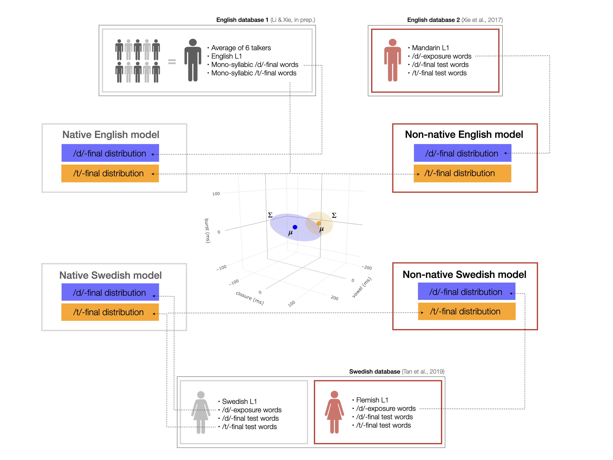

<style type="text/css">
div.main-container {
  max-width: 1800px;
  margin-left: auto;
  margin-right: auto;
}
</style>

```{r rmarkdown setup, include=FALSE}
knitr::opts_chunk$set(echo = FALSE, 
                      message=FALSE, warning=FALSE, error=TRUE, cache = FALSE, fig.cap="left-aligned")
```


```{r preamble, message=FALSE, warning=FALSE, error=FALSE, echo=FALSE, results='hide'}
rm(list=ls())
library(bookdown) # r markdown references to figures, tables, sections regardless of output format
library(MASS)
library(tidyverse)      # There is only one universe
library(magrittr)       # Pipes!
library(stringi)

library(knitr) 
library(kableExtra)     # more control over table formatting

library(lme4)           # mixed-effects analyses
library(lmerTest)       # p-values in LMMs
library(broom.mixed)    # easy extraction of information from LMMs
library(sjPlot)         # HTML tables of mixed models
library(emmeans)        # simple effects in LMMs
library(rms)

library(cowplot)        # multi-plot figures
library(plotly)         # 3D plotting 
library(shiny)          # tabs
library(ggpubr)
library(rstatix)
library(ggforce)
library(ggsignif)       # for significance stars on plots
library(gridExtra)

library(assertthat)
# devtools::install_github('kleinschmidt/daver')
library(daver)
# devtools::install_github("kleinschmidt/phondisttools")
library(phondisttools)
# devtools::install_github("hlplab/MVBeliefUpdatr")
library(MVBeliefUpdatr)
```

```{r constants and environments}
theme_set(
  theme_bw() + 
    theme(panel.border = element_blank(),
          axis.title.x = element_text(margin = margin(t = 20)),
          axis.title.y = element_text(margin = margin(r = 20)))
)

levels.Category = c("/d/", "/t/")
levels.Group = c("/d/-exposure", "control")
levels.Accent = c("non-native", "native")
levels.Language = c("Mandarin-accented English", "Flemish-accented Swedish")
levels.NativeLanguage = c("English", "Swedish")
colors.Group = c("red", "gray")
colors.Accent = colors.Group
colors.Category = c("blue", "orange")
colors.Language = c("cyan", "pink")
shapes.Category = c("circle","square")
```

```{r functions and pipes}
applyFactorLevels = function(d) {
  d %>%
    { if ("Language" %in% names(d)) mutate(., Language = 
                                             factor(Language, 
                                                    levels = levels.Language)) else . } %>%
    { if ("NativeLanguage" %in% names(d)) mutate(., NativeLanguage = 
                                                   factor(NativeLanguage, 
                                                          levels = levels.NativeLanguage)) else . } %>%
    { if ("Group" %in% names(d)) mutate(., Group = 
                                          factor(Group, 
                                                 levels = levels.Group)) else . } %>%
    { if ("Accent" %in% names(d)) mutate(., Accent = 
                                           factor(Accent, 
                                                  levels = levels.Accent)) else . } %>%
    { if ("Sound" %in% names(d)) mutate(., Sound = 
                                          factor(Sound, 
                                                 levels = levels.Category)) else . } %>%
    { if ("Used_for.Model.NativeLanguage" %in% names(d)) mutate(., Used_for.Model.NativeLanguage = 
                                                                factor(Used_for.Model.NativeLanguage, 
                                                                       levels = levels.NativeLanguage)) else . } %>%
    { if ("Used_for.Model.Group" %in% names(d)) mutate(., Used_for.Model.Group = 
                                                          factor(Used_for.Model.Group, 
                                                                 levels = levels.Group)) else . } %>%
    { if ("Used_for.Model.Sound" %in% names(d)) mutate(., Used_for.Model.Sound = 
                                                         factor(Used_for.Model.Sound, 
                                                                levels = levels.Category)) else . }
}

applyContrasts = function(d) {
  within(d, {
    contrasts(NativeLanguage) <- cbind("=Swedish vs. English" = c(-1,1))
    contrasts(Group) <- cbind("=/d/-exposure vs. control" = c(1,-1))
    contrasts(Sound) <- cbind("=/d/ vs. /t/" = c(1,-1))
  })

  # contrasts(d.test$NativeLanguage)
  # contrasts(d.test$Group)
  # contrasts(d.test$Sound)
}

insertLayer <- function(P, after=0, ...) {
  #  P     : Plot object
  # after  : Position where to insert new layers, relative to existing layers
  #  ...   : additional layers, separated by commas (,) instead of plus sign (+)
  if (after < 0)
    after <- after + length(P$layers)
  
  if (!length(P$layers))
    P$layers <- list(...)
  else 
    P$layers <- append(P$layers, list(...), after)
  
  return(P)
}

get_axes = function(.data, .data.test = NULL, cues) { 
  if(substr(cues[1], 1, 1) == "r")
  cue.names = paste(cues, "(ms)")
  cue.names = ifelse(substr(cue.names, 1, 1) == "r", 
                     paste("", substr(cue.names, 2, nchar(cue.names))), 
                     cue.names)

  if(!is.null(.data.test))
    .data %<>% full_join(.data.test)
  

  # axis setting 
  axx <- list(
    title = cue.names[1],
    nticks = 4,
    range = range(.data[, cues[1]]),
    gridwidth = 2
  )
  axy <- list(
    title = cue.names[2],
    nticks = 4,
    range = range(.data[, cues[2]]),
    gridwidth = 2
  )
  axz <- list(
    title = cue.names[3],
    nticks = 4,
    range =  range(.data[, cues[3]]),
    gridwidth = 2
  )
  
  return(list(axx, axy, axz))
}
```


# Overview

This supplementary information describes the results and methods of the perception experiments on Mandarin-accented English and Flemish-accented Swedish, as well as the development and evaluation of the ideal observer models. The experiment on Mandarin-accented English [@xie2017more] found an effect of exposure to the non-native-accented sound (syllable-final /d/) on subsequent /d/- and /t/-goodness ratings. This effect has been replicated in two other paradigms (identification and priming) using the same stimuli Xie et al. [@xie2017more]. Additionally, an earlier priming study found the same type of benefit for exposure to syllable-final /d/ in Dutch-accented English (Dutch, like Flemish, exhibits final devoicing, partially or completely neutralizing stop voicing in the syllable final position). In contrast to these previous studies, the experiment on Flemish-accented Swedish did *not* find a significant effect of exposure on subsequent /d/ and /t/-goodness ratings.

We begin by summarizing the methods and results of the two experiments. We find that the native Swedish listeners had an easier time understanding the Flemish-accented speaker than the American listeners had understanding the Mandarin-accented English speaker. This showed in the lexical decision accuracy during exposure, as well as the goodness ratings during test. Throughout the presentation, we review methodological differences between the two experiments and whether they are likely to explain the difference in results. The upshot of this review is that the Swedish null result seems to be *at least in part* driven by the phonetic characteristics of the Flemish-accented speech in our recordings---specifically, that the phonetic distribution of syllable-final /d/ in the Flemish-accented recordings deviated less from typical native Swedish than the phonetic distributions of syllable-final /d/ in the Mandarin-accented recordings deviated from typical American English. Such a difference in the 'non-nativeness' between the Flemish- and Mandarin-accented recordings could be particular to the specific recordings used in the experiment, reflect the talker-specific pronunciation of the speaker we recorded (e.g., due to differences in non-native proficiency), or reflect more general differences between Flemish-accented Swedish and Mandarin-accented English. 

Regardless of the specific source of the difference between the Flemish- and Mandarin-accented recordings, the question arises how to *predict* the effect of exposure on native listeners' perception given a specific set of non-native-accented speech stimuli. This motivates the present study: we sought to present a simple but principled approach to quantify the predicted effect of exposure on subsequent perception (here /d/- and /t/-goodness ratings, though the approach we present generalizes to identification tasks). Ideal observers provide a tool for this purpose, making it possible to predict the effect of exposure on ratings with zero computational degrees of freedom based on only 1) the phonetic properties of the non-native-accented exposure stimuli, 2) the phonetic properties of the  non-native-accented test stimuli, and 3) the phonetic properties of native-accented speech. The third and final component requires some estimates of the phonetic distributions of `typical' native-accented speech. We thus introduce and describe additional data sets containing information about native pronunciations of the same materials used in the perception experiments on non-native-accented speech. 

## Overview of data organization

In Sections \@ref(sec:perception-methods) and \@ref(sec:perception-results), we work exclusively with the perception data from the English and Swedish experiments. The perception data is split into the exposure data (`d.exposure`) and the test data (`d.test`). In Sections \@ref(sec:IO-methods), we use phonetic annotations from both the two experiments and additional sources (together combined into `d.stims`) to train ideal observers (`d.training`) that are then stored in a separate data frame (`d.IO`). Finally, Section \@ref(sec:IO-results) combines the ideal observers with the perception data from the test phase of the two experiments (`d.test`) into one data frame that contains the posterior probabilities, identification decisions, and /d/-goodness ratings predicted by the various ideal observers for each of the test trials from the experiments (`d.test.IO`).


# Methods of perception experiments {#sec:perception-methods}

We describe the methods used to derive the English [@xie2017more] and Swedish data sets. Both experiments employed an exposure-test paradigm. Exposure was manipulated between participants. Both groups were exposed to non-native-accented speech from the same talker (Mandarin-accented English for the English data; Flemish-accented Swedish for the Swedish data). The two groups of participants differed, however, in whether the exposure materials contained information about the critical phonological category (syllable-final /d/), for which the foreign accent is known to deviate from native pronunciations. The control group never heard any instances of syllable-final /d/ or /t/. The /d/-exposure group heard words with syllable-final /d/, but no words with syllable-final /t/. Following exposure, both groups went through the exact same test phase, during which they made goodness judgments of /d/- or /t/ tokens that were part of minimal pairs (e.g., "seed" or "seat").

In addition to the native-non-native language pairs (Mandarin-accented English vs. Flemish-accented Swedish) and participants' native (American English vs. Swedish), the two experiments exhibited a number of differences that we detail next. This includes differences in i) the number of participants, ii) the instructions and visual appearance of the experiment, iii) the number of stimuli, and iv) minor differences in the stimuli design. This summary aims to be exhaustive and to err on the side of listing differences regardless of whether we believe them to be relevant. For each difference, we describe the design consideration that motivated it, or whether it arose due to misunderstandings/mistakes. We also discuss whether the methodological differences can plausibly explain the differences in results between the two experiments, and what this would entail.

## Amount of data 
Compared to the English experiment, the Swedish experiment had substantially fewer participants (about 50\% fewer) and employed fewer test tokens than the English experiment (about 50\% fewer). This raises questions as to whether the resulting reduction in power could cause a Type II error for the Swedish data. 

### English 
48 monolingual English speakers participated in the experiment (24 /d/-exposure, 24 control). Each participant rated each word (one of the pair) both for goodness as /d/ and for goodness as /t/, resulting in 30 ratings per sound category (/d/ vs. /t/) per rating type (goodness as /d/ vs. goodness as /t/) and 120 ratings per participant.

**Total observations:**  48 \* 30 \* 2 \* 2 = 5760 

### Swedish
25 Swedish speakers recruited from the Department of Swedish \& Multilingualism at Stockholm University participated. Two of the participants were excluded from the analysis because post-experiment surveys found that they were not native speakers of Swedish. Participants were alternately assigned to the /d/-exposure or control group (11 /d/-exposure, 12 control). Each participant rated each word (one of the pair) either for goodness as /d/ or for goodness as /t/, resulting in 16 ratings per sound category (/d/ vs. /t/) per rating type (goodness as /d/ vs. goodness as /t/) and 64 ratings per participant.

**Total observations:**  23 \* 15 \* 2 \* 2 = 1380

### Why the difference?

The decision to recruit a smaller number of participants was made because 1) the Swedish experiment was conceived as pilot experiment for a larger series of experiments still to be conducted, and 2) other previous studies had found significant effects with a similarly small number of participants (12 participants for each of two conditions in @eisner2013constraints).

### What are the expected consequences of this difference?
Power analyses presented in Section \@ref(sec:bootstrap) find that a) the English and Swedish experiment indeed differed in the statistical power they provided, and b) that the difference in statistical power is *highly unlikely* to explain the difference in results between the two experiments.


## Recording of materials {#sec:recording}

By design, the two experiments differ by design in the native-non-native background of the recorded speaker. Additionally, the two experiments differed in the recording procedure. Whereas the English recordings was elicited without playing a native pronunciation (*unassisted*), the Swedish recordings were elicited by first playing a native pronunciation of the target word (*assisted*). Both the non-native talkers were selected based on experimenters' judgments of their accentedness. We cannot conclude that these two speakers were identical in their overall intelligibility and it is very unlikely that they are comparable in overall perceived accentedness.

### English
Recordings were made of a male native-Mandarin speaker who was a late second language learner of English. This speaker was an undergraduate student enrolled in a U.S. university and had resided in the United States for 18 months at the time of recording. Recordings were made in a sound-proof room using a microphone onto a digital recorder, digitally sampled at 44.1 kHz and normalized for root mean square amplitude to 70 dB sound pressure level. 


### Swedish
Recordings were made of a 25-year old, female native speaker of the Brabantish dialect of Central Flanders, with level A1 (CEFR) knowledge of Swedish at the time of recording. Additionally, recordings were made of a female native Swedish speaker of similar age (36). These recordings served as native exemplars for the Flemish speaker. 

Recordings were made in a sound-attenuated room at the Stockholm University Multilingualism Lab. Each trial started with a recording of the target word by the native Swedish speaker, played over Sony MDR-7506 headphones at a comfortable volume. Simultaneously and throughout the trial, the target word was displayed on a computer screen placed within a comfortable viewing distance. An audible beep was played after 2 seconds from trial onset (after the native recording had finished playing) to cue production of the target. Words were spoken into an Audio-Technica AT3035 microphone, placed directly in front of the speaker. Recordings were sampled at 44.1kHz. The experimenter controlled the presentation of each word which appeared three times in random order in order to give the speaker sufficient time and opportunity to say the words correctly. Recording samples were screened for vowel mispronunciation (e.g. mispronouncing a long vowel as short) and excluded from consideration. The word lists were divided into exposure /d/-final words, filler words, replacement words, and test words. These were recorded in separate sessions. Minimal pair test words were presented in separate lists to avoid deliberate contrastive hyper-articulation.

### Why the difference?
The difference in the L1-L2 background of the recorded speaker was part of the design. The central purpose of the Swedish experiment was to replicate the findings of @xie2017more and @eisner2013constraints for another L1-L2 combination. Whether differences between native and non-native accents in the statistics of the cue distributions for /d/ and /t/ could explain the results is the purpose of the present paper (regardless of whether these differences are caused by the L1-L2 pairing, the specific speaker that was recorded, or any other aspect of the recording procedure).

The decision to use an assisted recording procedure for the Swedish experiment was made because the non-native speaker was still in the early stages of non-native acquisition (A1 CEFR). In particular, Swedish has a complex vowel system, with many vowel categories that have no counterparts in the speakers' L1 (Flemish). Furthermore, the mapping from orthography to pronunciation is non-transparent in Swedish. As would be expected, the non-native speaker struggled with vowel pronunciation. After an initial *un*assisted recording session, we therefore decided to re-record the Flemish speaker in the assisted condition. The perception experiment employed the recordings from this latter recording session.

### What are the expected consequences of this difference?
The two recording equipment and environments were similar across the two experiments. Care was taken in both experiments to elicit recording free of noticeable background noise. All three cues (vowel, closure, and burst duration) are durational and therefore unlikely to suffer from minor differences in recording quality. The materials for both experiments are available via OSF. 

The differences in the instructions during recording, however, might affect how native-like the recordings of the non-native speaker sound. In previous analyses, we have found that the recording procedure indeed had a strong effect on the pronunciations of the non-native speaker (Tan, Xie, \& Jaeger, 2019). Specifically, we found that the category means of /d/ and /t/ in either of the two recording conditions differed significantly from the native pronunciations of the native speaker whose recordings were used in the assisted condition. However, the recordings in the unassisted condition differed significantly more from the native-accented speech, both in terms of the number of cue dimensions along which the non-native speech differed from native speech and in terms of the degree of difference (for details, see @tan2019analysing).

It is therefore possible that the decision to use stimuli from the assisted recording condition caused the null effect of /d/-exposure. This would not, however, make the analyses we present here any less relevant for future work. *Any* experiment on speech perception is based on a finite set of speech stimuli. These stimuli can be more or less representative of 'typical' speech from that talker or speech community. In no case, however, is any single experiment going to reflect the range of speech styles and talker types that are present in the speech community. While this raises interesting questions about the generalisability of research on speech perception (for discussion, see @xie2020comparing), these questions are orthogonal to the more modest goal we pursue here: to predict, for a given set of exposure and test stimuli, what consequences exposure is likely to have on listeners' perception and identification responses during test. This is the question the ideal observer analyses in Sections \@ref(sec:IO-methods) and \@ref(sec:IO-results) address.
<!-- Maryann, Xin: commented out for now but we might add this in later: In Section \@ref(sec:unassisted), we report a comparison of the IO's predictions for the non-native-accented stimuli recorded in the unnassisted condition and those recorded in the assisted condition. This comparison predicts that a perception experiment with the recordings from the unassisted condition would be substantially more likely to elicit a benefit of /d/-exposure. -->


## Exposure stimuli and procedure

During exposure, participants performed a lexical decision task. Recordings were played over headphones at a comfortable volume. Participants were instructed to decide whether the word they heard was a real word or not. Order of presentation was randomized across participants.

The full list of stimuli is available in Section \@ref(sec:stimuli) for both Swedish and English. In both experiments participants in both groups heard a total of 180 words, including the same 60 filler words in the respective languages and 90 pseudowords that obeyed English or Swedish phonotactical rules. The remaining 30 words were the critical words, manipulated between exposure groups. 

### English
The /d/-exposure group heard 30 critical words ending with \/d\/, and without \/t\/-final minimal pair neighbors (e.g. \textit{overload}). The 30 replacement words for the control group (e.g., animal) were matched to the critical /d/-words in syllable length and mean lemma frequency (based on CELEX, @baayen1995celex). 

All words or pseudowords were multisyllabic and contained two to four syllables. Other than the critical /d/-final words, no other alveolar stops, voiced stops, dental fricatives, and postalveolar affricates occured. The voiceless stops (/k/ and /p/) did not appear in word-final position. 

### Swedish
The /d/-exposure group heard 30 critical words ending with /d/, and without /t/-final minimal pair neighbors (e.g. \textit{episod}). The 30 replacement words for the control group did not contain \/d, t, b, g\/, and were matched in syllable length and average base form frequency (based on a 25 million word database from selected corpora from Språkbanken, https://spraakbanken.gu.se/korp, accessed January 2019). 

All words or pseudowords were multisyllabic and contained two to four syllables. Other than the /d/-final critical words, all stimuli were chosen to avoid voiced stops as well as /t/ in any position (i.e., no /d, t, b, g/). The other two voiceless stops (/k/ and /p/) were kept at a minimum but not fully avoidable in order to have a sufficent number of exposure words however they did not appear in word-final position. 

Unintended by the design, one critical word in the /d/-exposure group contained a word-medial syllable-initial /d/ (*medellivslangd*---'average life span'), one pseudoword contained word-medial syllable-initial /d/ (*mörvinder*---'meaningless'), and one pseudoword contained word-final /t/ (*spållrivet*---'meaningless'). 

### Why the difference?
Other than the three unintended occurences of /d,t/, differences between the English and Swedish exposure stimuli were a result of the constraints imposed by the two languages and the goal to balance word frequency across the two exposure groups. Under those constraints, complete avoidance of all stops other than syllable-final /d/ in the /d/-exposure group was not possible.

### What are the expected consequences of this difference?
The  occurrence of word-medial syllable-initial /d/ and word-final /t/ in the pseudoword list are unlikely to explain the null effect for the Swedish data. First off, participants reliably categorized these words as pseudowords (M = 0.96, SD = 0.19). This also means that these two exposure stimuli were not lexically labeled, so that participants did not get information as to whether these stimuli were meant to be pronunciations of /d/ or /t/. Even if participants gathered information from these pronunciations, it is unlikely that the two tokens alone (heard by both groups) led to so much adaptation that no further difference between exposure group could be detected.

Finally, the word-medial /d/ in *medellivslängd* was only heard by the /d/-exposure group and thus cannot not have affected adaptation in the control group. It is also unlikely that the occurrence of syllable-initial /d/ strongly affected adaptation in the the /d/-exposure group. On the one hand, only syllable-final stops are devoiced in Flemish, so that the syllable-initial /d/ pronunciation of the Flemish-accented speaker is unlikely to deviate as strongly from native Swedish pronunciation. But participants in the /d/-exposure group heard 30 words with syllable-final /d/, all of which deviated from native pronunciation. Even if both the two pseudowords and the word-medial /d/ in *medellivslängd* somehow affected participants' ratings during test, we would expect that the 30 critical exposure words with syllable-final /d/ would affect participants' ratings over and above that effect.


## Test stimuli and procedure

The test phase followed immediately after the exposure phase. In both experiments, the test phases started with two blocks in which participants rated recordings of /d,t/-final minimal pair words. Specifically, participants were asked to rate the final sound of the words on a 1-7 scale for how good an example that sound was for the named category (either /d/ or /t/), with 1 being the worst rating and 7 being the best. In one of these two test blocks, participants rated /d/-goodness. In the other test block, they rated /t/-goodness. The two words of a minimal pair never occurred within the same block. The order of the two blocks was counter-balanced across participants. Within each block, order of presentation was randomized across participants.

### English
The test stimuli included 60 monosyllabic minimal pairs ending in /d/ or /t/ (e.g., seed–seat). Other than the final stops, the same restrictions on sounds as in the exposure words were applied here. Across participants, all test words were rated both for /d/-goodness and for /t/-goodness (individual participants rated each word only for *either* /d/- *or* /t/-goodness).

### Swedish 
The Swedish experiment employed fewer test stimuli (64 \/d-\/t\/-final words from 32 minimal pairs,  e.g., *röd*---'red', *comm. gen.* and *röt*---'shout', *pret.*).  Additionally, test words were allowed to have word-initial voiced stops (other than /d/, e.g. *bädd-bett*).

Two pairs, (*vård-vårt* and *hård-hårt*) were excluded from analysis as it was discovered that dental stops preceded by /r/ in Swedish are pronounced differently as retroflexed variations of /d,t/ and therefore would not have been consistent with the rest of the set. This left 30 minimal pairs for analysis (and the test of the ideal observers in Section \@ref(sec:IO-results)).

Due to a misunderstanding, the Swedish data did not counter-balance whether a word recording was rated for /d/- or for /t/-goodness (e.g., the word *rid*---'ride' was always rated for /d/-goodness; the word *rit* ---'rite' was always rated for /t/-goodness; across minimal pair words, /d/- and /t/-final words were equally often rated for /d/- and /t/-goodness). This is unlikely to cause any problems: as shown in Figure \@ref(fig:rating-to-rating-correlation) /d/- and /t/-goodness ratings were almost perfectly inversely correlation, so that the gain in information from having each word rated for both /d/- and /t/-goodness (across participants) is minimal.

Finally, the Swedish experiment contained a third and fourth test block during which participants rated 54 words from 27 /d/-/t/-*initial* minimal pairs (e.g., *dom* and *tom*) for their /d/- or /t/-goodness. The relative order of these later test blocks (/d/- or /t/-goodness ratings) was counter-balanced across participants but participants always completed the test block with word-final ratings *before* performing the word-initial ratings. The data from word-initial ratings tasks are not part of the current analysis, though we note that exposure group did not affect the Swedish word-initial ratings either.

### Why these differences?

The Swedish experiment employed fewer test tokens because it was difficult to find additional minimal pairs for Swedish. While there are many /d/-/t/-final minimal pairs in Swedish, a large number of them share the same stem (e.g., *hård*---'hard', *comm. gen., adverb'* and *hårt*---'hard', *neut., adj.*). As the materials designed for this pilot was done in conjunction with the planning of a similar study involving priming, materials of this type would have been unsuitable and therefore excluded. The limited options also motivated the decision to allow test stimuli in which voiced stops (other than /d/) occurred at the word onset.

The additional test blocks with /d/- or /t/-initial minimal pair words were included in the Swedish experiment in order to investigate the question of whether exposure to devoiced /d/-final words might result in higher goodness ratings for /d/- or /t/-initial words (building on @eisner2013constraints).  

# Results of perception experiment {#sec:perception-results}

We compare the results of the perception experiments on English and Swedish. We first compare lexical decision accuracy during exposure. Then we compare the effect of the exposure manipulation on ratings of /d/-goodness during test. 

```{r load rating experiments, results='hide'}
# Swedish rating data
d.swedish = read_csv(file = "../data/Swedish/Swedish_perception_rating_exposure+test_Tan et al 2020.csv")
# English rating data
d.english.exposure <- read.csv("../data/English/English_perception_rating_exposure_Xie et al 2017.csv")
d.english.test <- read.csv("../data/English/English_perception_rating_test_Xie et al 2017.csv")

# Standardize variable names for Swedish
d.swedish %<>%
  dplyr::rename(
    Participant = participant,
    Item.WordID = item,
    Item.Type = item_cond,
    Item.Filename = sound,
    LD.Expected = corr_ans,
    LD.Response = key_resp_2.keys,
    LD.Correct = key_resp_2.corr,
    LD.RT = key_resp_2.rt,
    Rating.for = rating_for,
    Rating.Response = rating_1.response,
    Rating.RT = rating_1.rt,
    Block.Order = block_id) %>%
  mutate(
    Language = "Flemish-accented Swedish",
    NativeLanguage = "Swedish",
    Block.Type = gsub("^([A-Z]).*$", "\\1", Item.Type),
    Block.Type = case_when(
      Block.Type == "E" ~ "exposure",
      Block.Type == "T" ~ "test",
      T ~ NA_character_
    ),
    Participant = paste0("S", Participant),
    # Do not move the next line from here (order sensitive)
    ItemTemp = gsub("^[A-Z]([A-Z]+)$", "\\1", Item.Type),
    Item.WordStatus = factor(case_when(
      ItemTemp == "NW" ~ "pseudoword",
      ItemTemp %in% c("FW", "CW", "TW", "TF", "DF", "TI", "DI") ~ "word",
      T ~ NA_character_
    )),
    Item.Type = factor(case_when(
      ItemTemp %in% c("NW", "FW") ~ "filler",
      ItemTemp %in% c("CW", "TW") ~ "critical",
      ItemTemp %in% c("TF", "DF", "TI", "DI") ~ "test",
      T ~ NA_character_
    )),
    Sound = factor(case_when(
      ItemTemp %in% c("DI", "DF", "TW") ~ "/d/",
      ItemTemp %in% c("TI", "TF") ~ "/t/",
      T ~ NA_character_
    ), levels = levels.Category),  
    Sound.Position = case_when(
      ItemTemp %in% c("TF", "DF", "TW") ~ "final",
      ItemTemp %in% c("TI", "DI") ~ "initial",
      T ~ NA_character_
    ),
    Item.Word = str_replace(stri_trans_general(
      Item.Filename, 
      "Latin-ASCII"),
      "^[A-Z]+_[0-9]+_([a-z]+)_.*$", "\\1"),
    # For exposure trials, set Item.Minimal ID to NA. For the test trials, extract
    # ID from filename
    Item.MinimalPair = 
      ifelse(Block.Type == "exposure", 
             NA, 
             paste0("S", tolower(gsub("^[A-Z]+_([0-9]+)_.*$", "\\1", Item.Filename)))),
    # For exposure trials, use Item.WordID. For test trials, this is ambiguous since both
    # words of a minimal pair currently have the same Item.WordID. So change it for test
    # trials so that these words have unique IDs (the minimal pair ID plus d or t)
    Item.WordID = 
      ifelse(Block.Type == "exposure", 
             paste0("S", Item.WordID),
             paste0(Item.MinimalPair, ifelse(Sound == "/d/", "d", "t"))), 
    # One word ("nod") occurs twice. Make sure it has a unique Item.Word value.
    Item.Word = ifelse(Item.MinimalPair == "S15" & Item.Word == "nod", 
                       "nod15", as.character(Item.Word)),
  ) %>%
  group_by(Participant) %>%
  mutate(
    Group = if(sum(ifelse(ItemTemp == "TW", 1, 0)) == 0) 
      "control" else "/d/-exposure",
    Trial = row_number()
  ) %>%
  ungroup() %>%
  # Delete variable no longer necessary
  mutate(    
    listname = NULL,
    group = NULL,
    ItemTemp = NULL,
    position = NULL,
    X1 = NULL,
    X = NULL
  ) %>%
  # Order columns
  dplyr::select(Language, 
         NativeLanguage, 
         Group, Participant,
         Block.Type, Block.Order,
         Trial, 
         Item.MinimalPair, Item.WordID, Item.Type, Item.Word, Item.WordStatus, Item.Filename,
         Sound, Sound.Position, 
         LD.Expected, LD.Response, LD.Correct, LD.RT,
         Rating.for, Rating.Response, Rating.RT)

# Swedish exclusion
d.swedish %<>%
  # Remove participants 100 & 111 because they are nonnative
  filter(!Participant %in% c("S100", "S111")) %>%
  # Remove the second test block with /d,t/-initial sounds
  filter(is.na(Sound.Position) | Sound.Position == "final") %>%
  # Remove the 4 test items because -rd and -rt are pronounced differently in Swedish than d/t in other context
  filter(! Item.Word %in% c("voart", "voard", "hoart", "hoard")) %>%
  droplevels()

# Standardize variable names for English
d.english.test %<>%
  rename(
    Item.Word = Word,
    Item.MinimalPair = MinimalPairID,
    Rating.Response = Rating.Answer,
    Rating.RT = RT) %>%
  mutate(
    Language = "Mandarin-accented English",
    NativeLanguage = "English",
    Participant = paste0("E", Participant),
    Group = ifelse(Group == "experimental", "/d/-exposure", "control"),
    Block.Type = "test",
    Item.MinimalPair = paste0("E", Item.MinimalPair),
    Item.WordID = paste0("E", as.numeric(as.factor(Item.Word))),
    Item.Word = as.character(Item.Word),
    Sound = paste0("/", Sound, "/"),
    Sound.Position = "final",
    Session = NULL,
    Subject = NULL)

# Combine Swedish and English *test* data
d.test = d.swedish %>%
  filter(Block.Type == "test", Sound.Position == "final") %>%
  dplyr::select(Language,
         NativeLanguage,
         Group, Participant,
         Block.Type, Block.Order,
         Trial, 
         Item.MinimalPair, Item.WordID, Item.Type, Item.Word, 
         Sound, Sound.Position, 
         Rating.for, Rating.Response, Rating.RT) %>%
  full_join(d.english.test) %>%
  # Convert to /d/-goodness ratings and then zscore that rating
  mutate(Rating.Response.d = ifelse(Rating.for == "d", Rating.Response, 8 - Rating.Response)) %>%
  group_by(NativeLanguage, Group, Participant) %>%
  mutate(Rating.Response.d.zscored = as.numeric(scale(Rating.Response.d))) %>%
  ungroup() %>%
  # Create factors
  mutate_at(
    c("Participant", 
      "Block.Order", "Block.Type", 
      "Item.MinimalPair", "Item.WordID", "Item.Word",
      "Sound.Position",
      "Rating.for"),
    .funs = factor
  ) %>%
  applyFactorLevels()

# Combine English and Swedish *exposure* data 
d.exposure = 
  d.swedish %>%
  filter(Block.Type == "exposure") %>%
  dplyr::select(Language, NativeLanguage, Group, Participant, 
         Block.Type, Item.Type, Item.WordStatus,
         LD.Correct, LD.RT) %>%
  # Expand the English data so that we can have a combined tibble
  full_join(d.english.exposure %>%
              pivot_longer(
                cols = filler:Accuracy,
                names_to = "Item.Type",
                values_to = "accuracy"
              ) %>%
              filter(Item.Type != "Accuracy") %>%
              crossing(LD.Correct = c(0,1)) %>%
              mutate(
                Language = "Mandarin-accented English",
                NativeLanguage = "English",
                # Participants were renumbered in the English test-data. 
                # Making sure that IDs match across exposure and test data.
                Participant = ifelse(Group == "/d/-exposure",
                                     paste0("E", Participant + 100),
                                     paste0("E", Participant + 200)),
                Item.WordStatus = ifelse(Item.Type == "non.word", "pseudoword", "word"),
                Item.Type = ifelse(Item.Type == "non.word", "filler", Item.Type),
                Block.Type = "exposure",
                LD.RT = NA,
                Count = case_when(
                  Item.Type == "pseudoword" ~ 90,
                  Item.Type == "filler" ~ 60,
                  Item.Type == "critical" ~ 30
                ),
                Count = case_when(
                  LD.Correct == 1 ~ round(Count * accuracy, 0),
                  LD.Correct == 0 ~ Count - round(Count * accuracy, 0)
                ),
                accuracy = NULL) %>%
              group_by(Language, NativeLanguage, Group, Participant, 
                       Block.Type, Item.Type, Item.WordStatus, 
                       LD.Correct) %>%
              tidyr::expand(Count = 1:Count) %>%
              mutate(Count = NULL),
            by = c("Language", "NativeLanguage", "Group", "Participant", 
                   "Block.Type", "Item.Type", "Item.WordStatus", 
                   "LD.Correct")) %>%
  mutate_at(
    c("Participant", "Block.Type", "Item.Type", "Item.WordStatus"),
    .funs = factor
  ) %>%
  applyFactorLevels()

save(d.exposure, file = "../data/data_perception_exposure phase_both languages.Rdata")
save(d.test, file = "../data/data_perception_test phase_both languages.Rdata")
```

## Lexical decision accuracy during exposure

```{r functions for exposure data}
# Pipes
get_LD_byParticipant = . %>% 
  filter(Block.Type == "exposure") %>%
  group_by(Language, NativeLanguage, Group, Participant) %>% 
  summarise(
    Accuracy = mean(LD.Correct, na.rm = T),
    RT = mean(LD.RT, na.rm = T)) 

get_LD.Accuracy_byGroup = . %>% 
  get_LD_byParticipant() %>% 
  group_by(Language, NativeLanguage, Group) %>% 
  summarise(mean = mean(Accuracy, na.rm = T), 
            sd = sd(Accuracy, na.rm = T)) %>%
  ungroup() %>%
  mutate_at(c("mean", "sd"),
            .funs = function(x) 100 * round(x, 3))

get_LD.RT_byGroup = . %>% 
  get_LD_byParticipant() %>% 
  group_by(Language, NativeLanguage, Group) %>% 
  summarise(mean = mean(RT, na.rm = T), 
            sd = sd(RT, na.rm = T)) %>%
  ungroup() %>%
  mutate_at(c("mean", "sd"),
            .funs = function(x) round(x, 1))

# functions
extract_columns <- function(data) {
  extracted_data <- data %>%
    dplyr::select(.dots = common_cols)
  return(extracted_data)
}

get_LD_performance = function(
  d, 
  language = levels.NativeLanguage, 
  group = levels.Group, 
  what = "accuracy",
  critical = F) {
  require(magrittr)
  
  if (critical) {
    d %<>% 
      filter(Item.Type == "critical") 
  }
  d %<>% 
    filter(NativeLanguage %in% language, Group %in% group) %>% 
    droplevels()
  
  if (what == "accuracy") {
    d %<>% get_LD.Accuracy_byGroup() 
    suffix = "\\%"
  } else if (what == "RT") {
    d %<>% get_LD.RT_byGroup()
    suffix = " sec"
  }
  
  text = ""
  for (l in language) {
    # If more than one language, add language to paste, otherwise not
    if (length(language) > 1) text = paste0(text, l, ", ")
    for (g in group) {
      text = paste0(
        text, 
        # If more than one group, add group to paste, otherwise not
        if (length(group) > 1) paste0(g, " group: ") else "",
        "M = ", 
        d[d$NativeLanguage == l & d$Group == g, "mean"], 
        suffix, ", SD = ",
        d[d$NativeLanguage == l & d$Group == g, "sd"],
        suffix)
      if (
        !and(
          l == language[length(language)], 
          g == group[length(group)])) 
        text = paste0(text, "; ")
    }
  }
  
  return(text)
} 
```

The analysis of the exposure data serves to make two points. First, lexical decision accuracy during exposure was high across exposure groups and experiments. In particular, we show that participants in the /d/-exposure group recognized the critical exposure words with syllable-final /d/ (and without minimal pair neighbors). This justifies the assumption of lexically-guided adaptation made by the ideal observer we introduce below. 

Second, lexical decision accuracy was substantially higher in the Swedish data. This is one piece of evidence suggesting that the Flemish-accented speaker being easier to process for native Swedish participants than the Mandarin-accented English speaker was for the American participants. 

### English
Lexical decision accuracy was high across both the /d/-exposure (`r get_LD_performance(d.exposure, "English", "/d/-exposure")`) and control group (`r get_LD_performance(d.exposure, "English", "control")`). Accuracy was also high for critical words, including words with syllable-final /d/ in the /d/-exposure group (`r get_LD_performance(d.exposure, "English", critical = T)`). No reaction time data was available.

### Swedish
Figure \@ref(fig:LD-accuracy) summarizes participants' accuracy and reaction time for during exposure. 
Lexical decision accuracy was high across both the /d/-exposure (`r get_LD_performance(d.exposure, "Swedish", "/d/-exposure")`) and control group (`r get_LD_performance(d.exposure, "Swedish", "control")`). Accuracy was also high for critical words, including words with syllable-final /d/ in the /d/-exposure group (`r get_LD_performance(d.exposure, "Swedish", critical = T)`). 

Reaction times were slower in the /d/-exposure group (`r get_LD_performance(d.exposure, "Swedish", what = "RT")`). The very high average reaction time for participant 101 in the /d/-exposure group was caused by a single outlier trial, on which the participant took 35 seconds to respond. The difference between exposure conditions does, however, persist if reaction times above 3.5 SDs away from a participant's mean RT are excluded (`r get_LD_performance(d.exposure %>% group_by(Participant) %>% filter(abs(scale(LD.RT)) < 3.5) %>% ungroup(), "Swedish", what = "RT")`).

This suggests that the syllable-final /d/ of the Flemish-accented speaker was indeed accented, leading to additional difficulty beyond whatever other difficulty participants might have experienced while processing the foreign accent.

(ref:LD-accuracy) Lexical decision accuracies and RTs in the Swedish experiment by exposure group: all words (left) or only critical words (right). For the /d/ exposure group, critical words have syllable-final /d/. For the control group, critical words are matched in average length and frequency, but do not contain /d/ (or /t/).

```{r LD-accuracy, fig.cap="(ref:LD-accuracy)", fig.height=4.5, out.width='75%', fig.show = 'hold'}
p = d.exposure %>%
  filter(NativeLanguage == "Swedish") %>%
  get_LD_byParticipant() %>%
  ggplot(
    aes(x = RT, 
        y = Accuracy, 
        label = Participant, fill = Group)) + 
  geom_label(alpha = .5) + 
  scale_x_continuous(
    name = "Mean Reaction Time",
    limits = c(0,3)) + 
  scale_y_continuous(
    name = "Mean accuracy", 
    breaks = c(0, 0.25, 0.5, 0.75, 1.0), 
    limits = c(0, 1.0)) + 
  scale_fill_manual(values = colors.Group) + 
  facet_wrap(~ Language) +
  theme(legend.position = "right")

l = get_legend(p)
p = p + theme(legend.position = "none")
plot_grid(
  plotlist = list(p, 
                  p %+% (d.exposure %>% 
                   filter(NativeLanguage == "Swedish" & Item.Type == "critical") %>%
                   get_LD_byParticipant())),
  nrow = 1, rel_widths = c(.45, .45, .1))
```

## Goodness ratings during test

We focus here on goodness ratings for test words ending in /d,t/. Unlike the English data, the Swedish data also contained ratings for words beginning with /d,t/. These ratings were always obtained *after* the ratings of /d/-final test words. Ratings of these /d/-intial test words are not analyzed here, though we mention for completeness's sake that /d/-initial test words also did not reveal a significant effect of exposure group for the Swedish data.

We note here that the two experiments differed in the number of subject and items during test. Bootstrap analyses presented later in the SI assess whether this difference in the amount of test data could explain the difference in results. Here we first compare the two data sets using linear mixed-effects models, which do not require data to be balanced. 

### Preparing /d/- and /t/-goodness ratings for analysis

(ref:rating-to-rating-correlation) /d/-goodness ratings during test (z-scored) by native language and exposure group

```{r rating-to-rating-correlation, fig.cap='(ref:rating-to-rating-correlation)', fig.height=4.5, out.width='75%'}
d.test %>%
  filter(NativeLanguage == "English") %>%
  droplevels() %>%
  group_by(Group, Participant) %>%
  mutate(Rating.Response.zscored = as.numeric(scale(Rating.Response))) %>%
  group_by(Language, Group, Item.Word, Rating.for) %>%
  summarise(Rating.mean = mean(Rating.Response.zscored)) %>% 
  pivot_wider(names_from = "Rating.for",
            values_from = "Rating.mean") %>%
  ggplot(
    aes(x = d, y = t, label = Item.Word)
  ) + 
  geom_label(alpha = .5, aes(fill = Group)) + 
  geom_smooth(method = "lm", color = "black", alpha = .5) +
  scale_x_continuous("/d/-goodness rating (z-scored)") +
  scale_y_continuous("/t/-goodness rating (z-scored)") +
  scale_color_manual(values = colors.Group) +
  scale_fill_manual(name = "Exposure group", values = colors.Group) +
  facet_wrap(~ Language) +
  theme(legend.position = "top")
```


The /d/- and /t/-goodness ratings could range from 1 to 7. The two types of ratings were highly inversely correlated (see Figure \@ref(fig:rating-to-rating-correlation)). To simplify data analysis, we thus converted  all goodness ratings into /d/-goodness ratings. For /t/-goodness ratings, this means that we subtracted them from 8 (i.e., if a token was given a /t/-goodness of 3, it is transformed to have a /d/-goodness of 5). This decision does not affect the results: all results remain the same if the original ratings are analyzed while including `rating.for` (/d/- vs. /t/-goodness) and all its interactions as a predictor in the analysis. Following @xie2017more, we then z-scored /d/-goodness ratings within participants, by subtracting the participant's mean and dividing by the participant's standard deviation. 

### Results {#sec:results}

(ref:ratings-results) /d/-goodness ratings during test (z-scored) by native language and exposure group

```{r ratings-results, fig.cap="(ref:ratings-results)", fig.height=4.5, out.width='75%'}
p.results.perception = d.test %>%
  group_by(Language, NativeLanguage, Group, Sound, Participant) %>%
  summarise(Rating.mean = mean(Rating.Response.d.zscored)) %>%
  ggplot(mapping = aes(x = Sound, y = Rating.mean)) + 
  stat_summary(aes(fill = Group), fun = mean, geom = "bar", 
               alpha = .6,
               position = position_dodge(.93)) +
  stat_summary(aes(group = Group), fun.data = mean_cl_boot, geom = "linerange", 
               size = .8, 
               position = position_dodge(.9)) +
  scale_x_discrete("Intended sound category") +
  scale_y_continuous("/d/-goodness rating (z-scored)") +
  scale_color_manual(values = colors.Group) +
  scale_fill_manual(name = "Exposure group", values = colors.Group) +
  facet_grid(. ~ Language, scales="free_y") +
  theme(legend.position = "top",
        panel.grid.major.x = element_blank(),
        panel.grid.minor.x = element_blank())
ggsave(p.results.perception, filename = "../figures/Result-ratings.png",
       width = 7, height = 4)

p.results.perception.bySubject = insertLayer(
  p.results.perception, 
  after = 0,
  geom_dotplot(aes(fill = Group), color = NA, 
               alpha = 1,  dotsize = 0.5, 
               binaxis = "y", stackdir = "center", 
               position = position_dodge(.9)))

stat.test <- t_test(
  data = d.test %>%
  group_by(Language, NativeLanguage, Group, Sound, Participant) %>%
  summarise(Rating.mean = mean(Rating.Response.d.zscored)) %>% 
    group_by(Language, NativeLanguage, Sound),
  Rating.mean ~ Group, 
  var.equal = F, 
  paired = F) %>% 
  mutate(signif = ifelse(p <= .05, "*", "ns"))

p.results.perception.bySubject + 
  scale_y_continuous("Mean /d/-goodness ratings\n(z-scored) by subject") +
  stat_pvalue_manual(
    stat.test %>% add_x_position(x = "Sound", dodge = .9), 
    y.position = 1,
    label = "signif",
    remove.bracket = FALSE,
    bracket.size = 0.3,
    tip.length = .006)
```

Figure \@ref(fig:ratings-results) shows the z-scored /d/-goodness ratings from both experiments. To compare participants' ratings for the /d,t/-final test words across the two experiments, we conducted a linear mixed-effects regression [@baayen2008mixed] over the combined data from both experiments. The regression predicted z-scored /d/-goodness ratings based on the sound category (sum-coded: 1 = word recording intended to end in /d/ vs. -1 = word recording intended to end in /t/), exposure group (sum-coded: 1 =  /d/-exposure vs. -1 = control), the experiment (sum-coded: 1 = Swedish vs. -1 = English), and all their interactions. The regression contained the maximal random effect structure justified by the design (random by-participant intercepts and slope for sound; random by-item intercepts and slopes for sound, exposure group, and their interaction).^[Even this simplified model estimated the variance of the by-participant intercepts to be zero (see below), presumably because the z-scoring of ratings within participant already removed that variance. If all by-participant random effects are excluded, the results reported below do not change. If non-z-scored ratings are analyzed instead (unlike in previous work), the three-way interaction is no longer significant ($p = .11$).]

For the by-participant random effects, we had to remove the random slope for sound in order for the model to converge without perfect correlations. All other random correlations are included in the model. Table \@ref(tab:ratings-analysis) summarizes the results. We find a significant main effect of sound, so that non-native-accented productions of /d/ were judged to have higher /d/-goodness than non-native-accented productions of /t/ ($\hat{\beta} = .55, t = 19.3, p < .0001$). The two-way interaction between native language and sound was also higly significant ($\hat{\beta} = .11, t = 3.8, p < .0003$), so that the differences between the /d/-goodness ratings for /d/ and /t/ was larger for the Flemish-accented Swedish speaker than the Mandarin-accented English speaker. One possible interpretation of this is that the Flemish-accented Swedish speaker deviated less from the expectations of native Swedish listeners than the Mandarin-accented English speaker deviated from the expectations of American listeners. 

Finally, the three-way interaction between native language, sound, and exposure group was also significant ($\hat{\beta} = -.04, t = -3.3, p < .002$), suggesting that the effect of exposure on /d/-goodness ratings for /d/ and /t/ differed between the Swedish and English experiments. Simple effect analyses revealed that the two-way interaction between exposure group and sound was significant for English, so that /d/-exposure *in*creased the difference in /d/-goodness ratings for /d/ and /t/, compared to the control group ($\hat{\beta} = .04, t = 4.1, p < .0001$). That is, compared to the English control group, participants in the English /d/-exposure group rated the Mandarin-accented /d/ as a better exemplar of /d/ and the Mandarin-accented /t/ as a better exemplar of /t/. This simple effect did not reach significance in the Swedish experiment; in fact, it went in the opposite of the predicted direction ($\hat{\beta} = -.03, t = -1.6, p = .104$).


```{r ratings-analysis}
lmer.rating = lmer(Rating.Response.d.zscored ~ 
                     NativeLanguage * Group * Sound + 
         (1 + Sound * Group | Item.MinimalPair) + (1 | Participant), 
       data = d.test %>% 
         applyContrasts())

# Kenward-Rogers seems to take forever
# summary(lmer.rating, ddf="Kenward-Roger")
# summary(lmer.rating, ddf="Satterthwaite")
pred.labels = c(
            "(Intercept)",
            "Native language (Swedish vs. English)", 
            "Group (/d/-exposure vs. control)",
            "Sound (/d/ vs. /t/)",
            "Native language : Group", 
            "Native language : Sound",
            "Group : Sound", 
            "Native language : Group : Sound")
tab_model(lmer.rating,
          show.r2 = F,
          title = "(\\#tab:ratings-analysis) Results of linear mixed-effects regression of /d/-goodness ratings.",
          pred.labels = pred.labels,
          dv.labels = "/d/-goodness rating (z-scored)")

# Get simple effects via emmeans
emm = emmeans(lmer.rating,  ~ Group : Sound | NativeLanguage,
                       lmer.df = "Satterthwaite", lmerTest.limit = 10000)
                       # relevant only if lmer.df is set to Kenward-Rogers
                       # pbkrtest.limit = 10000)
lmer.rating.simple = emmeans::contrast(emm, interaction = c("consec", "consec"))
```

Next, we consider---and ultimately rule out---three possible explanations for the difference in results between the two experiment. Following that, we present ideal observer analyses that assess whether the distributions of phonetic properties in the exposure and test stimuli predict the differences in listeners' goodness ratings.


### Do outliers explain the English and Swedish rating results?

For the Swedish data it seems that both the /d/-exposure and the control group had two participants each who had ratings that were overall much closer to 0 than was the case for other participants (it is worth pointing out that, these ratings of these participants are not necessarily unexpected compared to the *English* data). To address potential concerns that the difference in the English and Swedish results is driven by these four Swedish participants, we repeated the analysis without these participants. Table \@ref(tab:ratings-analysis-no-Outliers) summarizes the results. All effects---including the three-way interaction---remain significant.

```{r ratings-analysis-noOutliers}
lmer.rating.noOutliers = lmer(Rating.Response.d.zscored ~ 
                     NativeLanguage * Group * Sound + 
         (1 + Sound * Group | Item.MinimalPair) + (1 | Participant), 
       data = d.test %>%
         filter(!(Participant %in% c("S105", "S108", "S113", "S122"))) %>% 
         applyContrasts())

tab_model(lmer.rating.noOutliers,
          show.r2 = F,
          title = "(\\#tab:ratings-analysis-noOutliers) Results of linear mixed-effects regression of /d/-goodness ratings after exclusion of the four participants in the Swedish data that have /d/-goodness ratings close to zero.",
          dv.labels = "/d/-goodness rating (z-scored)",
          pred.labels = pred.labels)
```

### Do differences in exposure performance explain English and Swedish rating results?

Another common concern is that participants who do not correctly recognize the critical words with syllable-final /d/ during exposure might not exhibit accent adaptation (e.g, because the input they experienced during exposure is not lexically labeled from the perspective of these participants). We therefore related participants' ratings during test to their accuracy on the critical words during exposure (for the /d/-exposure group, those are the non-native-accented words with syllable-final /d/). For this purpose, we transformed goodness ratings into the goodness rating for the *intended* category, so that higher ratings indicate that listeners perceived the recording to be typical for the sound category it was intended to represent (i.e., /d/-goodness ratings if the recorded word ended in /d/, /t/-goodness ratings if the recorded word ended in /t/). The result is shown in Figure \@ref(fig:ratings-and-accuracy). Although the direction of the trend is in the expected direction for the Swedish data, this trend was not significant (see confidence intervals in Figure \@ref(fig:ratings-and-accuracy)).

(ref:ratings-and-accuracy) Relation between the accuracy on critical exposure items and ratings during test.

```{r ratings-and-accuracy, height = 4, out.width="75%", fig.cap="(ref:ratings-and-accuracy)"}
d.test %>%
  group_by(Language, NativeLanguage, Group, Participant) %>%
  # Collapse into overall goodness ratings
  summarise(Rating.mean = mean(ifelse(Sound == "/d/", 
                                      Rating.Response.d.zscored,
                                      -Rating.Response.d.zscored))) %>%
  left_join(d.exposure %>% 
              filter(Item.Type == "critical") %>%
              get_LD_byParticipant(),
            by = c("Language", "NativeLanguage", "Group", "Participant")) %>%
  ggplot(aes(x = Accuracy * 100, y = Rating.mean, color = Group)) +
  geom_label(aes(label = Participant), alpha = .5) +
  geom_smooth(method = "lm") +
  scale_x_continuous("Percent correct on critical exposure items") +
  scale_y_continuous("goodness rating for the intended category (z-scored)") +
  scale_color_manual(name = "Exposure group", values = colors.Group) +
  scale_fill_manual(values = colors.Group) +
  facet_grid(. ~ Language, scales="free_y") +
  theme(legend.position = "top",
        panel.grid.major.x = element_blank(),
        panel.grid.minor.x = element_blank())
```


### Do differences in the amount of data explain the English and Swedish rating results? (power analysis) {#sec:bootstrap}

```{r bootstrap-downsampling, set.seed(333), warning=F, fig.cap = "(ref:bootstrap-downsampling)", fig.height=4.5, out.width='75%'}
set.seed(333) # comment out this setup for seed if a randomized procedure is desired. 

n.participant = 11
n.item = 30
n.bootstrap = 1000
original.tvalue = 
  lmer.rating.simple %>% 
  tidy() %>%
  filter(NativeLanguage == "Swedish") %>%
  dplyr::select(statistic) %>%
  as.numeric()

# Define the bootstrap function
bootstrap = function(replacement = T) {
  d = full_join( 
    # Get random sample of participants 
    d.test %>%
      distinct(NativeLanguage, Group, Participant) %>%
      group_by(NativeLanguage, Group) %>%
      sample_n(., n.participant, replace = replacement) %>%
      droplevels() %>%
      mutate(Participant.BootstrapID = row_number()),
    # Get random sample of items (minimal pairs)
    d.test %>%
      distinct(NativeLanguage, Item.MinimalPair) %>%
      group_by(NativeLanguage) %>%
      sample_n(., n.item, replace = replacement) %>%
      droplevels() %>%
      mutate(Item.BootstrapID = row_number()),
    by = "NativeLanguage"
  ) %>%
  # Add rating information for /d/ and /t/ item of minimal pair
  left_join(
    d.test %>% 
      dplyr::select(NativeLanguage, Group, Participant, Item.MinimalPair, 
             Sound, Rating.Response.d.zscored),
    by = c("NativeLanguage", "Group", "Participant", "Item.MinimalPair")) %>%
  # Make sure contrasts are the same as in main analysis
  applyContrasts() %>% 
  ungroup() %>%
  # Run analysis and simple effects
    summarise(
      lmer.rating = list(
        lmer(
          Rating.Response.d.zscored ~ 
            NativeLanguage * Group * Sound + 
            (1 + Sound * Group | Item.BootstrapID) + 
            (1 | Participant),
          data = .)),
      lmer.rating.simple = list(
      emmeans::contrast(
        emmeans(lmer.rating[[1]], ~ Group : Sound | NativeLanguage,
                lmer.df = "Satterthwaite", lmerTest.limit = 10000),
        interaction = c("consec", "consec")))
  )
  
  return(d)
}

# Check if bootstrap file or summary file exists. If summary exists load that.
# If not, if bootstrap exists load that. If neither file exists run bootstrap 
# and store results. 
filename.bootstrap = "../models/bootstrap.RData"
filename.bootstrap.summary = "../models/bootstrap-summary.RData"
if (file.exists(filename.bootstrap.summary)) { 
    load(filename.bootstrap.summary) 
  } else {
    # Summary doesn't exist. Create it.
    if (file.exists(filename.bootstrap)) 
      load(filename.bootstrap) else {
        # Bootstrap doesn't exist. Create it.
        d.bootstrap = plyr::rdply(n.bootstrap,
                                  bootstrap, .progress = "text") 
        save(d.bootstrap, file = filename.bootstrap)
      }

    d.bootstrap %<>% 
      # Extract the model coefficients
      mutate(
        coefs = map(lmer.rating, tidy, effects = "fixed"),
        coefs.simple = map(lmer.rating.simple, tidy)) %>%
      # Get the signficance and direction of 3-way interaction
      unnest(coefs) %>%
      filter(term == "NativeLanguage=Swedish vs. English:Group=/d/-exposure vs. control:Sound=/d/ vs. /t/") %>%
      group_by(.n) %>%
      transmute(
        interaction.significance = ifelse(p.value < 0.05, T, F),
        interaction.direction = ifelse(estimate >= 0, "+", "-"),
        coefs.simple = coefs.simple) %>%
      # Get the significance and direction of simple effects
      unnest(coefs.simple) %>%
      group_by(.n, 
               interaction.significance, interaction.direction, 
               NativeLanguage) %>%
      transmute(
        simple.significance = ifelse(p.value < 0.05, T, F),
        simple.direction = ifelse(estimate >= 0, "+", "-"),
        simple.tvalue = statistic
      ) 
    save(d.bootstrap, file = filename.bootstrap.summary)
  }

d.bootstrap %>%
  ggplot(aes(x = simple.tvalue, fill = NativeLanguage)) +
  geom_vline(xintercept = 0, color = "darkgray") +
  geom_density(alpha = .5, color = NA) +
  geom_vline(xintercept = original.tvalue, color = "darkgray", linetype = "dashed") +
  theme(axis.text.x = element_text(vjust = (vjust = -2)), 
        axis.ticks = element_blank(),
        axis.title.x = element_text(margin = margin(t = 20))) +
  scale_x_continuous("t-value") +
  scale_fill_manual("Native language",
                    values = colors.Language)
  
d.bootstrap %<>%
  pivot_wider(names_from = NativeLanguage,
              values_from = c(simple.significance, simple.direction,simple.tvalue),
              names_sep = ".") %>%
  # Was the t-value of the two-way interaction for English more extreme than the
  # t-value of the original two-way interaction in the original Swedish data?
  mutate(
    simple.larger_than_original = ifelse(simple.tvalue.English <= original.tvalue, T, F)
  )

  
d.bootstrap %<>%
  # Tally the results of the bootstrap
  ungroup() %>%
  summarise(
    p.interaction.significant = sum(interaction.significance) / n(),
    p.interaction.direction.expected = sum(interaction.direction == "-") / n(),
    p.interaction.significant.direction.expected = 
      sum(interaction.significance & interaction.direction == "-") / n(),
    p.simple.English.significant = sum(simple.significance.English) / n(),
    p.simple.English.direction.expected = sum(simple.direction.English == "+") / n(),
    p.simple.English.significant.direction.expected = 
      sum(simple.significance.English & simple.direction.English == "+") / n(),
    p.simple.Swedish.significant = sum(simple.significance.Swedish) / n(),
    p.simple.Swedish.direction.expected = sum(simple.direction.Swedish == "+") / n(),
    p.simple.Swedish.significant.direction.expected = 
      sum(simple.significance.Swedish & simple.direction.Swedish == "+") / n(),
    p.simple.larger_than_original = sum(simple.larger_than_original) / n()
  ) %>%
  mutate_all(.funs = function(x) round(x * 100, 1))
```

Since a benefit of /d/-exposure was found for the larger (English), but not the smaller (Swedish), data set, one obvious question is whether the difference in results is due to statistical power. Compared to the English experiment, the Swedish experiment employed about 50\% fewer items and 50\% fewer participants. The Swedish results are thus based on less than a quarter of the number of goodness ratings as the English results (1,380 vs. 5,760 observations). The resulting reduction in power could explain the null effect for Swedish. The possibility that Swedish experiment reflects a Type II error is further highlighted by the fact that the effect of exposure on the perception of non-native-accented syllable-final /d/ was found in other similar studies---both for the same Mandarin-accented stimuli [@xie2017more; @xie2017learning] and for Dutch-accented English [@eisner2013constraints].

To address this possibility, we repeated the linear mixed-effects regression over the combined data from both experiments (reported in Section \@ref(sec:results)), while down-sampling with replacement both the English and Swedish data to 11 participants per group and 30 minimal pair items during test. This hierarchical bootstrap was repeated `r n.bootstrap` times.^[As the bootstrap is a random process, the code source of this document sets a random seed to ensure reproducibility. We note that the seed also guarantees reproducibility for all other random processes in this document. To repeat the analysis under new randomization, change or remove the random seed before re-knitting the document.] 

The bootstrap analysis yielded two important findings. First, the analyses suggest that the Swedish experiment was indeed underpowered: the two-way interaction between exposure group and sound present in the original English data does not reliably replicate once the English data is down-sampled to (a little less than) the size of the Swedish data. Specifically, the simple effect of the two-way interaction was significant in the predicted direction---i.e., a bigger difference between the /d/-goodness of /d/-final and /t/-final words in the /d/-exposure condition, compared to the control---in only `r d.bootstrap$p.simple.English.significant.direction.expected`\% of all bootstrap samples. 

This result does not, however, entail that power explains the null results we observed for Swedish. Indeed, other aspects of the bootstrap results argue *against* this conclusion: even though the down-sampled data did not provide high power, the bootstrapped samples reliably showed a clear difference between the English and Swedish data. For instance, even in the downsampled English data, the simple effect went in the predicted direction (regardless of significance) in `r d.bootstrap$p.simple.English.direction.expected`\% of the samples. Significant two-way interactions in the *opposite* of the predicted---and originally observed---direction occurred in only `r d.bootstrap$p.simple.English.significant - d.bootstrap$p.simple.English.significant.direction.expected`\% of all samples (`r round((1-(d.bootstrap$p.simple.English.significant.direction.expected/d.bootstrap$p.simple.English.significant))*100,1)`\% of the samples with significant effects). For the downsampled Swedish data, the simple effect of the two-way interaction between exposure group and sound was significant in the predicted direction in `r d.bootstrap$p.simple.Swedish.significant.direction.expected`\% of all bootstrap samples (overall, the effect went in the predicted direction `r d.bootstrap$p.simple.Swedish.direction.expected`\% of the time). Significant two-way interactions in the *opposite* of the predicted direction occurred in `r d.bootstrap$p.simple.Swedish.significant - d.bootstrap$p.simple.Swedish.significant.direction.expected`\% of all samples (`r round((1-(d.bootstrap$p.simple.Swedish.significant.direction.expected/d.bootstrap$p.simple.Swedish.significant))*100, 1)`\% of the samples with significant effects).

(ref:bootstrap-downsampling) Distribution of $t$-values for the (simple effects) two-way interactions between exposure group (/d/-exposure vs. control) and sound (/d/ vs. /t/) across the `r n.bootstrap` bootstrap samples. The $t$-value of the two-way interaction in the original Swedish data is indicated by the dashed vertical line.

In line with our main analysis, this bootstrap result suggests that the effect of exposure on goodness ratings---i.e., the two-way interaction between exposure group and sound---differs between the Swedish and English data. This is also visible in Figure \@ref(fig:bootstrap-downsampling), which summarizes the distribution of the two-way interactions between exposure group and sound for both the English and Swedish bootstrap samples. In light of these differences, it is not surprising that the three-way interaction between native language, exposure group, and sound went in the same direction as in the original data for `r d.bootstrap$p.interaction.direction.expected`\% of the bootstrap samples. This three-way interaction was significant in `r d.bootstrap$p.interaction.significant.direction.expected`\% of the bootstrap samples. Significant three-way interactions in the opposite direction occurred in only `r d.bootstrap$p.interaction.significant-d.bootstrap$p.interaction.significant.direction.expected`\%. 

Finally, we can ask how often the bootstrapped English data returned $t$-values for the two-way interaction that were as large or larger than the $t$-value observed in the original Swedish data. In short, how likely would we be to observe the actual Swedish results if they reflected the same effect as present in the English sample. This was the case on only `r d.bootstrap$p.simple.larger_than_original`\% of all bootstrap samples.


# Methods of ideal observer analyses {#sec:IO-methods}

For both the English and the Swedish data, we compare the predictions of a control model and a /d/-exposure model. The control models are meant to predict the behavior of listeners without exposure to the non-native-accented /d/, i.e., listeners in the control condition. The /d/-exposure models are meant to predict the behavior of listeners with exposure to the non-native-accented /d/, i.e. listeners in the /d/-exposure condition. 

To this end, we train and test a total of four ideal observers: the control and /d/-exposure English models, and the control and /d/-exposure Swedish models. Both the control and /d/-exposure ideal observers are *tested* on the same non-native-accented minimal pair stimuli from the test phase of the experiments. Below we refer to these as the **test data**. The two models are, however, *trained* on different inputs. To avoid confusion with the set of exposure words used in the experiments, we refer to sets of words used during the training of the ideal observers as the **training data**.  In particular, the control and /d/-exposures were *trained on different /d/ tokens*: The /d/-exposure IOs were trained on the non-native-accented words with syllable-final /d/ from the /d/-exposure condition. The control IOs were trained on native-accented syllable-final /d/ productions from another database. This training is meant to parallel and capture the difference between the /d/- and control exposure in the experiments.

To derive predictions from the ideal observers it is also necessary to train each ideal observer on data from the /t/ category. Since /t/ was never (or hardly ever) observed in either exposure condition, both the control and /d/-exposure model were trained on *native* /t/. In other words, our /d/-exposure ideal observer makes the simplifying assumption that the /d/-exposure condition did not convey any information about the /t/ category, so that listeners in the /d/-exposure condition change their beliefs about the /d/ category, but do not change their beliefs about the /t/ category. This simplifying assumption is almost certainly wrong since, for example, talkers' means for different categories tend to correlate [@chodroff2017structure; @chodroff2018predictability]. Such between-category correlations are also observed in the native-English database we used [@Li2020database; see below for details]. However, it is unlikely to bias our results: here we ask whether the predictions of control and /d/-exposure ideal observers differ for the English and the Swedish data. Critically, we apply the same simplifying assumption to both the English and the Swedish ideal observers. Any difference we find between the predictions for English and Swedish can therefore not be due to this simplifying assumption.

Figure \@ref(fig:ideal-observer-and-data) summarizes what speech databases we used to train the ideal observers---i.e., to estimate the mean $\mu$ and covariance matrix $\Sigma$ of the multivariate Gaussian distributions for the /d/ and /t/ categories in each of the four ideal observers. The dotted lines in Figure \@ref(fig:ideal-observer-and-data) indicate for each category (/d/, /t/) in each model (control vs. /d/-exposure x English vs. Swedish), which database it was trained on.

In the following sections, we walk through the steps summarized in Figure \@ref(fig:ideal-observer-and-data). As shown in the figure, we draw on multiple databases. We emphasize that this was a matter of *necessity* rather than choice, and that other researchers who seek to model speech perception across non-native accents and languages (natives) will likely find themselves in a similar position, requiring trade-offs between available databases and the often disproportionate effort that would be required to obtain better data. Below, we hope to illustrate the steps that are necessary to prepare phonetic data from multiple disparate speech databases to facilitate unbiased model comparison across accents and languages. Specifically, the speech materials in the databases we employ here differ along dimensions that are not of theoretical interest to us, but that could affect the performance of the ideal observers. For example, if we train the ideal observers on the vowel, closure, and burst duration of multi-syllabic words and then test them on the vowel, closure, and burst duration of the mono-syllabic test items (of the English and Swedish experiment), this might make the comparison of the control and /d/-exposure models' performance on the test items uninformative. We thus prepared the training and test data by correcting for effects of phonological context, as we describe next. Following that, we describe the training and test procedure for the ideal observers.

(ref:ideal-observer-and-data) Four ideal observer models---a *control* and */d/-exposure* ideal observer each for the English and the Swedish data---were fit and cross-validated against production data from native and non-native English and Swedish. In the databases (top and bottom), native speech is shown in gray; non-native speech is shown in red. We use the same colors to distinguish between the control and /d/-exposure *model*. Each ideal observer has two components: the /d/ and the /t/ category. Training of the ideal observer refers to estimating the mean $\mu$ and covariance matrix $\Sigma$ of these two categories.

```{r ideal-observer-and-data, fig.cap="(ref:ideal-observer-and-data)", out.width="100%"}

```

## Phonetically annotated production data
The ideal observers require estimates of the distribution of the relevant phonetic cues for the syllable-final contrast between /d/ and /t/. Specifically, we need to estimate these distributions for `typical' native-accented productions of /t/ (for both the native and /d/-exposure IOs), the native-accented production of /d/ (for the native IO), and the non-native-accented production of /d/ (for the /d/-exposure IO). Next, we describe the databases, annotation procedure, and additional steps taken to obtain these estimates.

### English
For the native English IO, the /d/ and /t/ training data came from a larger database of 10 male native talkers of American English [@Li2020database], out of which 6 were selected based on their consistent burst realisations^[The database from which the tokens for the control and /d/-exposure English models were drawn comprised 10 native English talkers of which 6 were chosen for their consistent burst productions. Analysis (not presented here) showed that the models did not differ significantly when the 4 additional talkers were included.]. To the best of our knowledge, this is the largest database of syllable-final stop voicing in native-accented American English for which vowel, closure, and burst duration are annotated. The 6 talkers had the same sex and spanned a similar age range (18-35) as the Mandarin-accented talker in @xie2017more. The recording procedure was the same as in @xie2017more. We used the data of the 6 male native speakers in @Li2020database to estimate the mean and covariance for a *prototypical* native talker's /d/ and /t/. Specifically, we took the prototypical category mean to be the mean of 10 talkers' category means, and the prototypical category covariance to be the mean of the 6 talkers' covariance matrices. This provides an---admittedly very coarse-grained---point estimate of an native listeners' beliefs about a prototypical native talker's /d/ and /t/ categories.

For the non-native English IO, the /t/ training data was the same as the /t/ training data for the native English IO. This reflects our simplifying assumption that the /d/-exposure condition did not contain any information about the non-native /t/ (see above). The /d/ training data for the English /d/-exposure IO were the 30 critical words with syllable-final /d/ used during the non-native-accented exposure in @xie2017more. Note that we intentionally did *not* use data from additional non-native talkers in @Li2020database's database: the /d/-exposure IO is intended to approximate the beliefs held by an native listener who has perfectly adapted to the non-native-accented /d/ distribution during exposure. 

Of note, the words that were used as training data for the native /d/ were not the same as those used as training data for the non-native /d/. The training data for the native /d/ were all mono-syllabic words with syllable-final /d/ from @Li2020database. Below, we report how we corrected for effects of phonological context and syllable length.

### Swedish
The procedure for the Swedish data was identical with one exception. We did not find any Swedish database comparable to @Li2020database. We thus had access to only the recordings of one gender and age-matched native-accented speaker, judged to have standard Swedish pronunciation. This was the speaker recorded to provide the native pronunciations for the non-native-accented talker (see \@ref(sec:recording)). Instead of estimating a prototypical native talker of Swedish, we thus use the speech from the only native talker we had recordings of to estimate the /d/ and /t/ categories for the native Swedish IO. Thus, unlike for the English IOs, the words that were recorded to estimate the native and non-native Swedish categories were the same. 

As for the English data, the non-native Swedish IO's /t/ category was the same as for the native Swedish IO.

## Annotation and extraction of cues
Tokens were annotated for their duration of vowel, closure, and burst. These three cues are considered primary cues to syllable-final voicing [e.g., @hillenbrand1984perception; @lisker1957closure; @luce1985contextual]. It is therefore likely, but not guaranteed, that the three cues would explain a substantial part of variation in participants' ratings during test. The results of the ideal observer analyses reported below support this assumption: performance of the /d/-exposure IO was high for both experiments. This suggests that /d/ and /t/ in both the English and the Swedish data formed clusters that were separable within the 3D space defined by the three cues.

Annotations were completed in Praat [@boersma2019praat] using visual examination of spectrograms, and listening judgments. Cue boundaries were marked following conventions [@flege1992production]. Vowel duration was measured from the beginning of the first periodic portion of each waveform to the zero-crossing where the amplitude decreased abruptly and the waveform became sinusoidal. Burst was measured from stop release to the first zero crossing point where the amplitude became near zero. Closure was measured as the time between vowel offset and burst onset (for stops following nasals, closure onset was marked by an abrupt decline in amplitude of the nasal). All data were annotated by phonetically trained researchers: Maryann Tan for the Swedish data; Ruolan (Leslie) Li for the data from @Li2020database; Xin Xie for the data from @xie2017more.

## Correction for phonological context

```{r load production data, include=FALSE}
d.stims = 
  # Swedish data from Tan et al. (2019)
  read.csv("../data/Swedish/Swedish_production_exposure+test_Tan et al 2019.csv") %>%
  # Tan et al (2019) elicited recordings under two conditions. We limit the data set to those recordings
  # that were used in the Swedish perception experiment 
  filter(mimic %in% c("irrelevant", "yes")) %>%
  # Remove the 4 items because -rd and -rt are pronounced differently in Swedish than d/t in other context
  # (the same items were removed from the perception data)
  filter(! Word %in% c("voart", "voard", "hoart", "hoard")) %>%
  dplyr::select(-mimic, -MinimalPairID, -Item.Filename) %>% 
  rename(
    has_long_vowel = phon_ctxt_canonical_vl,
    has_stress = phon_ctxt_stress,
    coda_has_rhotic = phon_ctxt_r,
    coda_has_lateral = phon_ctxt_l,
    coda_has_nasal = phon_ctxt_n,
    number_syllables = syllable,
    number_segments = num_of_segments,
    Accent = language,
    Item.WordID = Item.Word,
    Item.Word = Word) %>%
  mutate(
    # Repair item ID to match that used in the perception experiment data files
    Item.WordID = paste0("S", gsub("^[A-Z]+_([0-9]+)_.*$", "\\1", Item.WordID)),
    # For exposure trials, use Item.WordID. For test trials, this is ambiguous since both
    # words of a minimal pair currently have the same Item.WordID. So change it for test
    # trials so that these words have unique IDs (the minimal pair ID plus d or t)
    Item.WordID = 
      ifelse(Block.Type == "exposure", 
             Item.WordID,
             paste0(Item.MinimalPair, ifelse(Sound == "/d/", "d", "t"))), 
    NativeLanguage = "Swedish",
    Talker = ifelse(Accent == "native", "S1", "F1"),
    has_long_vowel = ifelse(has_long_vowel == "short", "no", "yes"),
    onset_has_nasal = ifelse(Item.Word %in% 
                               c("skillnad", "vemod", "nomad", "haarmed", 
                                 "skepnad", "loppmarknad" , 
                                 "promenad", "oeverlevnad", "nod", "not", 
                                 "smed", "smet", "smid", "smit", "mod", 
                                 "mot", "nod15", "noet"), "yes", "no")) %>%
  droplevels() %>%
  # English data from Xie et al. (2017)
  full_join(
    read.csv("../data/English/English_production_exposure+test_Xie et al 2017.csv") %>%
      rename(
        has_stress = phon_ctxt_stress,
        number_segments = num_of_segments,
        number_syllables = syllable
      ) %>%
      mutate(
        NativeLanguage = "English",
        Accent = "non-native",
        Talker = "M5") %>%
      dplyr::select(-Word)
  ) %>%
  mutate(
    Used_for = case_when(
      # Only the non-native /d/ and /t/ are used for test.
      # The native test /d/ are not used at all.
      # The native test /t/ are used for training (only exist for Swedish, where they are the only available native /t/s)
      # The exposure /d/s are used for training.
      Sound %in% c("/d/", "/t/") & Accent %in% "non-native" & Block.Type == "test" ~ "test",
      Sound %in% c("/d/") & Accent == "native" & Block.Type == "test" ~ "nothing",
      Sound %in% c("/t/") & Accent == "native" & Block.Type == "test" ~ "training",
      Sound %in% c("/d/") & Accent %in% c("native", "non-native") & Block.Type == "exposure" ~ "training",
      T ~ NA_character_)) %>%
  # English data from Li et al. (2020). It is assumed that this file only
  # contains data from **native** talkers.
  full_join(
    read.csv("../data/English/English_production_Li et al 2020.csv") %>%
      filter(!(Speaker %in% c("E12", "E3", "E7", "E9"))) %>%  # apply this if only speakers with a high ratio of burst releases are included
      # exclude the nasal words for now due to different annotation criteria compared to Xie et al. 2017 (to check).
      #filter(coda_has_nasal == "no") %>% 
      dplyr::select(-Word) %>%
      rename(
        Talker = Speaker,
        has_stress = phon_ctxt_stress,
        number_segments = num_of_segments,
        number_syllables = syllable
      ) %>%
      mutate(NativeLanguage = "English",
             Accent = "native",
             Block.Type = "none") %>%
      # All of the words from the Li et al. database are used for training
      mutate(Used_for = "training")
  ) %>%
  # Select columns and order them
  dplyr::select(NativeLanguage, Accent, Talker, Used_for, Block.Type, 
         Item.MinimalPair, Item.WordID, Item.Word, Sound,
         vowel, closure, burst, 
         starts_with("has"), starts_with("onset"), starts_with("coda"), everything()) %>%
  mutate_at(c("vowel", "closure", "burst", "syllable_duration"), function(x) x * 1000) %>%
  mutate_at(c("NativeLanguage", "Accent", "Used_for", "Talker", "Block.Type",
              "Item.MinimalPair", "Item.Word", "Item.WordID",
              "has_stress", "has_long_vowel", "onset_has_nasal",
              "coda_has_rhotic", "coda_has_lateral", "coda_has_nasal", "coda_has_fricative",
              "set"), factor) %>%
  applyFactorLevels() %>%
  left_join(read.csv("../data/English/English_word_info_old.csv"), by = "Item.Word")
```


The realization of phonetic cues is known to be strongly influenced by phonological context [e.g., @ladefoged1957information; @lindblom1967role], and human listeners are known to effectively discount these effects---a process often referred to as *normalization* [e.g., @mann1980influence; @mann1981influence; @johnson200815; @mcmurray2011information]. Additionally, some of the cues to syllable-final /d/ voicing are simultaneously used to signal other contrasts. This is most obviously the case for vowel duration in Swedish. Swedish has a phonological contrast between long and short vowels (e.g., *vit*---'white, comm. gend.' vs. *vitt*---'white, neuter'). Vowel duration is an important cue to this contrast. 

We thus obtained context-corrected phonetic cues by estimating (via linear regression) and removing (via residualization) the effects of phonological context from vowel, closure, and burst duration. By both training and testing the ideal observer on context-corrected cues, we aim to compare like with like. The literature contains many competing approaches to normalization [for a recent review, see @weatherholtz2016speech; @flynn2011comparing; @clopper2009computational; and @adank2004comparison]. Here we follow the *C-CuRE* model [@mcmurray2011information], which captures the intuition behind many previous proposals---that listeners interpret cues relative to the cue value that is *expected* in the present phonological context (*C-CuRE* stands for "computing cues relative to expectation"). C-CuRE-corrected cues have been found to provide a good fit against human categorization of English fricatives [@mcmurray2011information; @apfelbaum2015relative] though other studies have found that C-CuRE does not fully capture listeners' ability to correct for talker-specific characteristics, [@kleinschmidt2019structure; @xie2021encoding]. C-CuRE *centers* cues relative to their context by subtracting the context-specific mean of the cue (i.e., the cue's expected value) from each token's cue value. This centering operation is shared with many other common normalization approaches [@lobanov1971classification; @nearey1978phonetic; @johnson200815], though we note that several of these approaches additionally involve standardizing. 

C-CuRE has the additional advantage that it is computationally tractable, as the effects of different contexts are assumed to be additive (i.e., C-CuRE does not consider interactions between the effects of contexts on cues). Specifically, the C-CuRE-corrected cues are simply the residuals of a linear regression that predicts the cue from the linear combination of contexts:

$$corrected\_cue = cue - (\beta_1 context_1 + \beta_2 context_2 + ... + \beta_k context_k)$$

where the $\beta$s are the maximum likelihood coefficients of the following linear regression: 

$$lm(cue \sim context_1 + context_2 + ... + context_k)$$

We apply C-CuRE to the present data while considering talker, segmental and supra-segmental phonotactic contexts. A number of properties of the English and Swedish production data complicate this procedure, requiring us to estimate context effects sequentially on subsets of the data (see Table \@ref(tab:summary-cue-correction)). This is not an ideal situation but one that many researchers aiming to predictively model speech perception across native and non-native accents will have to face. Table \@ref(tab:summary-cue-correction) summarizes the two separate steps we used to estimate effects of segmental and supra-segmental context, which were then combined with correction for talker context. The following sections describe and motivate these steps in detail. Since our goal here is to compare the predicted effect of /d/-exposure and control exposure across the two experiments on English and Swedish, we apply the same steps to the production data of both languages.

```{r summary-cue-correction, out.width="100%"}
correction_table <- as_tibble(read_csv("../data/correction_procedure_table.csv")) 
correction_table %>% 
  kbl(caption = "Summary of cue correction procedure") %>% 
  kable_styling(bootstrap_options = c("striped", "condensed"), full_width = F) %>% 
  column_spec(1, bold = T, border_right = T) %>% 
  column_spec(2, bold = F, border_right = T) %>% 
  column_spec(3, bold = F, border_right = T) %>% 
  column_spec(4, bold = F, border_right = T, width = "9em") %>% 
  column_spec(5, bold = F, border_right = T, width = "6em") 
```

(ref:summary-cue-correction) Summary of steps in the cue value correction procedure. For the native Swedish data, the test words are the native recordings of the same words used in the non-native-accented test phase of the Swedish experiment. For the native English data, the test words are the native recordings of the mono-syllabic words with final /d,t/ in @Li2020database. For the non-native data, the /d/ words are the non-native recordings of the /d/-final exposure and test words in the respective experiments.

### Step 1: Correcting for segmental context 
<!-- {.tabset .tabset-fade} -->

```{r step 1 functions to correct for segmental context}
# Correct for phonological context. For the specified cue (cue.name), we use linear regression 
# to predict its values from the phonological context. The linear regression is fit against the
# /d/ and /t/ test words from the native talker(s) (data.fit) for the specified experiment (language). 
# The predictions for all terms of this linear regression (except Talker and the intercept) are then 
# returned *all* data (data.predict: exposure /d/ + test /d/ + test /t/). 

get_segmental_model = function(
  data.fit,
  cue.name = c("vowel", "closure", "burst"), 
  language = c("English", "Swedish"),
  plot = F
) {
  message("NB: get_segmental_model() assumes that the input data contains only one native language at a time.")
  data.fit$y = as_vector(data.fit[, cue.name])
  # Fit separate effects for each language & cue based on best model fit determined by validate() in rms package
 f = formula(
    case_when(
       language == "English" & cue.name == "vowel" ~ 
         "y ~ 1 + number_segments + coda_has_lateral + onset_has_lateral + onset_has_rhotic + Talker ",
       language == "English" & cue.name == "closure" ~
         "y ~ 1 + number_segments + coda_has_lateral + onset_has_lateral + onset_has_nasal + onset_has_rhotic + Talker",
       language == "English" & cue.name == "burst" ~
         "y ~ 1 + number_segments + onset_has_lateral + onset_has_nasal + coda_has_nasal + onset_has_rhotic + Talker",
       language == "Swedish" & (cue.name == "vowel" | cue.name == "closure")  ~ 
         "y ~ 1 + has_long_vowel + coda_has_nasal",
       language == "Swedish" & cue.name == "burst" ~
         "y ~ 1 + number_segments + has_long_vowel",
       T ~ NA_character_))
  
  l = lm(f, data = data.fit)
  
  if (plot) 
    print(plot_model(l, type = "est",
                     show.p = T, show.values = T, show.data = T,
                     title = paste("Effects of segmental context on", cue.name, "duration for the", language, "test data"),
                     axis.title = c(paste("Change in", cue.name, "duration (in msec)"), "")))
  
  return(l)
}

get_predictions_for_segmental_context = function(
  data.fit,
  cue.name = c("vowel", "closure", "burst"), 
  language = c("English", "Swedish"),
  plot = F
) {
  data.predict = data.fit
  data.fit %<>%
    # Predict from test data from the native talker (Swedish); 
    # the /d/ and /t/ words from Li et al. (English)
    filter(Accent == "native" & Block.Type != "exposure")

  l = get_segmental_model(data.fit, cue.name, language, plot = plot)

  # Return linear predictor for all terms except for the intercept for all of the original data.
  # This is the offset based on Step 1 that can be used in subsequent steps. Note that the Talker
  # term is intentionally *not* included since we only want the segmental terms.
  return(
    rowSums(predict.lm(
      l, 
      # Set Talker to a known Talker level (it will be ignored but this is necessary for the predict
      # function to work)
      newdata = data.predict %>% 
        mutate(Talker = first(data.fit$Talker)), 
      type = "terms", 
      terms = setdiff(labels(terms(l)), "Talker"))))
}

correct_for_segmental_context = function(
  data.fit,
  cue.name = c("vowel", "closure", "burst"), 
  language = c("English", "Swedish"),
  plot = T
) {
  # Return residuals after correcting for Talker, intercept, and segmental offset terms from Step 1
  # (for correction, all data is used and so both English and Swedish have multiple talkers)
  return(
    residuals(
      lm(
        y ~ 1 + Talker, 
        offset = get_predictions_for_segmental_context(data.fit, cue.name, language, plot = plot),
        data = data.fit %>%
          mutate(y = as_vector(data.fit[, cue.name])))))
}
```

Previous work has applied and tested C-CuRE normalization on native English only [@kleinschmidt2019structure; @mcmurray2011information; @xie2021encoding]. One question that arises when one applies C-CuRE to both native and non-native data is whether one should employ separate normalization procedures to the two types of data, allowing context to affect native and non-native talkers' productions differently. On the one hand, there are at least two reasons to believe that phonetic context affects non-native talkers differently. First, effects of segmental context are known to be at least partially conventionalized [@lahiri1991mental], and thus would have to be learned by non-native speakers. Second, it is possible that non-native speakers react differently to being recorded, choosing different speech registers. In a study conducted over the @Li2020database database of native and Mandarin-accented English, @xie2020comparing found that effects of phonological context were often reduced in the non-native-accented speech, possibly due to more deliberate articulation and slower speech rates.

This raises questions as to how we should estimate effects of phonological context. One could estimate the effects of phonological context from native data alone or separately for native and non-native speech. The first aproach models the assumption that native listeners do *not* learn how non-native speakers deviate from native speakers in how phonological context affects their speech. The second models the assumption that native listeners learn how non-native speakers differ from native speakers in how they are affected by phonological context.

Here we decided to compute estimates with native data whenever possible. This decision was made because C-CuRE assumes context effects to be additive. @mcmurray2011information estimate effects of phonetic context across all talkers in their data set. This means that effects of phonetic context are assumed to be based on long-term estimates across all previously encountered talkers. For a native listener, these estimates thus likely reflect mostly context effects observed in native speech.

For Swedish, we *estimated* (fit) the effects of segmental context from the native recordings of the /d/- and /t/-final words from the test block of the behavioural experiment. For English, recordings of the /d/- and /t/-final words from the experimental test block were available only from the non-native talker. We instead fitted the effects of phonological context with words from @Li2020database. As mentioned above, the words in @Li2020database were slightly different from those in @xie2017more's test block. However, both sets of words were mono-syllabic sets of minimal pairs and included the same type of segmental contexts. We did not include words from the English or Swedish exposure data in the fitting of the regression, because test and training words differed in terms of word length (corrected for in Step 2 below). Our procedure thus assumes that the effect of segmental context is identical regardless of word length. This follows the assumption of C-CuRE that effects of phonetic context are additive. However, even if this assumption turned out to be wrong, it does not introduce any obvious bias with regard to the ideal observer comparisons across English and Swedish. 

We considered the following segmental contexts:

 - number_of_segments in the syllable (to capture general compensatory lengthening/shortening [@peterson1960duration; @lindblom1973some; @fowler1981relationship], which can cause segments to be longer in syllables with fewer segments [@klatt1976linguistic]).
 - onset_has_lateral
 - coda_has_lateral
 - onset_has_nasal
 - coda_has_nasal
 - onset_has_rhotic, 
 - phonological vowel length (only relevant to Swedish)
 
as well as the talker context (only relevant for English since the database of @Li2020database comprised multiple native talkers). All predictors were treatment coded. Given the high number of possible predictors and to avoid over-fitting, we employed cross-validated backward step-down model reduction to determine which predictors had significant effects on which cues in which language. Specifically, we used the ```validate()``` function from the R package package ```rms'for R``` [@Harrell2020rms]. This resulted in 3 (vowel, closure, burst duration) * 2 (English, Swedish) linear regressions summarized in the following figures. Each figure shows the predicted effect (in msecs) and confidence interval for all predictors. Significance is indicated through stars.

```{r step 1 correct for segmental context}
# storing changes in separate dataframes so that d.stims is not affected. Allows better tracking.
d.stims.step1 <- d.stims %>%
  group_by(NativeLanguage) %>%
  nest()

d.stims.step1 %<>% 
   mutate(
    offset_segmental_context_vowel = map2(
      data, NativeLanguage,
      ~ get_predictions_for_segmental_context("vowel", 
                             data.fit = .x,
                             language = .y)),
    offset_segmental_context_closure = map2(
      data, NativeLanguage, 
      ~ get_predictions_for_segmental_context("closure", 
                             data.fit = .x,
                             language = .y)),
    offset_segmental_context_burst = map2(
      data, NativeLanguage, 
      ~ get_predictions_for_segmental_context("burst", 
                             data.fit = .x, 
                             language = .y)),
    rvowel.step1 = map2(
      data, NativeLanguage,
      ~ correct_for_segmental_context("vowel", 
                             data.fit = .x,
                             language = .y)),
    rclosure.step1 = map2(
      data, NativeLanguage, 
      ~ correct_for_segmental_context("closure", 
                             data.fit = .x,
                             language = .y)),
    rburst.step1 = map2(
      data, NativeLanguage, 
      ~ correct_for_segmental_context("burst", 
                             data.fit = .x, 
                             language = .y))) 

d.stims.step1 %<>%
  unnest(c(data, 
           offset_segmental_context_vowel, offset_segmental_context_closure, offset_segmental_context_burst,
           rvowel.step1, rclosure.step1, rburst.step1)) 
```

The estimates shown in the above figures are the segmental context effects we then subtracted out of *all* tokens. Figures \@ref(fig:native-english-cue-before-and-after-segment-correction) to \@ref(fig:non-native-swedish-cue-before-and-after-segment-correction) show the distribution of cues to the /t/ and /d/ categories before and after correction for segmental context for the English and Swedish experiment, respectively. We show both 3D plots, and pairwise correlation plots.

```{r prepare for cue plot after step 1, include=FALSE}
# Make pipe to transform d.stim into long format for plotting (used a few times below)
make_long = . %>%
  distinct() %>%
  # Convert into long format for plotting, with one row for each correction 
  # step as well as uncorrected cues
  pivot_longer(
    cols = c(contains("vowel"), contains("closure"), contains("burst"), -has_long_vowel),
    names_to = c(".value", "ContextCorrected"),
    names_pattern = "r{0,1}([a-z]+)[\\.]{0,1}(step[0-9]){0,1}"
  ) %>%
  mutate(
    ContextCorrected = ifelse(ContextCorrected == "", "uncorrected", ContextCorrected),
    ContextCorrected = factor(ContextCorrected,
                              levels = unique(ContextCorrected))
  )

d.stims.long = 
  d.stims.step1 %>%
  make_long()

# Animations can be manipulated via animation_opts() but it seems that 
# scatter3d (and other 3D options) are currently not animatable (see schema()).
plot_corrected_cues = function(.data, title = "Correction step") {
  plot_ly(data = .data %>% 
            droplevels(),
          frame= ~ContextCorrected,
          ids= ~Item.Word, 
          x= ~vowel,
          y= ~closure,
          z= ~burst,
          text= ~Item.Word,
          color= ~Sound,
          colors = colors.Category,
          opacity = .35, 
          symbol= ~Used_for,
          symbols = shapes.Category,
          hoverinfo = "text", showlegend = T,
          type="scatter3d", mode="markers") %>%
    animation_slider(
      currentvalue = list(prefix = paste0(title, ": "), 
                          font = list(color="black"))
    )   
}

# make pairwise correlation plots for the corrected cues in 1D and 2D
plot_cue_matrix <- function(data, cues) {
  message("Assumes that the cues are given in the order vowel, closure, burst.")
  
  data %>% 
    mutate(
      "Vowel" = !! sym(cues[1]),
      "Closure" = !! sym(cues[2]),
      "Burst" = !! sym(cues[3])) %>% 
  ggplot(aes(x = .panel_x, y = .panel_y, colour = Sound, fill = Sound)) +
  scale_colour_manual(values = colors.Category) +
  scale_fill_manual(values = colors.Category) +
  geom_point(alpha = 0.6, shape = 16, size = 1) +
  geom_autodensity(alpha = .04, position = "identity") +
  stat_ellipse(type = "norm") +
  facet_matrix(vars(!!! syms(cues)), layer.diag = 2, layer.upper = 3, 
                    grid.y.diag= FALSE) +
  theme_bw()
}
```

<!-- ```{r results='asis', echo=FALSE} -->
<!-- p1 = plot_corrected_cues( -->
<!--    d.stims.long %>%  -->
<!--           filter(NativeLanguage == "English", Accent == "native"), -->
<!--    title = "Corrected for segmental context" -->
<!-- ) -->

<!-- p2 = plot_corrected_cues( -->
<!--    d.stims.long %>%  -->
<!--           filter(NativeLanguage == "English", Accent == "non-native"), -->
<!--    title = "Corrected for segmental context" -->
<!-- ) -->

<!-- shiny::tabsetPanel(id = 'tbSet1', -->
<!--                    shiny::tabPanel('Tab Name 1', ggplotly(p1)), -->
<!--                    shiny::tabPanel('Tab Name 2', ggplotly(p2)) -->
<!-- ) -->
<!-- ``` -->

#### English (native)
(ref:native-english-cue-before-and-after-segment-correction) native-accented English words with syllable-final /d/ or /t/ before and after correction for segmental context.

```{r native-english-cue-before-and-after-segment-correction, fig.cap="(ref:native-english-cue-before-and-after-segment-correction)", out.width="75%", fig.show='hold'}
plot_corrected_cues(
   d.stims.long %>% 
          filter(NativeLanguage == "English", Accent == "native"))
```

(ref:native-english-cue-before-and-after-segment-correction-2D) 1D density plots and 2D pairwise correlation plots of native English cues corrected for segmental context.

```{r native-english-cue-before-and-after-segment-correction-2D, fig.cap="(ref:native-english-cue-before-and-after-segment-correction-2D)", out.width="75%", fig.show='hold'}
plot_cue_matrix(
  d.stims.step1 %>% 
    filter(NativeLanguage == "English" & Accent == "native"),
  cues = c("rvowel.step1", "rclosure.step1", "rburst.step1"))
```

#### English (non-native)
(ref:non-native-english-cue-before-and-after-segment-correction) Mandarin-accented English words with syllable-final /d/ or /t/ before and after correction for segmental context.

```{r non-native-english-cue-before-and-after-segment-correction, fig.cap="(ref:non-native-english-cue-before-and-after-segment-correction)", out.width="75%", fig.show='hold'}
plot_corrected_cues(
   d.stims.long %>% 
          filter(NativeLanguage == "English", Accent == "non-native"))
```

(ref:non-native-english-cue-before-and-after-segment-correction-2D) 1D density plots and 2D pairwise correlation plots of non-native English cues corrected for segmental context.

```{r non-native-english-cue-before-and-after-segment-correction-2D, fig.cap="(ref:non-native-english-cue-before-and-after-segment-correction-2D)", out.width="75%", fig.show='hold'}
plot_cue_matrix(
  d.stims.step1 %>% 
    filter(NativeLanguage == "English" & Accent == "non-native"),
  cues = c("rvowel.step1", "rclosure.step1", "rburst.step1"))
```

#### Swedish (native)
(ref:native-swedish-cue-before-and-after-segment-correction) native-accented Swedish words with syllable-final /d/ or /t/ before and after correction for segmental context.

```{r native-swedish-cue-before-and-after-segment-correction, fig.cap="(ref:native-swedish-cue-before-and-after-segment-correction)", out.width="75%", fig.show='hold'}
plot_corrected_cues(
   d.stims.long %>% 
          filter(NativeLanguage == "Swedish", Accent == "native"))
```

(ref:native-Swedish-cue-before-and-after-segment-correction-2D) 1D density plots and 2D pairwise correlation plots of native Swedish cues corrected for segmental context.

```{r native-Swedish-cue-before-and-after-segment-correction-2D, fig.cap="(ref:native-Swedish-cue-before-and-after-segment-correction-2D)", out.width="75%", fig.show='hold'}
plot_cue_matrix(
  d.stims.step1 %>% 
    filter(NativeLanguage == "Swedish" & Accent == "native"),
  cues = c("rvowel.step1", "rclosure.step1", "rburst.step1"))
```


#### Swedish (non-native)
(ref:non-native-swedish-cue-before-and-after-segment-correction) Flemish-accented Swedish words with syllable-final /d/ or /t/ before and after correction for segmental context.

```{r non-native-swedish-cue-before-and-after-segment-correction, fig.cap="(ref:non-native-swedish-cue-before-and-after-segment-correction)", out.width="75%", fig.show='hold'}
plot_corrected_cues(
   d.stims.long %>% 
          filter(NativeLanguage == "Swedish", Accent == "non-native"))
```

(ref:non-native-Swedish-cue-before-and-after-segment-correction-2D) 1D density plots and 2D pairwise correlation plots of non-native Swedish cues corrected for segmental context.

```{r non-native-Swedish-cue-before-and-after-segment-correction-2D, fig.cap="(ref:non-native-Swedish-cue-before-and-after-segment-correction-2D)", out.width="75%", fig.show='hold'}
plot_cue_matrix(
  d.stims.step1 %>% 
    filter(NativeLanguage == "Swedish" & Accent == "non-native"),
  cues = c("rvowel.step1", "rclosure.step1", "rburst.step1"))
```

### Step 2: Correcting for supra-segmental context

```{r step 2 functions to correct for supra-segmental context}
get_suprasegmental_model = function(
  data.fit,
  cue.name = c("vowel", "closure", "burst"),
  language = c("English", "Swedish"),
  plot = F
) {
  # get offset for the specific cue that is being corrected
  if(cue.name == "vowel") {
    offset = data.fit$offset_segmental_context_vowel
  } else if(cue.name == "closure") {
    offset = data.fit$offset_segmental_context_closure
  } else {
    offset = data.fit$offset_segmental_context_burst
  }
  
  data.fit$y = as_vector(data.fit[, cue.name])
  l = lm(y ~ 1 + number_syllables + has_stress,
         data = data.fit,
         offset = offset)
  
  if (plot)
    print(plot_model(l,  type = "est",
                     show.p = T, show.values = T, show.data = T,
                     title = paste("Effects of suprasegmental context on", cue.name, "duration for the", language, "test data"),
                     axis.title = c(paste("Change in", cue.name, "duration (in msec)"), "")))
  
  return(l)
}
 
get_predictions_for_suprasegmental_context = function(
  data.fit, 
  cue.name = c("vowel", "closure", "burst"), 
  language = c("English", "Swedish"),
  plot = F
) {
  data.predict = data.fit
  
  # Predict from non-native /d/ words (respectively for English & Swedish)
  data.fit %<>% filter(Accent == "non-native" & Sound == "/d/")
  l = get_suprasegmental_model(data.fit, cue.name, language, plot = plot)

  return(
    rowSums(
      predict.lm(l,
                 newdata = data.predict,
                 type = "terms", 
                 terms = labels(terms(l)))))
}

correct_for_suprasegmental_context = function(
  data.fit,
  cue.name = c("vowel", "closure", "burst"),
  language = c("English", "Swedish"),
  plot = T
) {
  return(
    residuals(
      lm(
        y ~ 1 + Talker,
        offset = get_predictions_for_segmental_context(
          data.fit, 
          cue.name, 
          language, 
          plot = F) + 
          get_predictions_for_suprasegmental_context(
            data.fit, 
            cue.name, 
            language, 
            plot = plot),
        data = data.fit %>% 
          mutate(y = as_vector(data.fit[, cue.name])))))
}
```

Supra-segmental factors like---lexical stress and speech rate---are also known to affect the phonetic realization of sounds. For example, segments tend to have longer durations in stressed, compared to unstressed, syllables [@lindblom1963spectrographic; @van1987effects] and in words with fewer syllables [@rietveld1987effect]. We thus removed effects of lexical stress, and syllable/word complexity on vowel, closure, and burst duration.

The linear regressions were estimated using only the /d/-final words, since the syllable-final /t/ (by design) only occurred as mono-syllabic test words. Furthermore, recordings of multi-syllabic /d/-words in our English database were only available for the non-native talker, forcing us to fit the regressions with non-native data.^[While the Swedish database had native recordings of multi-syllabic /d/-words we used the non-native data to keep the modeling maximally parallel across the two languages.] Using non-native data for this purpose is not ideal given that C-CuRE is fundamentally meant to estimate the expected cue values based on native realizations but it was the only choice available to us. Our procedure thus assumes that supra-segemental effects are identical for both syllable-final /d/ and /t/. 

The resulting linear regression for both languages was ```cue ~ 1 + number_syllables + has_stress`+ offset(segmental_context)```, where the offset term is the sum of all segmental context effects found to be significant in Step 1 (for that language and cue). Note that there was no need to include Talker as a predictor in this regression because both the English and the Swedish data only contained one non-native talker. The following figures summarize the effects of supra-segmental context for the resulting 3 (vowel, closure, burst duration) * 2 (English, Swedish) linear regressions. Each figure shows the predicted effect (in msecs) and confidence interval for all predictors. Significance is indicated through stars.

```{r correcting for suprasegmental effects}
d.stims.step2 <- 
  d.stims.step1 %>% 
  group_by(NativeLanguage) %>% 
  nest() 

d.stims.step2 %<>% mutate(
  offset_suprasegmental_context_vowel = map2(
    data, NativeLanguage,
    ~ get_predictions_for_suprasegmental_context(
      "vowel", 
      data.fit = .x,
      language = .y)),
  offset_suprasegmental_context_closure = map2(
    data, NativeLanguage,
    ~ get_predictions_for_suprasegmental_context(
      "closure", 
      data.fit = .x,
      language = .y)),
  offset_suprasegmental_context_burst = map2(
    data, NativeLanguage,
    ~ get_predictions_for_suprasegmental_context(
      "burst", 
      data.fit = .x,
      language = .y)),
  rvowel.step2 = map2(
    data, NativeLanguage,
    ~ correct_for_suprasegmental_context(
      "vowel", 
      data.fit = .x,
      language = .y)),
  rclosure.step2 = map2(
    data, NativeLanguage, 
    ~ correct_for_suprasegmental_context(
      "closure", 
      data.fit = .x,
      language = .y)),
  rburst.step2 = map2(
    data, NativeLanguage, 
    ~ correct_for_suprasegmental_context(
      "burst", 
      data.fit = .x, 
      language = .y))) 

d.stims.step2 %<>%
  unnest(
    c(data, 
      offset_suprasegmental_context_vowel, 
      offset_suprasegmental_context_closure, 
      offset_suprasegmental_context_burst,
      rvowel.step2, 
      rclosure.step2, 
      rburst.step2))
```

Figures \@ref(fig:native-english-cue-before-and-after-suprasegmental-correction) to \@ref(fig:non-native-swedish-corrected-cues-2D) show the distribution of cues to the /t/ and /d/ categories before and after correction for segmental and supra-segmental context for the English and Swedish experiment, respectively. We show both 3D plots, and pairwise correlation plots. The cue distributions after the second, and final, correction step were then used to train (fit) and test the four ideal observers for the /d/-exposure and control conditions for English and Swedish.

```{r prepare for cue plot after step 1 and 2, include=FALSE}
d.stims.long = 
  d.stims.step2 %>% 
  dplyr::select(c(-contains("offset"))) %>% 
  make_long()
```

```{r store-corrected-production-data, include=FALSE}
# store the final residualised values from step 2 as r<cue>
d.stims <- d.stims.step2 %>% 
  mutate(
    rvowel = rvowel.step2,
    rclosure = rclosure.step2,
    rburst = rburst.step2)

save(
  d.stims, 
  file = "../data/data_production_corrected for phonetic context_both languages.Rdata")
```


#### English (native)
(ref:native-english-cue-before-and-after-suprasegmental-correction) native-accented English words with syllable-final /d/ or /t/ before and after correction for supra-segmental context.

```{r native-english-cue-before-and-after-suprasegmental-correction, fig.cap="(ref:native-english-cue-before-and-after-suprasegmental-correction)", out.width="75%", fig.show='hold'}
plot_corrected_cues(
  d.stims.long %>% 
    filter(NativeLanguage == "English", Accent == "native"))
```

(ref:native-english-corrected-cues-2D) 1D density plots and 2D pairwise correlation plots of native English cues corrected for both segmental and supra-segmental context.

```{r native-english-corrected-cues-2D, fig.cap="(ref:native-english-corrected-cues-2D)", out.width="75%", fig.show='hold'}
plot_cue_matrix(
  d.stims.step2 %>% 
    filter(NativeLanguage == "English" & Accent == "native"),
  cues = c("rvowel.step2", "rclosure.step2", "rburst.step2"))
```

#### English (non-native)
(ref:non-native-english-cue-before-and-after-suprasegmental-correction) Mandarin-accented English words with syllable-final /d/ or /t/ before and after correction for supra-segmental context.

```{r non-native-english-cue-before-and-after-suprasegmental-correction, fig.cap="(ref:non-native-english-cue-before-and-after-suprasegmental-correction)", out.width="75%", fig.show='hold'}
plot_corrected_cues(
   d.stims.long %>% 
          filter(NativeLanguage == "English", Accent == "non-native"))
```

(ref:non-native-english-corrected-cues-2D) 1D density plots and 2D pairwise correlation plots of non-native English cues corrected for both segmental and supra-segmental context.

```{r non-native-english-corrected-cues-2D, fig.cap="(ref:non-native-english-corrected-cues-2D)", out.width="75%", fig.show='hold'}
plot_cue_matrix(
  d.stims.step2 %>% 
    filter(NativeLanguage == "English" & Accent == "non-native"),
  cues = c("rvowel.step2", "rclosure.step2", "rburst.step2"))
```

#### Swedish (native)
(ref:native-swedish-cue-before-and-after-suprasegmental-correction) native-accented Swedish words with syllable-final /d/ or /t/ before and after correction for supra-segmental context.

```{r native-swedish-cue-before-and-after-suprasegmental-correction, fig.cap="(ref:native-swedish-cue-before-and-after-suprasegmental-correction)", out.width="75%", fig.show='hold'}
plot_corrected_cues(
   d.stims.long %>% 
          filter(NativeLanguage == "Swedish", Accent == "native"))
```

(ref:native-swedish-corrected-cues-2D) 1D density plots and 2D pairwise correlation plots of native Swedish cues corrected for both segmental and supra-segmental context.

```{r native-swedish-corrected-cues-2D, fig.cap="(ref:native-swedish-corrected-cues-2D)", out.width="75%", fig.show='hold'}
plot_cue_matrix(
  d.stims.step2 %>% 
    filter(NativeLanguage == "Swedish" & Accent == "native"),
  cues = c("rvowel.step2", "rclosure.step2", "rburst.step2"))
```

#### Swedish (non-native)
(ref:non-native-swedish-cue-before-and-after-suprasegmental-correction) Flemish-accented Swedish words with syllable-final /d/ or /t/ before and after correction for supra-segmental context.

```{r non-native-swedish-cue-before-and-after-suprasegmental-correction, fig.cap="(ref:non-native-swedish-cue-before-and-after-suprasegmental-correction)", out.width="75%", fig.show='hold'}
plot_corrected_cues(
   d.stims.long %>% 
          filter(NativeLanguage == "Swedish", Accent == "non-native"))
```

(ref:non-native-swedish-corrected-cues-2D) 1D density plots and 2D pairwise correlation plots of non-native Swedish cues corrected for both segmental and supra-segmental context.

```{r non-native-swedish-corrected-cues-2D, fig.cap="(ref:non-native-swedish-corrected-cues-2D)", out.width="75%", fig.show='hold'}
plot_cue_matrix(
  d.stims.step2 %>% 
    filter(NativeLanguage == "Swedish" & Accent == "non-native"),
  cues = c("rvowel.step2", "rclosure.step2", "rburst.step2"))
```


## Training the four ideal observers {#sec:IO-training}

```{r IO-training-functions, include=FALSE}
# Select cues to train on
selected_cues = c("rvowel", "rclosure", "rburst")

# Draws on training set for all four IO models (i.e., English & Swedish x native & non-native)
# The only random part is the selection of the native English training data
draw_training_data = function(
  .data
) {
  # Draw English and Swedish training data for /t/ and /d/ category of control models
  .data %>%
    filter(Used_for == "training", Accent == "native") %>%
    group_by(NativeLanguage, Talker, Sound) %>%
    droplevels() %>% 
    # For the native data, one can sample with replacement since this is really meant to represent 
    # knowledge from a much larger base of experience
    sample_n(30, replace = T) %>%
    mutate(Used_for.Model.Group = "control") %>%
    ungroup() %>%
    # Duplicate this training data for the /t/ category of /d/-exposure models
    { . ->> temp } %>% 
    rbind(temp %>% 
            filter(Sound == "/t/") %>%
            mutate(Used_for.Model.Group = "/d/-exposure")) %>%
    # Draw English and Swedish training data for /d/ category of /d/-exposure model
    full_join(
      .data %>%
        filter(Used_for == "training", Accent == "non-native" & Sound == "/d/") %>% 
        droplevels() %>% 
        group_by(NativeLanguage, Talker, Item.Word) %>%
        sample_n(1) %>%
        mutate(Used_for.Model.Group = "/d/-exposure")
    ) %>% 
    ungroup() %>%
    rename(
      Used_for.Model.NativeLanguage = NativeLanguage,
      Used_for.Model.Sound = Sound) %>%
    mutate_at(vars(Used_for, Used_for.Model.NativeLanguage, Used_for.Model.Group, Used_for.Model.Sound,
           Talker,Item.Word), factor) %>%
    dplyr::select(Used_for, Used_for.Model.NativeLanguage, Used_for.Model.Group, Used_for.Model.Sound,
           Talker,Item.Word, 
           vowel, closure, burst, 
           rvowel, rclosure, rburst) %>%
    applyFactorLevels()
}

# Guesses groups for data
guess_groups = function(.data) {
  groups = c()
  
  if (length(unique(.data$Used_for.Model.NativeLanguage)) > 1) groups = append(groups, "Used_for.Model.NativeLanguage") 
  if (length(unique(.data$Used_for.Model.Group)) > 1) groups = append(groups, "Used_for.Model.Group") 
  if (length(unique(.data$Used_for.Model.Sound)) > 1) groups = append(groups, "Used_for.Model.Sound") 
  if (length(unique(.data$Talker)) > 1) groups = append(groups, "Talker") 

  return(groups)  
}

# Returns the mu and Sigma for a data set
make_IO = function(
  .data, 
  cues, 
  # Guess maximal grouping structure from data
  groups = guess_groups(.data)
) {
  # Make sure that only training data is used
  .data %<>%
    ungroup() %>%
    filter(Used_for == "training") %>%
    droplevels()
  
  # Get the mean and covariance matrix
  .data %>%
    # If there's more than one talker do the subsequent steps separately for each talker
    group_by(!!! rlang::syms(groups)) %>%
    summarise(
      mu = list(colMeans(cbind(!!! rlang::syms(cues)))),
      Sigma = list(cov(cbind(!!! rlang::syms(cues))))
    ) %>%
    # If there's more than one talker get the average of by-talker mu and Sigma
    { if (nlevels(.data$Talker) > 1) {
      # Group by everything *except* for Talker
      group_by(., !!! rlang::syms(setdiff(groups, "Talker"))) %>%
        summarise(
          Model = list(list(
            mu = Reduce("+", mu) / length(mu),
            Sigma = Reduce("+", Sigma) / length(Sigma)))
        ) } else . } %>%
    dplyr::select(!!! rlang::syms(setdiff(groups, "Talker")), Model) %>%
    # Now that IO is made, change the "Used_for" columns into "Model" columns
    rename_at(vars(starts_with("Used_for.")), ~str_remove(.x, pattern = "Used_for.")) %>%
    applyFactorLevels()
}
```


```{r IO-visualization-functions, include=FALSE}
# Make ellipsis from mu and Sigma, and return as tibble with 3 columns, named after cue names
make_ellipse = function(model, cues) {
  ellipse = rgl::ellipse3d(model$Sigma, subdivide = 5)
  message("make_ellipse() currently expects three cues: vowel, closure, burst (corrected or uncorrected).")
  
  # Could be revised to accept a flexible number of cues
  x = as.numeric(ellipse$vb[1,] + model$mu[1])
  y = as.numeric(ellipse$vb[2,] + model$mu[2])
  z = as.numeric(ellipse$vb[3,] + model$mu[3])
  
  t = tibble(x, y, z)
  names(t) = cues
  return(t)
}


# Plot ideal observer's beliefs in 3D cue space.
plot_IO = function(
  .data.IO, 
  language, 
  .plot = NULL,
  cues,
  alpha = .1,
  addSlider = T
) {
  # Unnest data if that hasn't already happened
  if ("ellipse" %in% names(.data.IO)) .data.IO %<>%
    unnest(ellipse)

  if (is.null(.plot)) .plot = plot_ly()
  
  .data.IO %<>%
        filter(Model.NativeLanguage == language) %>%
        mutate(
          vowel = !! rlang::sym(cues[1]),
          closure = !! rlang::sym(cues[2]),
          burst = !! rlang::sym(cues[3]))
  
  # If there are two models, separate by frame
  if (length(unique(.data.IO$Model.Group)) > 1) {
    .plot = .plot %>%
      add_trace(
        data = .data.IO,
        type = 'mesh3d', 
        x= ~vowel, y= ~closure, z= ~burst,
        alphahull = 0,
        frame = ~Model.Group,
        color = ~Model.Sound,
        vertexcolor = colors.Category[.data.IO$Model.Sound],
        opacity = alpha, 
        hoverinfo = 'text',
        text = ~paste("Category:", Model.Sound,
                      "<br>Vowel:", signif(vowel, 4),
                      "<br>Closure:", signif(closure, 4),
                      "<br>Burst:", signif(burst, 4)),
        inherit = F,
        showlegend = F)
  # If there's only one model, don't use
  } else {
    .plot = .plot %>%
      add_trace(
        data = .data.IO,
        type = 'mesh3d', 
        x= ~vowel, y= ~closure, z= ~burst,
        alphahull = 0,
        color = ~Model.Sound,
        vertexcolor = colors.Category[.data.IO$Model.Sound],
        opacity = alpha, 
        hoverinfo = 'text',
        text = ~paste("Category:", Model.Sound,
                      "<br>Vowel:", signif(vowel, 4),
                      "<br>Closure:", signif(closure, 4),
                      "<br>Burst:", signif(burst, 4)),
        inherit = F,
        showlegend = F)   
  }
  
  if (addSlider) {
    .plot = .plot %>%
    animation_slider(
      currentvalue = list(prefix = paste0("Ideal observer for ", language, ": "), 
                          font = list(color="black"))) 
  }
  
  return(.plot)
}


plot_IO_training = 
  function(
  .data.IO, 
  .data.training = NULL,
  language, 
  cues
) {
  message("plot_IO() currently expects three cues: vowel, closure, burst (corrected or uncorrected).")
  
  # Unnest data if that hasn't already happened
  if ("ellipse" %in% names(.data.IO)) .data.IO %<>%
    unnest(ellipse)
  
  axes = get_axes(.data.IO, cues = selected_cues)
  
  if (!is.null(.data.training)) {
    p = plot_ly(
      data = .data.training %>%
        filter(Used_for.Model.NativeLanguage == language) %>%
        mutate(
          vowel = !! rlang::sym(cues[1]),
          closure = !! rlang::sym(cues[2]),
          burst = !! rlang::sym(cues[3])),
      x= ~vowel, y= ~closure, z= ~burst,
        color= ~Used_for.Model.Sound,
        colors = colors.Category,
        frame = ~Used_for.Model.Group,
        opacity = .2,
        showlegend = T,
        type="scatter3d", mode="markers") 
  } else p = plot_ly()
  
  p = p %>%
    # specify axis range to be held constant across plots
    layout(scene = list(xaxis = axes[[1]], yaxis = axes[[2]], zaxis = axes[[3]], aspectmode='cube'))

  p = plot_IO(.data.IO, language = language, .plot = p, cues = cues)
    
  return(p)
}
```


For the non-native /d/ category, we used all 30 tokens observed during non-native exposure. For the native /d/ and /t/, we sampled 30 tokens with replacement for each talker. The non-native /t/ category was identical to the native /t/ category (for each draw of a training set). In summary, we use the following training data:

- **control** ideal observers: 
  + Exposure /d/ comes from the *native* talker's exposure /d/ (30 tokens)
  + Exposure /t/ comes from the native talker's test /t/ (downsampled to 30 tokens)
  + Test /d/ and /t/ comes from the non-native talker's test /d/ and /t/

- **/d/-exposure** ideal observers: 
  + Exposure /d/ comes from the *non-native* talker's exposure /d/ (30 tokens)
  + Exposure /t/ comes from the native talker's test /t/ (downsampled to 30 tokens)
  + Test /d/ and /t/ comes from the non-native talker's test /d/ and /t/

We then calculated the mean $\mu$ and covariance matrix $\Sigma$ for each unique combination of native language (English, Swedish), model type (control, /d/-exposure), sound category (/d/, /t/), and talker. For the native English /d/ and /t/, for which we had 10 talkers' worth of data, we then calculated the mean of the by-talker $\mu$s and $\Sigma$s. Put differently, we marginalize (average over) the 10 different ideal observers for English, to create an ideal observer based on expectations about the 'prototypical' native talker of English. The result of this procedure was one estimate of $\mu$ and $\Sigma$ for each unique combination of native language (English, Swedish), model type (control, /d/-exposure), and sound category (/d/, /t/). Together the pairs of $\mu$s and $\Sigma$s for /d/ and /t/ form an ideal observer, for a total of four ideal observers (native and non-native English, native and non-native Swedish). Figures \@ref(fig:plot-IO-3D-English) and \@ref(fig:plot-IO-3D-Swedish) visualize the resulting four ideal observers, along with the training data that was used to train these four models.

(ref:plot-IO-3D-English) English control and /d/-exposure ideal observer visualized in 3D cue space. Points show the data used for *training* the model.

(ref:plot-IO-3D-Swedish) Swedish control and /d/-exposure ideal observer visualized in 3D cue space. Points show the data used for *training* the model.

```{r plot-IO-3D-English, fig.cap="(ref:plot-IO-3D-English)", out.width="75%", fig.show='hold'}
d.IO.training = d.stims %>%
  draw_training_data() 
save(d.IO.training, file = "../data/data_IO training_both languages.Rdata")

d.IO = d.IO.training %>%
  make_IO(., cues = selected_cues) %>%
  # Create ellipses of the training data
  mutate(ellipse = map(Model, ~ make_ellipse(.x, cues = selected_cues))) 

d.IO %>% plot_IO_training(d.IO.training, language = "English", cues = selected_cues)
```

```{r plot-IO-3D-Swedish, fig.cap="(ref:plot-IO-3D-Swedish)", out.width="75%", fig.show='hold'}
d.IO %>% plot_IO_training(d.IO.training, language = "Swedish", cues = selected_cues)
``` 


## Testing the four ideal observers {#sec:IO-test}

```{r IO-categorization-functions, include=FALSE}
drop_ellipse <- function(.data.IO) {
  if ("ellipse" %in% colnames(.data.IO))
    .data.IO %<>% dplyr::select(-c(ellipse)) 
  
  return(.data.IO)
}

IO_categorization = function(
  .data.test,
  .data.IO
) {
  
  # Add model information to test data
  .data.test %>%
    crossing(.data.IO) %>%
    # Only use data + model combinations for which the native language matches (i.e., do not 
    # predict Swedish data from English model, etc.)
    filter(NativeLanguage == Model.NativeLanguage) %>%
    # Get likelihood for each test token under each model
    mutate(
      x = pmap(list(!!! rlang::syms(selected_cues)), cbind),
      Model.Likelihood = unlist(map2(Model, x, phondisttools::model_lhood))) %>%
    # Move models and likelihoods for the two categories into separate columns (rather than rows)
    pivot_wider(
      names_from = Model.Sound,
      values_from = c(Model, Model.Likelihood)) %>%
    rename(
      Model.Likelihood.d = `Model.Likelihood_/d/`,
      Model.Likelihood.t = `Model.Likelihood_/t/`
    ) %>%
    mutate(
      Model.Posterior.d = Model.Likelihood.d / (Model.Likelihood.d + Model.Likelihood.t),
      Model.Posterior.t = Model.Likelihood.t / (Model.Likelihood.d + Model.Likelihood.t),
      Model.Posterior.Intended = ifelse(Sound == "/d/", Model.Posterior.d, Model.Posterior.t),
      Model.Categorization = ifelse(Model.Posterior.d >= .5, "/d/", "/t/")
    ) %>%
    mutate(
      x = NULL
    ) %>%
    applyFactorLevels()
}


# Links the IO's posterior to the human ratings by using a linear model to predict the latter from the former. 
# The ratings predicted by the IO are the predictions of that link model.
# (assumes that the input is a data frame that contains both the IO predictions and the human test ratings)
IO_ratings = function(.data) {
  assert_that(unique(.data$Block.Type) == "test")
  
  message("Ideal observers' posterior is linked to human z-scored ratings on a by-item level after aggregating over subjects.")
  l = lm(
    Rating.Response.d.zscored ~ Model.Posterior.d,
    data = .data %>%
      # Only use posterior from models that match the exposure group
      filter(Model.Group.matchesParticipant.Group == "yes") %>%
      # Group data by Native language, group
      group_by(NativeLanguage, Group, Item.WordID) %>%
      summarise(
        Rating.Response.d.zscored = mean(Rating.Response.d.zscored),
        Model.Posterior.d = mean(Model.Posterior.d))
  )
  
  .data %>%
    mutate(
      Model.Rating.d.zscored = predict(l, newdata = .))
}
```

By applying the control and /d/-exposure ideal observers to the stimuli from the test phase of the English and Swedish perception experiments, we can calculate the posterior category probabilities, $p(sound | cues, model)$, for each of those test stimuli. Specifically, we apply the English models to the English test data, and the Swedish models to the Swedish test data. The resulting posterior category probabilities are shown in Section \@ref(sec:IO-methods-posterior-probabilities).

To derive predictions about human behavior from the posterior category probabilities of the ideal observer, it is necessary to specify a linking hypothesis. Previous work has done so for *categorization* tasks [e.g., @clayards2008perception; @kleinschmidt2011bayesian; @kleinschmidt2012continuum; @kleinschmidt2016re; @kronrod2016unified]. We follow these previous works and assume Luce's choice rule---also known as probability matching---and visualize the predictions for categorization tasks in Section \@ref(sec:IO-methods-categorization). Then we specify the linking hypothesis for goodness ratings in Section \@ref(sec:IO-methods-link). To reduce researchers' degrees of freedom, we simply assume a linear link between posterior probabilities and goodness ratings. This essentially makes the same assumptions as Luce's choice rule makes for categorization. We validate the linking hypothesis against human data from another experiment [Experiments 2 and 3 of @xie2017more]. 

```{r integrate-test-data-with-modeling-results, include=FALSE}
categorize_stims_by_IO <- function(d.stims, d.IO) {
  # Bind stimulus information and predictions of ideal observer
  # (this is the tibble to use for visualization of predictions -- each test data point occurs only once)
  d.stims %>%
    filter(Block.Type == "test", Accent == "non-native") %>%
    IO_categorization(drop_ellipse(d.IO)) %>%
    droplevels()
}

# Add human data into the prediction file
# (this increases the number of rows by many times -- each test data point occurs once *per participant*)
join_IO_categorizations_with_human_test <- function(d.IO.categorizations, d.test) {
  # Human rating responses during test phase of perception experiment
  d.test %>%
    droplevels() %>%
    # Join with stimulus and ideal observer information 
    left_join(d.IO.categorizations) %>%
    # Is the model meant for this exposure group? 
    mutate(
      Model.Group.matchesParticipant.Group = factor(case_when(
        NativeLanguage != Model.NativeLanguage ~ NA_character_,
        Group == Model.Group ~ "yes",
        Group != Model.Group ~ "no",
        T ~ NA_character_
      ), levels = c("no", "yes"))) %>%
    IO_ratings()
}

d.IO.test <- categorize_stims_by_IO(d.stims, d.IO)
d.test.IO <- join_IO_categorizations_with_human_test(d.IO.test, d.test)
save(d.test.IO, file = "../data/data_perception_test phase plus IO predictions_both languages.Rdata")

# Combinations of Native languages, exposure groups, and model properties
# d.IO.test %>% select(NativeLanguage, Model.NativeLanguage, Model.Group) %>% distinct()
# d.test.IO %>% select(NativeLanguage, Model.NativeLanguage, Group, Model.Group) %>% distinct()
```

### Posterior probabilities {#sec:IO-methods-posterior-probabilities}

Figure \@ref(fig:ideal-observers-posterior) summarizes the predicted posterior probability of /d/ under both the control and /d/-exposure ideal observer.

(ref:ideal-observers-posterior) Posterior probabilities of /d/ and /t/ predicted by the control and /d/-exposure ideal observers for the non-native-accented /d/- and /t/ words during test.

```{r ideal-observers-posterior, fig.cap="(ref:ideal-observers-posterior)", fig.height=4.5, out.width="75%"}
p.post = d.IO.test %>%
  ggplot(aes(x= Sound, 
           y = Model.Posterior.Intended, 
           color = Model.Group, 
           fill = Model.Group)) +
  scale_x_discrete("Intended sound category") +
  scale_y_continuous("Posterior probability of \n intended category") +
  scale_color_manual("Ideal observer", values = colors.Accent) +
  scale_fill_manual("Ideal observer", values = colors.Accent) +
  facet_grid(. ~ NativeLanguage, scales="free_y") +
  theme(legend.position = "top",
        panel.grid.major.x = element_blank(),
        panel.grid.minor.x = element_blank())

p.post + 
    stat_summary(aes(group = Model.Group), fun.data = mean_cl_boot, geom = "pointrange", 
               alpha = .8, size = .8, 
               position = position_dodge(.3))
```

### Categorization accuracy {#sec:IO-methods-categorization}

As in our previous work, we assume that the ideal observer employs Luce's choice rule (also known as probability matching) to categorize inputs. Under this assumption, the ideal observer responds by sampling from its posterior. If the posterior probability of a /d/ is, say, .45 for a given stimulus, the observer will on average respond "d" on 45\% of all trials and "t" on 55\% of all trials. This choice rule does thus not introduce any additional degrees of freedom. 

Figure \@ref(fig:ideal-observers-accuracy) shows the predicted accuracy for a hypothetical categorization task over the test stimuli for the English and Swedish experiment. Critically, the /d/-exposure ideal observer patterns consistently with human responses from the /d/-exposure groups; we elaborate on this in Section \@ref(sec:results-main). Notably, the ideal observers for English, achieves high accuracy over the non-native-accented test stimuli, consistently higher than the control ideal observer.

(ref:ideal-observers-accuracy) Predicted accuracy of control and /d/-exposure ideal observers for the non-native-accented /d/- and /t/ words during test.

```{r ideal-observers-accuracy, fig.cap="(ref:ideal-observers-accuracy)", fig.height=4.5, out.width="75%"}
p <- p.post %+% 
  (d.IO.test) +
  geom_hline(yintercept = 1/2, color = "gray") +
  stat_summary(aes(color = Model.Group), fun = mean, geom = "bar",
               alpha = .6, fill = NA,
               position = position_dodge(.93)) +
  stat_summary(aes(group = Model.Group), fun.data = mean_cl_boot, geom = "linerange", 
               alpha = .8, size = .8, color = "black",
               position = position_dodge(.93)) +
  scale_y_continuous("Accuracy") 
ggsave(p, filename = "../figures/IO_predict_accuracy.png", 
       width = 7, height = 4)
p
```


### Linking hypothesis for goodness ratings {#sec:IO-methods-link}

Here we assume a linear link with 0 degrees of freedom between the posterior probability of /d/ and the predicted rating of /d/-goodness. Specifically, for visualization that compare the ideal observers' prediction against human data, we simply multiply posterior probabilities by 2 and subtract 1, to obtain predicted /d/-goodness ratings that range from -1 to 1, which is approximately the range observed for z-scored human ratings (see Figure \@ref(fig:ratings-results) in Section \@ref(sec:results)). For analyses, we predict human z-scored /d/-goodness ratings from ideal observer (IO) predicted posterior probabilities of /d/.

The assumption of a linear link between posterior probabilities and goodness ratings predicts that categorization responses and rating responses should be linearly correlated, which we validate next.

### Validating the linking hypothesis in human data

@xie2017more conducted both an identification and a rating experiment using the exact same Mandarin-accented English exposure and test items employed here. The exposure task was the same for both experiments (lexical decision, as already described). Only the test task differed. In the identification task, participants provided categorization responses ("Did the word end in a /d/ or /t/?") rather than ratings. This allows us to compare identification and rating responses against each other. If posterior probabilities map linearly onto both ratings and identification, as assumed here, we should see a linear relation between identification and rating responses.

Figure \@ref(fig:ID-to-ratings) shows the item-level correlation in participants' rating and identification responses across the two experiments. At least for the range of test stimuli in @xie2017more, the link between ratings and identification indeed seems to be linear.  

```{r load categorization experiments, results='hide'}
# load English ID data
d.english.ID <- read.csv("../data/English/English_perception_identification_Xie et al 2017.csv")

# Recode identification response as proportion of /d/ response
d.english.ID <- d.english.ID %>%
  rename(
    Participant = participant,
    ID.Response = Spelling1.ACC,
    ID.RT = Spelling1.RT,
    Item.Word = Word,
    Block.Order = Block) %>%
  mutate(
    NativeLanguage = "English",
    Participant = paste0("E", Participant),
    Group = ifelse(Group == "experimental", "/d/-exposure", "control"),
    Block.Type = "test",
    Sound = factor(paste0("/", Sound, "/"),
                   levels = levels.Category),
    Sound.Position = "final",
    ID.Response.d = case_when(
      (Sound == levels.Category[1] & ID.Response == 1) | (Sound == levels.Category[2] & ID.Response == 0) ~ 1,
      (Sound == levels.Category[2] & ID.Response == 1) | (Sound == levels.Category[1] & ID.Response == 0) ~ 0),
    Subject = NULL,
    Session = NULL
  ) %>%
  left_join(
    d.test %>%
      filter(NativeLanguage == "English") %>%
      dplyr::select(Item.Word, Item.MinimalPair, Sound) %>%
      distinct(), by = c("Item.Word", "Sound")) %>%
  applyFactorLevels()
```

(ref:ID-to-ratings) Item-level correlation of human identification and rating responses from two experiments in @xie2017more. The two experiments used the same exposure and test stimuli, and differed only in the task during test (identification vs. rating). The trend line shows a generalized additive model fit with a non-parametric smoother. That is, the fit would in principle allow non-linearity in the relation between identification and rating responses. The fact that no non-linearity is detected suggests that the relation is largely linear. Shaded areas show 95\% confidence intervals.

```{r ID-to-ratings, fig.cap="(ref:ID-to-ratings)", fig.height = 4.5, out.width="75%"}
d.english.test.byItem <- 
 plyr::rbind.fill(d.test %>% filter(NativeLanguage == "English") %>%
                     droplevels() %>% 
                    mutate(Task = "rating"), d.english.ID %>% 
                    mutate(Task = "ID")
                  ) %>%
  group_by(Task, Group, Sound, Item.Word, Item.MinimalPair) %>%
  summarise(zRating.d = mean(Rating.Response.d.zscored),
            Proportion.d = mean(ID.Response.d)) %>% 
ungroup() %>%
  dplyr::select(-Task) %>% 
  pivot_longer(c("zRating.d", "Proportion.d"),
               names_to = "resp",
               values_to = "value") %>% 
  filter(!is.na(value)) %>% 
  pivot_wider(names_from = "resp",
              values_from = "value") %>% 
  mutate(Logodds.d = qlogis(Proportion.d)) %>%
  mutate_if(is.character, as.factor) %>%
  applyFactorLevels()

# correlation between ratings and percent /d/ responses
ggscatter(d.english.test.byItem, x = "Proportion.d", y = "zRating.d", color = "Group", 
          cor.method = "pearson",
          xlab = "Proportion of /d/-responses from identification task", ylab = "/d/-goodness from rating task") + 
  stat_cor(label.x.npc = "middle", label.y.npc = "bottom") + 
  facet_grid(~ Group) + 
  geom_smooth(method = "gam", formula = y ~ s(x), color = "black", fill = "black") +
  scale_color_manual(
    breaks = c("/d/-exposure", "control"),
    values = colors.Group
  )
```


# Results of ideal observer analyses {#sec:IO-results}

We evaluate the ideal observers against human responses in two ways. First, we qualitatively compare *average group-level* for the two exposure groups (/d/-exposure vs. control). Second, we analyze and visualize the quantitative item-level fit between the predictions of ideal observers and human responses. This leads us to discuss how the use of naturally distributed test tokens limits the statistical power of the experiments analyzed here---in ways that are likely to apply to many, if not most, experiments on accent adaptation. 

Finally, we assess whether ideal observers that match the exposure condition of participants match those participants' responses better than ideal observers that do not match participants' exposure condition. 

## Qualitative group-level comparison between human and model-predicted ratings {#sec:results-main}

Figure \@ref(fig:IO-ratings-results-byItem) plots the predictions of the ideal observers. Figure \@ref(fig:ratings-results-byItem) replots the human rating results for the English and Swedish experiments from Figure \@ref(fig:ratings-results) in Section \@ref(sec:results). However, unlike the original Figure \@ref(fig:ratings-results), Figure \@ref(fig:ratings-results-byItem) shows by-item (rather than by-subject) means. This is done to facilitate comparison to the ideal observer predictions, which---by necessity---are predictions about individual items. 

(ref:IO-ratings-results-byItem) **Ideal observer /d/-goodness ratings** during test (z-scored) predicted by the control and /d/-exposure ideal observers. Error bars show 95\% bootstrapped confidence intervals over by-item predictions (since there aren't multiple subjects). To facilitate comparison to the human data, predicted ratings were derived from each ideal observer by projecting its predicted posterior probability of /d/ linearly onto the range of the human z-scored /d/-goodness ratings (see Section \@ref(sec:IO-methods-link)). This was done only for the purpose of visualization---all analyses presented below directly predict human ratings from the ideal observers' posterior probabilities.

(ref:ratings-results-byItem) **Human /d/-goodness ratings** during test (z-scored) by native language and exposure group. To facilitate comparison of the human data to the ideal observers in Figure \@ref(fig:IO-ratings-results-byItem), we first aggregate the human data by exposure condition and *item*, averaging across all subjects. These are the individual points shown in the figure. The bars show the mean of these by-item means, and the error interval shows the 95\% confidence interval over the by-item means. This contrasts with Figure \@ref(fig:ratings-results) in Section \@ref(sec:results), where we plotted the mean and confidence interval of by-subject means. 

```{r IO-ratings-results-byItem, fig.cap="(ref:IO-ratings-results-byItem)", fig.height=4.5, out.width='75%'}

p.IO_prediction <- p.results.perception.bySubject %+%
  (d.test.IO %>%
     filter(Model.Group.matchesParticipant.Group == "yes") %>%
     group_by(Language, NativeLanguage, Group, Sound, Item.WordID, Model.Group) %>%
     summarise(Rating.mean = mean(Model.Posterior.d * 2 - 1))) +
  ylab("Ideal observer predicted\n/d/-goodness rating (z-score aligned)") +
  scale_fill_manual("Ideal observer",
    breaks = c("/d/-exposure", "control"),
    labels = c("/d/-exposure", "control"),
    values = colors.Accent) +
  ylim(-1.25, 1.25)

# stat.test <- compare_means(
#   Rating.mean ~ Model.Group, 
#   data = d.test.IO %>%
#      filter(Model.Group.matchesParticipant.Group == "yes") %>%
#      group_by(Language, NativeLanguage, Group, Sound, Item.WordID, Model.Group) %>%
#      summarise(Rating.mean = mean(Model.Posterior.d * 2 - 1)), 
#   group.by = c("Language", "NativeLanguage", "Sound"),
#   method = "wilcox.test",
#   comparison = c(1,2),
#   paired = T
# )
stat.test <- d.test.IO %>% filter(Model.Group.matchesParticipant.Group == "yes") %>%
  group_by(Language, 
           NativeLanguage, 
           Group, Sound, 
           Item.WordID, 
           Model.Group) %>% 
  summarise(Rating.mean = mean(Model.Posterior.d * 2 - 1)) %>% 
  group_by(Language, 
           NativeLanguage, 
           Sound) %>% 
  rstatix::pairwise_t_test(Rating.mean ~ Model.Group, 
                           paired = TRUE,
                           var.equal = FALSE) 

p.IO_prediction + 
  stat_pvalue_manual(
    stat.test %>% 
      add_x_position(x = "Sound", 
                     dodge = 0.9), 
    y.position = 1.2,
    label = "p.adj.signif",
    remove.bracket = FALSE,
    bracket.size = .3,
    tip.length = .006)

ggsave(p.IO_prediction, filename = "../figures/IO-result-ratings-byItem.png",
       width = 7, height = 4)
```


```{r ratings-results-byItem, fig.cap="(ref:ratings-results-byItem)", fig.height=4.5, out.width='75%'}
p.results.percept.byItem <- p.results.perception.bySubject %+%
  (d.test %>%
     group_by(Language, NativeLanguage, Group, Sound, Item.WordID) %>%
     summarise(Rating.mean = mean(Rating.Response.d.zscored))) +
  ylab("Mean /d/-goodness ratings\n(z-scored) by item") +
  ylim(-1.25, 1.30)

stat.test <- pairwise_t_test(data = d.test %>%
     group_by(Language, 
              NativeLanguage, 
              Group, 
              Sound, 
              Item.WordID) %>%
     summarise(Rating.mean = mean(Rating.Response.d.zscored)) %>% 
       group_by(Language, 
                NativeLanguage, 
                Sound),
   Rating.mean ~ Group,
  paired = T,
  var.equal = FALSE
)

p.results.percept.byItem +
  stat_pvalue_manual(stat.test %>% 
                       add_x_position(x = "Sound", dodge = 0.9),
    y.position = 1.3,
    label = "p.adj.signif", 
    bracket.size = .3, 
    tip.length = .006) 

ggsave(p.results.percept.byItem, filename = "../figures/Result-ratings-byItem.png",
       width = 7, height = 4)
```

The ideal observers' predictions differ from the human ratings in a number of ways. First, the human data is more gradient than predicted by the ideal observers. This is most evident for the Swedish data. One likely explanation for this is that the simple ideal observers we employ here do not account for perceptual noise [cf. @feldman2009influence] or attentional lapses (see Table S1 with model assumptions). Second, the differences between the different ideal observers are more pronounced than for the z-scored human ratings. This is the case both across languages, and across exposure conditions within each language. This difference between model predictions and human ratings is particularly evident for /t/ test items after control exposure in the English experiment (gray bars on the right side of the left panels of Figures \@ref(fig:IO-ratings-results-byItem) and \@ref(fig:ratings-results-byItem)): whereas the ideal observers predicts very little of a difference between /d/ and /t/ test items, the ratings of human participants show a clear difference. We will return to this particular difference below, since it suggests that even participants in the English control condition where able to distinguish the L2-accented /d/ from the L2-accented /t/.

The ideal observers do, however, predict the qualitative patterns in the human goodness ratings. For the English data, the ideal observers predict significantly higher ratings from the /d/-exposure model over the control model for both /d/ and /t/. This advantage of /d/-exposure seems more pronounced for the /t/-category than for the /d/ category. Though less obviously so, this also is the case for the human ratings: for the /t/ category, the CIs of the two models do not include the means of the other model; for the /d/ category, they do. For the Swedish data, the ideal observers predict no difference between the control and /d/-exposure model for /d/ but higher ratings for the the *control* model for /t/. This qualitatively mirrors the asymmetry between /d/ and /t/ observed for the human ratings, though the effect for /t/ is only marginal for the human ratings.

## How robust are these qualitative predictions? How much data is required for this type of modeling approach?
Our initial analysis did not employ any safe-guards against over-fitting to the data. This decision was made since the training and test data are completely non-overlapping. Except for the *intended* statistical dependencies between the training and test data for the /d/-exposure condition (for which the training and test data are drawn from the same talker), the training and test data are thus expected to be statistically independent of each other. This differs from the common scenario of training and testing computational models on the same data, in which case it is absolutely critical to guard against over-optimism/over-fitting by subsetting the data into separate training and test subsets.

During the review process, reviewers raised questions about the amount of data that would be required for the type of computational analysis conducted here. This is likely to be asked by any researcher interested in applying a computational approach to the interpretation of their experiments on speech perception. Here, we address this question by subsetting the training and test data to assess the variability of the results across cross-validated folds of the training and test data. This allows us to assess the extent to which the results in the previous section are due to overfitting to the training data. 

Our ideal observers are trained on two types of data: data that estimate native listeners' expectations about /d/ and /t/ based on previous lifelong experience with their native language, and data that estimate the effects of the exposure to nonnative accented speech (for the /d/ category in the /d/-exposure condition). For the former data, we randomly created two non-overlapping folds, each containing 50% of the native training data. The folds were created by sampling (with replacement) the native data described in Section \@ref(sec:IO-training) *within* each unique combination of talker and category. Each model was then trained on one of the two folds (50% of the data, i.e., 15 tokens per category and talker), resulting in two models, each omitting another half of the native training data. Since the exposure data---by hypothesis---form the basis of adaptation, we do *not* resample or subset these data but rather hold them constant across all folds of the training data. By comparing across these two models, we can thus assess the extent to which the specific native data used to train the ideal observers affects our results (recall that these data determine the /t/ category in both the control and the /d/-exposure models, as well as the /d/ category in the control model). At the same time, this analysis sheds light on whether 15 tokens per talker and category are even remotely sufficient to achieve robust estimates of category means and covariances. This is a question, in particular, for the Swedish models, for which we had phonetically annotated data from only *one* native talker (as opposed to 6 talkers for the English data).  

```{r cross-validation-train-IO, set.seed(333), include = FALSE}
k <- 2 # set number of training iterations

# divide training data into k sets
d.IO.training.CV <- 
  d.IO.training %>% 
  group_by(Used_for.Model.NativeLanguage,
           Used_for.Model.Group,
           Talker, Used_for.Model.Sound) %>%
  mutate(
    Training_fold =  ntile(runif(length(Talker)), k))


 fold <- function(.data, excluded_fold) {
  .data %>% mutate(Used_for = case_when(Talker == "M5" ~ "training",
                                        Talker == "F1" ~ "training",
                                        Training_fold == excluded_fold ~ "exclude",
                                        TRUE ~ "training"))
}

# fold training: train models, excluding 1/k each iteration.
d.IO.wTraining_folds <- map(
  seq(1,k), 
  ~ make_IO(
    fold(d.IO.training.CV, .x), 
    selected_cues) %>%
    mutate(Training_fold = .x)) %>%
  reduce(rbind) %>% 
  group_by(Training_fold, .add = T)
```

We first evaluated the two-folded training models on the entire test set, following the same procedure outlined in Section \@ref(sec:IO-test). Figure \@ref(fig:IO-ratings-results-byItem-wTraining-folds) plots the predictions of the ideal observers. For English, we find that the /d/-exposure model consistently outperform the control model in both training folds. For both training folds, the predictions closely reflect those of the model trained on 100% of the data \@ref(fig:IO-ratings-results-byItem) and thus continue to provide a good qualitative fit for the human goodness ratings in the English experiment (shown in \@ref(fig:ratings-results-byItem)). Specifically, we continue to see that the predicted effects of /d/-exposure, compared to control exposure, are larger for the /t/ category than for the /d/ category, mirroring the human ratings. 

For Swedish,the models using both folds find that /d/-exposure should not affect ratings. This is consistent with the models fit to the complete training data as well as the human ratings. For the /t/ category, too, the predictions are qualitatively consistent across the two folds, and reflect what we found in the overall analysis and---marginally---in the human goodness ratings for /t/. It is, however, also apparent that the difference between the /d/-exposure and control model is more pronounced in the first test fold. This numerical difference is driven by the fact that training can lead to an ideal observer for the control condition that recognized most, if not all, /t/ test items with 100% accuracy (see gray points the bottom-right bar of bottom-right panel of Figure \@ref(fig:IO-ratings-results-byItem-wTraining-folds)). In other training folds (not shown here), we found that the significant advantage of control exposure for /t/-ratings can disappear in one of the test folds, suggesting that this aspect of our results should be interpreted with caution. What is, however, stable across training folds even for the Swedish /t/ category is that no model predicts an advantage of /d/-exposure over control. We find the consistency across training folds encouraging, given the relatively small amount of data that the ideal observers were trained on---in particular for Swedish, for which we only had access to recordings from a single native talker (age and gender-matched to the non-native talker).

(ref:IO-ratings-results-byItem-wTraining-folds) **2-fold cross-validated ideal observer /d/-goodness ratings** during test (z-scored) predicted by the control and /d/-exposure ideal observers. Error bars show 95\% bootstrapped confidence intervals over by-item predictions (since there aren't multiple subjects). Each row shows one training fold excluding a different half of the native training data. For additional details, see Figure \@ref(fig:IO-ratings-results-byItem). 

```{r IO-ratings-results-byItem-wTraining-folds, fig.cap="(ref:IO-ratings-results-byItem-wTraining-folds)", fig.height=8.5, out.width='75%'}
# Following same steps as above for non-CV testing
d.IO.test.wTraining_folds <- categorize_stims_by_IO(d.stims, d.IO.wTraining_folds)
d.test.IO.wTraining_folds <- join_IO_categorizations_with_human_test(d.IO.test.wTraining_folds, d.test)
save(d.test.IO.wTraining_folds, file = "../data/data_perception_test phase plus IO predictions_both languages-2 training folds.Rdata")

stat.test <- d.test.IO.wTraining_folds %>%
     filter(Model.Group.matchesParticipant.Group == "yes") %>%
     group_by(Language, 
              NativeLanguage, 
              Group, 
              Sound, 
              Item.WordID, 
              Model.Group, 
              Training_fold) %>%
     summarise(Rating.mean = mean(Model.Posterior.d * 2 - 1)) %>% 
  group_by(Language, 
           NativeLanguage, 
           Sound, 
           Training_fold) %>%
     pairwise_t_test(Rating.mean ~ Model.Group, 
                     paired = T,
                     var.equal = FALSE
)

p.IO_prediction %+% 
  (d.test.IO.wTraining_folds %>%
     filter(Model.Group.matchesParticipant.Group == "yes") %>%
     group_by(Language, NativeLanguage, Group, Sound, Item.WordID, Model.Group, Training_fold) %>%
     summarise(Rating.mean = mean(Model.Posterior.d * 2 - 1))) +
  facet_grid(Training_fold ~ Language, scales="free_y") +
  stat_pvalue_manual(stat.test %>% 
                       add_x_position(x = "Sound", dodge = 0.9),
                     y.position = 1.25,
    label = "p.adj.signif",
    bracket.size = .5,
    tip.length = .008)
ggsave(filename = "../figures/Result-ratings-byItem-wTraining_folds.png",
       width = 14, height = 20)
```

Next, we evaluated the models obtained from both training folds on cross-validated test folds. By comparing across test folds within each training fold, we can estimate how robust our results are as the test items change. Specifically, we randomly split the test data into folds of 30 tokens each (15 minimal pairs), resulting in 2 folds for the Swedish test data (which had 60 test tokens) and 4 folds for the English test data (which had 120 test tokens). Each fold was created by sampling minimal pairs---rather than individual words---to hold the phonological context constant between the /d/ and /t/ test items within each fold. We then compared the model predictions for each test fold against the human ratings on the same test items. 

Figure \@ref(fig:IO-ratings-results-byItem-wTraining-folds-folded-test) plots the predictions for each combination of training and test fold. As expected, now with only 1/4 of the test items for English and 1/2 for Swedish, the confidence interval of the mean goodness ratings predicted by the ideal observers noticeably widened, leaving most contrasts between the /d/-exposure and control models no longer significant. Encouragingly, however, the qualitative pattern of predictions---the contrast between the /d/-exposure and control models---remained largely stable across test folds within the same training fold for both the English and Swedish data. Thus it appears that, at the group-level, the predictions of the two ideal observers we developed are relatively stable even for small amounts of training and test data.

At the same time, Figure \@ref(fig:IO-ratings-results-byItem-wTraining-folds-folded-test) suggest clear limits to what can be inferred from our data: the predicted contrast between /d/ and /t/ test items in the English control model is numerically reversed in three of the test folds for the first training fold (top row of left panel of Figure \@ref(fig:IO-ratings-results-byItem-wTraining-folds-folded-test)). This stands in stark contrast to what we observe in the human ratings, as already noted in the previous section. This mismatch is particularly noteworthy, since we generally see the opposite pattern: as noted in the previous section, the predictions of our ideal observers are generally *more* categorical than the actual pattern of human ratings. This also means that the ideal observers' failure to reliably predict a contrast between /d/ and /t/ test items after control exposure in the English experiment is unlikely to be due to our assumption of noise-free perception (as the inclusion of noise should lead to even less categorical predictions). In short, while cross-validation confirms the qualitative contrasts between /d/-exposure and control models that continue to parallel those observed for human participants, we also find a qualitative mismatch between the models and the human data with regard to the ability to distinguish between /d/ and /t/ even after *control* exposure. As we discuss in the general discussion in the main text, this mismatch might mean that the participants in the English experiment already had exposure to Mandarin-accented English /d/ prior to the experiment. Alternatively, it might mean that even the control exposure (which contains Mandarin-accented English but not Mandarin-accented English /d/) provided participants in the English experiment with helpful information about how Mandarin-accented /d/ and /t/ are realized---information that is not captured by the ideal observers we developed here. It is, however, also possible that this mismatch points to other, more severe, deficiencies of the models we developed here---including the possibility that distributional learning does *not* underlie accent adaptation.

Whatever the reasons are for this mismatch between the ideal observer and the results of the English experiment, it also explains another unexpected result that we describe next in Section \@ref(sec:matching-vs-mismatching-IO).

(ref:IO-ratings-results-byItem-wTraining-folds-folded-test) **2-fold cross-validated ideal observer /d/-goodness ratings evaluated on separate test folds**. Error bars show 95\% bootstrapped confidence intervals over by-item predictions (since there aren't multiple subjects). Each row shows one training fold excluding a different half of the native training data. Each column shows a separate test bin with 15 randomly chosen minimal pairs (resulting in 4 test folds for the English experiment and 2 test folds for the Swedish experiment). For additional details, see Figure \@ref(fig:IO-ratings-results-byItem).

```{r cross-validation-fold-test, set.seed(333)}
d.test.IO.wTraining_folds.wTest_folds <-
  left_join(
    d.IO.test.wTraining_folds,
    # Getting the random minimal pair IDs for each test fold
    d.IO.test.wTraining_folds %>%
      group_by(NativeLanguage) %>%
      distinct(Item.MinimalPair) %>%
      mutate(Test_fold = case_when(
        NativeLanguage == "English" ~ ntile(runif(length(Item.MinimalPair)), 4),
        NativeLanguage == "Swedish" ~ ntile(runif(length(Item.MinimalPair)), 2)))) %>%
  join_IO_categorizations_with_human_test(d.test)
```

```{r IO-ratings-results-byItem-wTraining-folds-folded-test, fig.cap="(ref:IO-ratings-results-byItem-wTraining-folds-folded-test)", fig.height=8.5, fig.width=10.5, out.width='100%'}

stat.test <- d.test.IO.wTraining_folds.wTest_folds %>%
     filter(Model.Group.matchesParticipant.Group == "yes") %>%
     group_by(Language, 
              NativeLanguage, 
              Group, 
              Sound, 
              Item.WordID, 
              Model.Group, 
              Training_fold, 
              Test_fold) %>%
     summarise(Rating.mean = mean(Model.Posterior.d * 2 - 1)) %>% 
  group_by(Language, 
           NativeLanguage, 
           Sound, 
           Training_fold, 
           Test_fold) %>%
     pairwise_t_test(Rating.mean ~ Model.Group, 
                     paired = T, 
                     var.equal = FALSE)

plot_grid(
  p.IO_prediction %+% 
    (d.test.IO.wTraining_folds.wTest_folds %>%
       filter(Model.Group.matchesParticipant.Group == "yes", NativeLanguage == "English") %>%
       group_by(Language, NativeLanguage, Group, Sound, Item.WordID, Model.Group, Training_fold, Test_fold) %>%
       summarise(Rating.mean = mean(Model.Posterior.d * 2 - 1))) +
    facet_grid(Training_fold ~ Test_fold, scales="free_y") +
    stat_pvalue_manual(stat.test %>% 
                         filter(Language == "Mandarin-accented English") %>%
                         add_x_position(x = "Sound", 
                                        dodge = .9),
                       y.position = 1.125, 
                       label = "p.adj.signif",
                       bracket.size = .5,
                       tip.length = .01) +
    ggtitle("Mandarin-accented English"),
  p.IO_prediction %+% 
    (d.test.IO.wTraining_folds.wTest_folds %>%
       filter(Model.Group.matchesParticipant.Group == "yes", NativeLanguage == "Swedish") %>%
       group_by(Language, NativeLanguage, Group, Sound, Item.WordID, Model.Group, Training_fold, Test_fold) %>%
       summarise(Rating.mean = mean(Model.Posterior.d * 2 - 1))) +
    facet_grid(Training_fold ~ Test_fold, scales="free_y") +
    stat_pvalue_manual(stat.test %>% 
                         filter(Language == "Flemish-accented Swedish") %>%
                         add_x_position(x = "Sound", 
                                        dodge = .9),
                       y.position = 1.125, 
                       label = "p.adj.signif",
                       bracket.size = .5,
                       tip.length = .01) +
    ggtitle("Flemish-accented Swedish"), 
  nrow = 1,
  rel_widths = c(4, 2))


ggsave(filename = "../figures/Result-ratings-byItem-wTraining_folds-folded-test.png",
       width = 30, height = 20)
```

## Quantitative item-level comparison between human and model-predicted ratings

So far we have compared the qualitative patterns of ideal observer predictions and human ratings. Next, we assess the predictive power of ideal observer more directly.  We first predicted human responses across all native languages and exposure conditions from the ideal observers that are meant for those languages and exposure conditions. That is, we predict human ratings in the /d/-exposure group from the /d/-exposure ideal observer, and human ratings in the control group from the control ideal observer. Specifically, we use a linear mixed-effects regression, predicting human /d/-goodness ratings from the posterior probability of /d/ predicted by the ideal observers, while also including the maximal converging random effect structure (random intercepts by participant and minimal pair). 
 
This analysis is summarized in Table \@ref(tab:ratings-IO-analysis) and found a highly significant effect of IO-predicted posterior probabilities on the z-scored human goodness ratings ($\hat{\beta} = 1.25, t = 25.09, p < .001$). 
 
```{r item-level-regression-between-ID-rating-tasks}
lmer.IOtoRating =
  lmer(Rating.Response.d.zscored ~ 1 + Model.Posterior.d + 
         (1 | Item.MinimalPair) +  (1 + Model.Posterior.d | Participant), 
                     data = d.test.IO %>%
                       filter(Model.Group.matchesParticipant.Group == "yes"))

# summary(lmer.IOtoRating)
pred.labels = c("Intercept", "IO-predicted posterior of /d/")
tab_model(lmer.IOtoRating,
          show.r2 = F,
          title = "(\\#tab:ratings-IO-analysis) Results of linear mixed-effects regression of /d/-goodness ratings on ideal observer posterior /d/ predictions.",
          pred.labels = pred.labels,
          dv.labels = "/d/-goodness rating (z-scored)")
```

Next, we asked whether the effect of the IO-predicted posterior probabilities differed depending on the native language, exposure group, and/or the test token's intended category label. To this end, we repeated the above analysis while incrementally including additional control predictors in the model. We started by adding only native language, then the full factorial of native language and exposure condition, and finally the full factorial of native language, exposure condition, and sound category. At each step, we asked whether the effect of the IO-predicted posterior probability of /d/ was still significant. All categorical predictors were sum-coded (native language: English = -1 vs. Swedish = 1; exposure group: control = -1 vs. /d/-exposure = 1; sound category: /t/ = -1 vs. /d/ = 1), and all analyses contained the the maximal converging random effect structure by-items (random intercept and slopes for sound category) and by-participant (random intercepts).
 
The effect of the IO-predicted posterior probability of /d/ remained significant when native language or its full factorial with exposure group were added to the model ($p$s $< .02$), but stopped being a significant predictor once the tokens' correct (intended) category label was included in the model. This final analysis is summarized in Table \@ref(tab:ratings-IO-analysis-full). Together with the first analysis, this suggests that the effect of the IO-predicted posterior probability is largely driven by the fact that the ideal observer correctly predicts whether a sound should be categorized as /d/ or /t/.^[This loss of significance remained unchanged when the IO-predicted posterior probability was allowed to interact with all of the other predictors. Simple effect analyses showed that the predicted posterior probability had no significant effect for any of the combinations for native language, exposure group, and sound category.] 

```{r}
lmer.IOtoRating.full <- lmer(Rating.Response.d.zscored ~ 
                               1 + NativeLanguage * Group * Sound + Model.Posterior.d + 
                               (1 + Sound | Item.MinimalPair) + (1 + Model.Posterior.d | Participant),
                     data = d.test.IO %>%
                       filter(Model.Group.matchesParticipant.Group == "yes"))

pred.labels = c("Intercept",
                "Native language (Swedish vs. English)",
                "Group (/d/-exposure vs. control)",
                "Sound (/d/ vs /t/)",
                "IO-predicted posterior of /d/",
                "Native language : Group",
                "Native language : Sound",
                "Group : Sound",
                "Native language : Group : Sound")

tab_model(lmer.IOtoRating.full,
          show.r2 = F,
          title = "(\\#tab:ratings-IO-analysis-full) Results of linear mixed-effects regression of /d/-goodness ratings on ideal observer posterior /d/ predictions with full interactions of native language, exposure group and sound.",
          pred.labels = pred.labels,
          dv.labels = "/d/-goodness rating (z-scored)")
```

To understand this result, it is important to keep in mind that the test data for both experiments comes from natural productions (as is common for experiments on accent adaptation), rather than experimenter-controlled resynthesized speech (as is common for experiments on, e.g., perceptual recalibration). This lends ecological validity to the design of experiments on accent adaptation. However,it also reduces the power to find significant correlations between model predictions and human ratings *within* categories since most test tokens fall close to the category mean. This is evident in Figure \@ref(fig:plot-3d-test-IO-English) and \@ref(fig:plot-3d-test-IO-Swedish): comparatively few of the test tokens fall into the phonetic space between the /d/ and /t/ categories. This means that comparatively few test tokens fall into the space for which the gradient posterior probability of /d/ or /t/ provides information that goes beyond what is already contained in the category label. Figure \@ref(fig:plot-3d-test-IO-English-difference) and Figure \@ref(fig:plot-3d-test-IO-Swedish-difference) illustrate this point further by showing the *difference* between the predictions of the control and /d/-exposure ideal observers. These visualizations show that the both the control and the /d/-exposure models make qualitatively identical (correct) predictions for most of the test items---namely all those test items that are not close to the boundary between the two categories. In short, there is little power to detect effects of the IO-predicted posterior probabilities *within* each category.^[This, we think, highlights an important but perhaps under-appreciated consequence of using naturally distributed productions in experiments on accent adaptation: reduced power to detect within-category differences in the perception of test tokens. An interesting venue for future work is to employ naturally produced accented tokens but to select a subset of test tokens that are maximally informative about the effects of exposure. This would allow researchers to maintain the ecological validity of natural (rather than synthesized) productions, while also providing more statistical power during test.]

```{r functions to plot-ideal-observers-results-3D}
plot_IO_test = function(
  .data.IO, 
  .data.test,
  language, 
  cues,
  show.difference = FALSE, # Should the difference between native and non-native posterior be plotted?
  points.alpha = .8,
  points.size = 6,
  points.line.width = 3,
  ellipses.alpha = .2
) {
  message("plot_IO() currently expects three cues: vowel, closure, burst (corrected or uncorrected).")
  
  # If .data.test contains more than one instance per unique combination of stimulus & model, 
  # summarize it down to one observation per stimulus & model
  .data.test %<>% 
    filter(Model.Group.matchesParticipant.Group == "yes") %>%
    dplyr::select(-Model.Group.matchesParticipant.Group) %>%
     distinct(NativeLanguage, 
              Item.Word, Item.WordID, Item.MinimalPair, 
              Model.Group,
              Model.Posterior.d, Model.Posterior.Intended, rvowel, rclosure, rburst, Sound) %>%
    filter(NativeLanguage %in% language) %>%
    mutate(
      vowel = !! rlang::sym(cues[1]),
      closure = !! rlang::sym(cues[2]),
      burst = !! rlang::sym(cues[3])) %>%
    mutate(color.outer = colors.Category[Sound]) %>%
    # IMPORTANT: Sorting by Model.Group (which is used below as frame argument)
    # This might be a bug in plotly() but it seems to assume that the data are arranged
    # by the frame variable
    arrange(Model.Group)
  
  # Unnest data if that hasn't already happened
  if ("ellipse" %in% names(.data.IO)) .data.IO %<>%
    unnest(ellipse)

  axes = get_axes(.data.IO, .data.test, cues)
  
  if (!show.difference) {
    if (length(unique(.data.test$Model.Group)) > 1) {
       p = plot_ly() %>%
      add_trace(data = .data.test,
            x = ~rvowel,
            y = ~rclosure,
            z = ~rburst,
            frame = ~Model.Group,
            type = "scatter3d", 
            mode = "markers",
            color = ~Sound, 
            colors = colors.Category,
            showlegend = T,
            visible = "legendonly") 
    } else {
       p = plot_ly() %>%
      add_trace(data = .data.test,
            x = ~rvowel,
            y = ~rclosure,
            z = ~rburst,
            type = "scatter3d", 
            mode = "markers",
            color = ~Sound, 
            colors = colors.Category,
            showlegend = T,
            visible = "legendonly") 
    }
    
    # p = plot_IO(.data.IO, language = language, .plot = p, cues = cues, alpha = ellipses.alpha, addSlider = F) 
  }
  
  # Plot difference ...
  if (show.difference) {
    .data.test %<>%
      dplyr::select(-Model.Posterior.d) %>%
      pivot_wider(
        names_from = Model.Group,
        values_from = Model.Posterior.Intended
      ) %>%
      # Using difference. Could use ratio instead
      mutate(Model.Posterior.Intended.Difference = `/d/-exposure` - control)
    
    p = 
      plot_ly(
        data = .data.test,
        type = "scatter3d", 
        mode = "markers",
        showlegend = F) %>%
      add_trace(
        type = "scatter3d",
        x = ~vowel, 
        y = ~closure,
        z = ~burst,
        marker = list(
          color = ~Model.Posterior.Intended.Difference, 
          line = list(
            color = colors.Category[.data.test$Sound],
            width = points.line.width),
          opacity = points.alpha,
          size = points.size,
          autocolorscale = F,
          # list three colors: gray,white and red
          colorscale = list(c(0, colors.Group[2]),
                            list(0.5, 'white'),
                            list(1, colors.Group[1])), 
          cmin = -1,
          cmid = 0,
          cmax = 1,
          colorbar = list(
            len = .75,
            title = 'Advantage of\n/d/-exposure over\ncontrol model')),
        hoverinfo = 'text',
        text = ~paste("Advantage:", signif(Model.Posterior.Intended.Difference, 3),
                      "<br>Intended category:", Sound,
                      "<br>Vowel:", signif(vowel, 4),
                      "<br>Closure:", signif(closure, 4),
                      "<br>Burst:", signif(burst, 4))) 
    # ... or posterior by accent
  } else 
    # If there is more than one model group, use frame to express model group
    if (length(unique(.data.test$Model.Group)) > 1) {
      p = p %>%
        add_trace(
          data = .data.test,
          type = "scatter3d",
          x = ~vowel, 
          y = ~closure,
          z = ~burst,
          frame = ~Model.Group,
          showlegend = F,
          marker = list(
            color = ~Model.Posterior.d, 
            line = list(
              color = ~color.outer,
              width = points.line.width),
            opacity = points.alpha,
            size = points.size,
            autocolorscale = F,
            # the bottom of the scale is 0 (1t and 0d, the middle is 0.5t and 0.5d, the top is 0t and 1d)
            colorscale = list(c(0, colors.Category[2]),
                              list(0.5,'white'),
                              list(1, colors.Category[1])),
            cmin = 0,
            cmid = 0.5,
            cmax = 1,
            colorbar = list(
              len = .75,
              title = 'Model-predicted\nposterior of /d/')
          ),
          hoverinfo = 'text',
          text = ~paste("Posterior predicted /d/:", signif(Model.Posterior.d, 4),
                        "<br>Intended category:", Sound,
                        "<br>Vowel:", signif(vowel, 4),
                        "<br>Closure:", signif(closure, 4),
                        "<br>Burst:", signif(burst, 4))) 
      # if there's only one model group, don't use frame
    } else {
      p = p %>%
        add_trace(
          data = .data.test,
          type = "scatter3d",
          x = ~vowel, 
          y = ~closure,
          z = ~burst,
          showlegend = F,
          marker = list(
            color = ~Model.Posterior.d, 
            line = list(
              color = ~color.outer,
              width = points.line.width),
            opacity = points.alpha,
            size = points.size,
            autocolorscale = F,
            # the bottom of the scale is 0 (1t and 0d, the middle is 0.5t and 0.5d, the top is 0t and 1d)
            colorscale = list(c(0, colors.Category[2]),
                              list(0.5,'white'),
                              list(1, colors.Category[1])), 
            cmin = 0,
            cmid = 0.5,
            cmax = 1,
            colorbar = list(
              len = .75,
              title = 'Model-predicted\nposterior of /d/')),
          hoverinfo = 'text',
          text = ~paste("Posterior predicted /d/:", signif(Model.Posterior.d, 4),
                        "<br>Intended category:", Sound,
                        "<br>Vowel:", signif(vowel, 4),
                        "<br>Closure:", signif(closure, 4),
                        "<br>Burst:", signif(burst, 4))) 
    }

  p = p %>%
    # specify axis range to be held constant across plots
    layout(scene = list(xaxis = axes[[1]], yaxis = axes[[2]], zaxis = axes[[3]], aspectmode='cube'), 
           legend = list(itemsizing = "constant"))

  if (!show.difference & length(unique(.data.test$Model.Group)) > 1)
    p = p %>%
    animation_slider(
      currentvalue = list(prefix = paste0("Ideal observer for ", language, ": "), 
                          font = list(color="black"))) 
  
  return(p)
}
```

(ref:plot-3d-test-IO-English) IO-predicted posterior probabilities for all test tokens of the experiment on English. Shapes indicate the intended sound category and color indicates whether the posterior probability of that *intended* category was low or high. 

(ref:plot-3d-test-IO-English-difference) Difference between /d/-exposure and control IO-predicted posterior probabilities of the *intended* category for all test tokens of the experiment in English. The posterior probability predicted by the control ideal observer is subtracted from the posterior probability predicted by the /d/-exposure ideal observer. Positive values thus indicate test tokens for which the /d/-exposure ideal observer makes better predictions.

(ref:plot-3d-test-IO-Swedish) IO-predicted posterior probabilities for all test tokens of the experiment in Swedish. Shapes indicate the intended sound category and color indicates whether the posterior probability of that *intended* category was low or high. 

(ref:plot-3d-test-IO-Swedish-difference) Difference between /d/-exposure and control IO-predicted posterior probabilities for all test tokens of the experiment on Swedish. 

```{r plot-3d-test-IO-English, fig.cap="(ref:plot-3d-test-IO-English)", fig.height=6.5, out.width="95%", cache=FALSE}
plot_IO_test(d.IO, d.test.IO, language = "English", cues = selected_cues)
``` 

```{r plot-3d-test-IO-English-difference, fig.cap="(ref:plot-3d-test-IO-English-difference)", fig.height=6.5, out.width="95%", cache=FALSE}
plot_IO_test(d.IO, d.test.IO, language = c("English"), cues = selected_cues, show.difference = T,
             points.alpha = .9, points.line.width = 2)
```

```{r plot-3d-test-IO-Swedish, fig.cap="(ref:plot-3d-test-IO-Swedish)", fig.height=6.5, out.width="95%", cache=FALSE}
plot_IO_test(d.IO, d.test.IO, language = "Swedish", cues = selected_cues)
``` 

```{r plot-3d-test-IO-Swedish-difference, fig.cap="(ref:plot-3d-test-IO-Swedish-difference)", fig.height=6.5, out.width="95%", cache=FALSE}
plot_IO_test(d.IO, d.test.IO, language = c("Swedish"), cues = selected_cues, show.difference = T, 
             points.alpha = .9, points.line.width = 2)
```

## Do ideal observers that model an exposure condition predict item-level human /d/-goodness ratings *better* than ideal observers intended for a different exposure condition? {#sec:matching-vs-mismatching-IO}

All analyses presented so far predicted human ratings from the predictions of ideal observers that are intended to *match* the exposure condition that participants experienced. As we have shown in the preceding sections, these analyses find a good fit between the posterior probabilities of /d/ predicted by the ideal observers and human /d/-goodness ratings. These analyses do, however, leave open whether human ratings could be predicted equally well from ideal observers that mismatch participants' exposure condition. For example, are participants' ratings after /d/-exposure exposure better predicted by an ideal observer that is intended to model /d/-exposure than by an ideal observer that is intended to model control exposure? Or, in more techincal terms, is the likelihood of the human ratings higher under an ideal observer that matches the exposure condition of the participant than under an ideal observer that models the opposite exposure condition?

To address this question, we again conducted an item-level linear mixed-effects regression to analyze human goodness ratings as a function of the IO-predicted posterior probabilities. This time, however, the regression include the full factorial interaction between the model predictions and native language (again sum-coded: English = -1 vs. Swedish = 1), exposure group (again sum-coded: control = -1 vs. /d/-exposure = 1), and an indicated variable coding whether the ideal observer matched the exposure group (sum-coded: mismatching = -1 vs. matching = 1). The model again contained the maximal converging random effect structure (random by-participant intercepts and by-item intercepts and slopes for exposure group, model match, and their interaction). This analysis thus assesses whether matching and non-matching ideal observers differ in how well their predictions fit human ratings, in which case we should find an interaction between the IO-predicted posteriors and model match. 

We again found a highly significant effect of the IO-predicted posterior probabilities ($\hat{\beta} = 1.2, t = 32.7, p < .0001$). This effect interacted significantly with model match ($\hat{\beta} = 0.1, t = 2.5, p < .02$), so that the effect of IO-predicted posterior probabilities was, on average, larger when the model assumptions matched the actual exposure condition of the participant. This two-way interaction did, however, further participate in marginally signigicant three-way interactions with both native language ($\hat{\beta} = -0.11, t = -1.6, p < .1$) and exposure group ($\hat{\beta} = -0.14, t = -1.9, p < .07$), as well as a four-way interaction with the interaction of native language and exposure group ($\hat{\beta} = 0.17, t = 1.7, p < .1$). Additionally, some of the interactions of native language, exposure group, and model match were significant. Since these effects are of no theoretical importance here, we do not discuss them further.^[Additional analyses confirmed the pattern reported here separately for all training-test folds.]

The interactions between the IO-predicted posteriors, model match, native language, and exposure group cannot be conclusively interpreted. On the one hand, the marginally significant three- and four-way interactions might reflect Type I errors. For example, under Bonferroni correction for the number of post-hoc tests we have conducted, these effects would no longer be even marginally significant. Under this interpretation, the pattern of significant effects would confirm that ideal observers matching participants' exposure condition provide a better fit against human ratings than those that do not. 
On the other hand, the absolute size of the coefficients for the three- and four-way interactions with native language and exposure group (all *larger* than the coefficent of the two-way interaction) suggest that this would be too optimistic a conclusion. This is perhaps most easily appreciated by looking at the simple effects of the IO-predicted posteriors, model match, and their interaction in Table \@ref(tab:ratings-IO-model-comparison). Of central interest are the final four rows. 

For the Swedish experiment, the simple effects interactions between IO-predicted posteriors and model match are not significant. This is not really surprising since we have already established that the two ideal observers make *very* similar predictions for the Swedish experiment.  

Of more interest are thus the simple effects for the English experiment. For this experiment, /d/-exposure and control models differ in their predictions. Here, we find that the predictions of matching ideal observers provide a better fit against participants' ratings in the /d/-exposure condition but a *worse* fit against participants' ratings in the control condition. Put differently, the /d/-exposure model provides a better fit than the control exposure model regardless of participants' actual exposure condition. At first blush, this should be surprising: after all, we found (1) that human ratings differ significantly after control and /d/-exposure and (2) that the matching ideal observers predict those qualitative differences well. However, recall that there was on particular aspect in which the control model differed starkly from human participants: the ability to distinguish between /d/ and /t/ during test (which human participants can after control exposure, but the model cannot; cf. Section \@ref(sec:results-main)). This explains why the /d/-exposure model (which *does* clearly distinguish between /d/ and /t/ during test) provides a better fit against human ratings than the control model: the difference in /d/-goodness ratings between /d/ and /t/ test items is much larger than the difference of theoretical interest between exposure conditions.

This leaves one question to be addressed in future work: *why* does the control model for the English experiment predict little to no difference between the ratings for /d/ and /t/ test items, whereas human participants were able to distinguish between /d/ and /t/ items even after control exposure? One possibility is that the participants in the English experiment already had exposure to Mandarin-accented English /d/ prior to the experiment. Alternatively, even the control exposure (which contains Mandarin-accented English but not Mandarin-accented English /d/) might have provided participants in the English experiment with helpful information about how Mandarin-accented /d/ and /t/ are realized---information that is not captured by the ideal observers we developed here. This might, for example, include information due to cross-talker correlations between the phonetic realizations of non-stops and the realization of /d/ vs. /t/. It is, however, also possible that this mismatch points to other, more severe, deficiencies of the models we developed here---including the possibility that distributional learning does *not* underlie accent adaptation.

```{r item-level-regression-between-models}
contrasts(d.test.IO$Model.Group.matchesParticipant.Group) = cbind("Yes.vs.No" = c(-1, 1))
d.test.IO$cModel.Posterior.d = d.test.IO$Model.Posterior.d - mean(d.test.IO$Model.Posterior.d)

lmer.IOtoRating.ModelComparison <- lmer(
    Rating.Response.d.zscored ~ 
      1 + NativeLanguage * Group * Model.Group.matchesParticipant.Group * cModel.Posterior.d + 
      (1 + Group * Model.Group.matchesParticipant.Group | Item.MinimalPair) + (1 + Model.Group.matchesParticipant.Group * cModel.Posterior.d | Participant),
    data = d.test.IO)
# summary(lmer.IOtoRating.ModelComparison)

lmer.IOtoRating.ModelComparison.simpleEffects <-
  lmer(
    Rating.Response.d.zscored ~ 1 + (NativeLanguage * Group) / 
      (cModel.Posterior.d * Model.Group.matchesParticipant.Group) + 
      (1 | Item.MinimalPair) + (1 | Participant), 
    data = d.test.IO)

pred.labels = c("Intercept",
                "Native language (Swedish vs English)",
                "Group (/d/-exposure vs. control)",
                "Native language : Group", 
                "English : /d/-exposure : IO-predicted posterior of /d/",
                "Swedish : /d/-exposure: IO-predicted posterior of /d/",
                "English : control : IO-predicted posterior of /d/",
                "Swedish : control : IO-predicted posterior of /d/",
                "English : /d/-exposure : IO matches exposure (Yes vs No)",
                "Swedish : /d/-exposure : IO matches exposure (Yes vs No)",
                "English : control : IO matches exposure (Yes vs No)",
                "Swedish : control : IO matches exposure (Yes vs No)",
                "English : /d/-exposure : IO-predicted p : IO matches exposure",
                "Swedish : /d/-exposure : IO-predicted p : IO matches exposure",
                "English : control : IO-predicted p : IO matches exposure",
                "Swedish : control : IO-predicted p : IO matches exposure")

tab_model(lmer.IOtoRating.ModelComparison.simpleEffects,
          show.r2 = F,
          title = "(\\#tab:ratings-IO-model-comparison) Results of linear mixed-effects regression of /d/-goodness ratings on matching vs mismatching ideal observer models. For ease of interpretation, all effects are expressed as simple effects at each level of native language.",
          pred.labels = pred.labels,
          dv.labels = "/d/-goodness rating (z-scored)")
```


## Assessing the first aga
We used a linear mixed-effects regression to predict human /d/-goodness ratings from the posterior probability of /d/ predicted by the ideal observers, while also including the maximal converging random effect structure (random intercepts by participant and minimal pair). For each unique combination of native language (English and Swedish), experimental group (/d/-exposure vs. control), and training-test fold (eight for the English experiment, 4 for the Swedish experiment), we regressed human /d/-ratings on the predicted posterior probabilities for /d/ predicted by the *matching* ideal observer model as well as the *mismatching* ideal observer model (for the /d/-exposure group the mismatched model would be the control ideal observer and vice versa). We did this for each of the eight training-test folds for English, and four training-test folds for Swedish. From t

Then we obtained the log likelihood per test token for each training-test fold. Comparing the likelihoods of the matching with the mismatching models indicates the relative goodness-of-fit of the ideal observers to the human ratings and whether the matching models closely reflect the exposure effects on the respective experimental groups.

Figure \@ref(fig:IO-log-likelihood-training-test-folds) shows the fit of matching and mismatching ideal observers to the human /d/-goodness ratings averaged across the training-test folds. For the English data the matching ideal observer provided a better fit over the mismatching model for the /d/-exposure group while the mismatching ideal observer fit the human data better in the control group. In the Swedish results the pattern was reversed with the mismatching ideal observer providing a better fit for the /d/-exposure group and the matching ideal observer, for the control group. The large overlapping confidence intervals for the Swedish models however indicate that matching and mismatching models were less likely to have been significantly different in terms of fit to the data and this reflects the fact that we did not find an advantage of the /d/-exposure over control models in any of the training-test folds in the Swedish data.

What may be surprising from this analysis is that for the English models, the /d/-exposure ideal observers not only captured the effects /d/-exposure group better, but they also fit the control group's ratings better than the control ideal observers. This is unexpected given that the relative performance of the /d/-exposure and control models had qualitatively resembled the results of the human ratings. 

Reexamining figures \@ref(fig:IO-ratings-results-byItem) and \@ref(fig:ratings-results-byItem) helps explain this apparent incompatibility. Notice that in figure \@ref(fig:ratings-results-byItem) the /d/-ratings relative to /t/-ratings given by participants were distinctly in opposite directions for both the /d/-exposure and control groups. Looking at their corresponding models in figure \@ref(fig:IO-ratings-results-byItem) we find that the /d/-exposure group's ratings are clearly reflected by the /d/-exposure ideal observer but less so for the control group (grey bars). In fact, the control ideal observer, although different in its categorisation of /d/ and /t/, could barely capture the difference exhibited in human ratings by the control group. As indicated by the confidence interval, it is not clear that the contrast between mean /d/-ratings and mean /t/-ratings are statistically significant even if there is a numeric difference. That difference within the control group is instead, better captured by the red bars of the /d/-exposure model. 

This reveals several insights to our modelling efforts. Firstly, our models in their current form hold assumptions that limit their capacity to predict the different effects of the two exposure types on human ratings. The fact that the control group, even without receiving any exposure to final stops by the Mandarin-accented talker, could still differentiate the categories substantially well suggests that:

a) they may have come to the experiment with some prior experience of the accented /d/ and /t/, which our models currently assume none of or 
b) human listeners use different cues to perceive the contrast which our models do not capture.

<insert explanation on the poverty of models; when sound is included the posterior predictive power falls>

```{r compare-log-likelihood, include = FALSE}

# lmer_IO <- function(.data, include.sound = FALSE) {
#   if (include.sound) { 
#     my.model <- lmer(Rating.Response.d.zscored ~ 1 + scale(Model.Posterior.d) + Sound +
#          (1 + Sound + scale(Model.Posterior.d) | Item.MinimalPair) + 
#            (1 + scale(Model.Posterior.d) | Participant), 
#                      data = .data, control = lmerControl(optCtrl = list(maxfun=20000)), REML = F)
#   } else {
#     my.model <- lmer(Rating.Response.d.zscored ~ 1 + scale(Model.Posterior.d) + 
#          (1 + scale(Model.Posterior.d) | Item.MinimalPair) + 
#            (1 + scale(Model.Posterior.d) | Participant), 
#                      data = .data, control = lmerControl(optCtrl = list(maxfun=20000)), REML = F)
#   }
# }
# 
# get_loglik <- function(.data, include.sound) {
#   LikeIndex <- 1
#   my.model <- lmer_IO(.data, include.sound) %>% logLik()
#   return(my.model[[LikeIndex]])
# }
# 
# get_tvalue <- function(.data, include.sound) {
#   my.model <- 
#     lmer_IO(.data, include.sound) %>%
#       tidy()
#   return(my.model[[2, 6]])
# }
# 
# models.likelihood <- d.test.IO.wTraining_folds.wTest_folds %>% 
#   group_by(Language, Group, Model.Group.matchesParticipant.Group, Training_fold, Test_fold) %>% 
#   nest() %>% 
#   mutate(
#     include.sound = FALSE,
#     n.token = map_dbl(data, ~ nrow(.x)),
#     log.likelihood = map2_dbl(.x = data, .y = include.sound, ~ get_loglik(.x, .y)), 
#     log.likelihood.per.token = log.likelihood/n.token,
#     t.value.posterior = map2_dbl(.x = data, .y = include.sound, ~ get_tvalue(.x, .y))
#   ) 
# 
# models.sound.likelihood <- d.test.IO.wTraining_folds.wTest_folds %>% 
#   group_by(Language, Group, Model.Group.matchesParticipant.Group, Training_fold, Test_fold) %>% 
#   nest() %>% 
#   mutate(
#     include.sound = TRUE,
#     n.token = map_dbl(data, ~ nrow(.x)),
#     log.likelihood = map2_dbl(.x = data, .y = include.sound, ~ get_loglik(.x, .y)), 
#     log.likelihood.per.token = log.likelihood/n.token,
#     t.value.posterior = map2_dbl(.x = data, .y = include.sound, ~ get_tvalue(.x, .y))
#   ) 
```


```{r IO-log-likelihood-training-test-folds, fig.cap="(ref:IO-log-likelihood-training-test-folds)", fig.height=4.5, out.width='75%'}
# p.likelihood <- models.likelihood %>% 
#   ggplot(aes(x = Group , y = log.likelihood.per.token, colour = Group, shape = Model.Group.matchesParticipant.Group)) +
#   geom_dotplot(aes(fill = Group),  
#                alpha = .3,  dotsize = 0.5, 
#                binaxis = "y", stackdir = "center", 
#                position = position_dodge(.4)) +
#   scale_fill_manual(values = colors.Accent) + 
#     stat_summary(
#       geom = "pointrange", 
#       fun.data = mean_cl_boot, 
#       size = 0.7, 
#       position = position_dodge(width = 0.4)) +
#     scale_color_manual(values = colors.Accent) +
#     scale_shape_manual("IO matches exposure", breaks = c("yes", "no"), values = c(16, 17)) +
#   scale_y_continuous(name = "Fit against perceptual responses\n(per token log likelihood)") +
#     guides(shape = guide_legend(override.aes = list(size = .7)),
#            colour = guide_legend(override.aes = list(size = .7))) +
#   facet_wrap( ~ Language)
# 
# p.likelihood
# p.likelihood + 
#   aes(y = t.value.posterior) +
#   scale_y_continuous(name = "Effect of model-predicted posterior\n(t-value)")
```

(ref:IO-log-likelihood-training-test-folds) **Relative goodness-of-fit of matching ideal observers against that of mismatching ideal observers** to human ratings across all training and test folds. The log likelihood measures the fit of a linear mixed effects regression on human ratings with the posterior /d/-ratings by the respective ideal observers as a predictor. Error bars indicate 95\% bootstrapped confidence interval over the average log likelihood per token.

```{r IO-log-likelihood-training-test-folds-sound, fig.cap="(ref:IO-log-likelihood-training-test-folds-sound)", fig.height=4.5, out.width='75%'}
# p.sound.likelihood <- models.sound.likelihood %>% 
#   ggplot(aes(x = Group , y = log.likelihood.per.token, colour = Group, shape = Model.Group.matchesParticipant.Group)) +
#   geom_dotplot(aes(fill = Group),  
#                alpha = .3,  dotsize = 0.5, 
#                binaxis = "y", stackdir = "center", 
#                position = position_dodge(.4)) +
#   scale_fill_manual(values = colors.Accent)
#   
#   p.sound.likelihood + 
#     stat_summary(geom = "pointrange", fun.data = mean_cl_boot, size = 0.7, position = position_dodge(width = 0.4)) +
#     scale_color_manual(values = colors.Accent) +
#     scale_shape_manual("IO matches exposure", breaks = c("yes", "no"), values = c(16, 17)) +
#   scale_y_continuous(name = "Fit against perceptual responses\n(per token log likelihood)") +
#       guides(shape = guide_legend(override.aes = list(size = .7)),
#            colour = guide_legend(override.aes = list(size = .7))) +
#   facet_wrap( ~ Language)
```

(ref:IO-log-likelihood-training-test-folds-sound) **Relative goodness-of-fit of matching ideal observers against that of mismatching ideal observers** to human ratings across all training and test folds. The log likelihood measures the fit of a linear mixed effects regression on human ratings with the posterior /d/-ratings by the respective ideal observers and sound as predictors. Error bars indicate 95% bootstrapped confidence interval over the average log likelihood per token.
 


# Appendix: List of stimuli {#sec:stimuli}

## Exposure word list

### English
```{r wordlist-English}
read_csv("../data/English/English_wordlist_exposure.csv") %>% 
  replace_na(list(`Critical (/d/-Exposure)` = "-", `Critical (Control)` = "-" , `Filler` = "-" )) %>%
  kbl() %>% 
  kable_styling(bootstrap_options = "striped", full_width = F, position = "center")
  #knitr::kable(booktabs = TRUE, caption = 'English - Exposure')
```

### Swedish
```{r wordlist-Swedish}
read_csv("../data/Swedish/Swedish_wordlist_exposure.csv") %>% 
  replace_na(list(`Critical (/d/-Exposure)` = "-", `Critical (Control)` = "-" , `Filler` = "-" )) %>%
   kbl() %>% 
   kable_styling(bootstrap_options = "striped", full_width = F, position = "center")
 # knitr::kable(booktabs = TRUE, caption = 'Swedish - Exposure')
```

## Test word list

### English
```{r test-wordlist-English}
read_csv("../data/English/English_perception_rating_test_Xie et al 2017.csv") %>% 
  distinct(Word, MinimalPairID, Sound) %>%
  pivot_wider(
    names_from = Sound,
    values_from = Word) %>%
  dplyr::select(-MinimalPairID) %>%
  rename_all(.funs = function(x) paste0("/", x, "/-final")) %>%
   kbl() %>% 
   kable_styling(bootstrap_options = "striped", full_width = F, position = "center")
  #knitr::kable(booktabs = TRUE, caption = 'English - Test')
```


### Swedish
```{r test-wordlist-Swedish}
read_csv("../data/Swedish/Swedish_wordlist_test.csv") %>%
   kbl() %>% 
   kable_styling(bootstrap_options = "striped", full_width = F, position = "center")
  #knitr::kable(booktabs = TRUE, caption = 'Swedish - Test')
```


# Session info 
```{r}
options(width = 120)
devtools::session_info()
```


